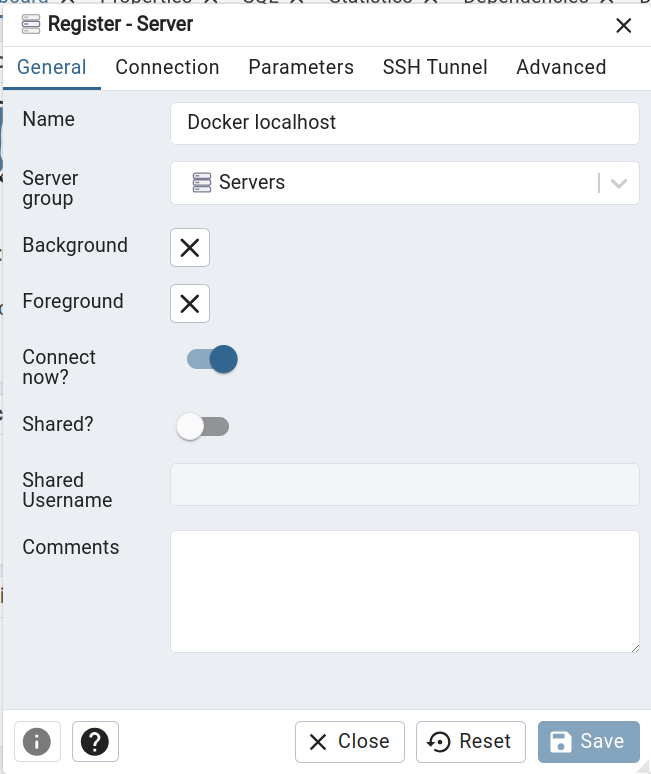
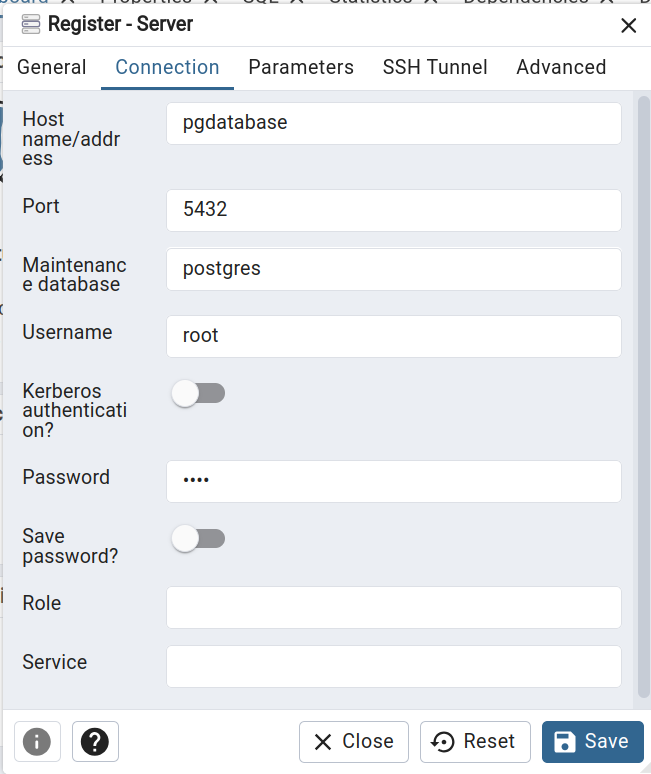
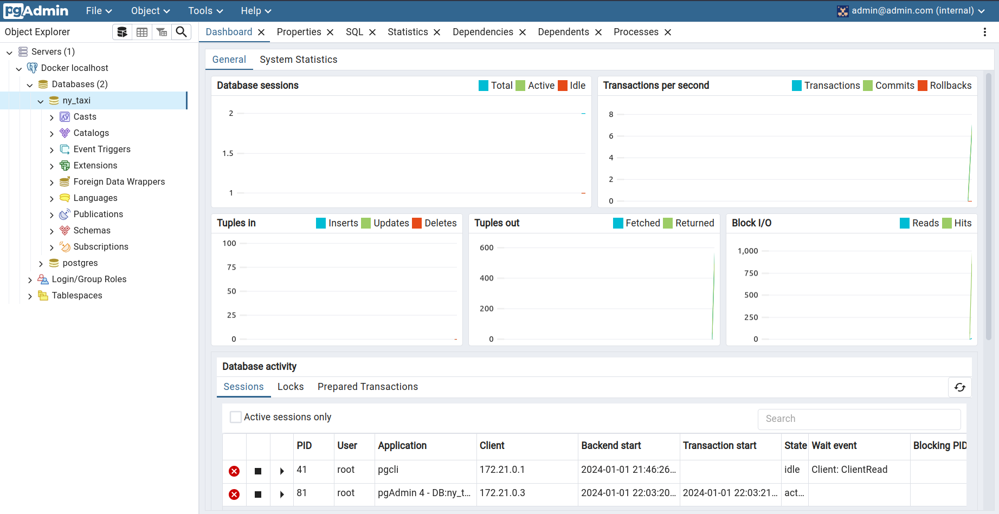
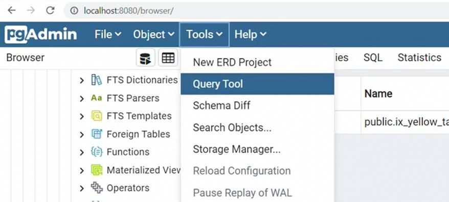
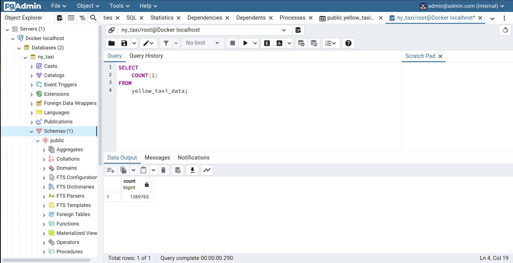

# Module 1: Introduction & Prerequisites

- Course overview
- Introduction to GCP
- Docker and docker-compose
- Running Postgres locally with Docker
- Setting up infrastructure on GCP with Terraform
- Preparing the environment for the course
- Homework

# 1 Docker and SQL

## 1.2.1 Introduction to Docker

- Docker allows to run software in isolated containers where all relevant dependencies are installed
- Why should we care about Docker?
    - Reproducibility of environments
    - Allows local experiments in isolation
    - Integrations Tests (CI/CD)
    - Running Pipelines on the cloud (AWS Batch, Kubernetes jobs, ... )
    - Spark (for Datapipelines)
    - Serversless (AWS Lambda, Google functions, ...)

- **Relevance for Data-Engineering**: Isolate a data-pipeline, that processes input-data, in a docker container
    - Input: csv-file
    - Output: Postgres-database

Installation instructions for Docker can be found here: https://docs.docker.com/get-docker/ 

After installation you can test if docker is correctly installed with some test-commands:
```bash
# Basic example script for verification of installation
docker run hello-world

# Obtaining an Ubuntu image and enter it (into bash)
docker run -it ubuntu bash

# Obtaining an Python image and enter it (into python-console)
docker run python:3.9
``` 

For the use-case of Data Engineering often Python-container are used. To be utilized such containers need to have required dependencies to be installed. This can be easily done by entering the python-container with into the bash. Installation is then done with pip.

```bash
# Enter container
docker run -it --entrypoint=bash python:3.9
# install dependency
pip install pandas 
```

Checking if all worked out correct (`python`):
```python
import pandas as pd
print(pd.__version__)
```

After leaving the docker-container all changes will be lost and the "original" image will be used to instantiate a container. To create a customer container with all the relevant components, the usage of Dockerfiles is advised. 

### Creating a Dockerfile
- Used to build a docker container (everything needed will be specified there)

A "dummy" data-pipeline is put into the container:
```python
import sys
import pandas as pd

print(sys.argv)

day = sys.argv[1]

# Some processing!

print(f"Job finished successfully for day = {day}")
```

The used [Dockerfile](Dockerfile):
```Dockerfile
FROM python:3.9.1

# Installing pandas in the container
RUN pip install pandas

# Changing working directory + copying the pipeline
WORKDIR /app
COPY pipeline.py pipeline.py

# Enter container into bash by default
ENTRYPOINT [ "python", "pipeline.py" ]
```

Building the container with:
```bash
docker build -t test:pandas .
```

Running the container:
```bash
docker run -it test:pandas 2024-01-01
```

Output:
```txt
Job finished successfully for day = 2024-01-01
```

## 1.2.2 - Ingesting NY Taxi Data to Postgres

The first step is to create a docker-container that uses Postgres.
```bash
docker run -it \
    -e POSTGRES_USER="root" \
    -e POSTGRES_PASSWORD="root" \
    -e POSTGRES_DB="ny_taxi" \
    -v $(pwd)/ny_taxi_postgres_data:/var/lib/postgresql/data \
    -p 5432:5432 \
    postgres:13
```

In another terminal the database will now be accessed. For this the python-package `pgcli` needs to be insrtalled (globally or in specific environment for the course):
```bash
pip install pgcli
```

To finally connect to the database, the following command is used:
```bash
pgcli -h localhost -p 5432 -u root -d ny_taxi
```

You are now insid the container, but there are no Databases yet!
```bash
root@localhost:ny_taxi> \dt # lists databases
+--------+------+------+-------+
| Schema | Name | Type | Owner |
|--------+------+------+-------|
+--------+------+------+-------+
SELECT 0
Time: 0.018s
```

To put the dataset into the container, [this](upload-data.ipynb) Jupyter Notebook will be used (can also be done with python-scripts etc.).

After executing the code in the notebook the result is:
```bash
root@localhost:ny_taxi> \dt
+--------+------------------+-------+-------+
| Schema | Name             | Type  | Owner |
|--------+------------------+-------+-------|
| public | yellow_taxi_data | table | root  |
+--------+------------------+-------+-------+
SELECT 1
Time: 0.014s
```


## 1.2.3 - Connecting pgAdmin and Postgres
Now that the data is put into the database, you can play arount a little bit with the data.

Example:
```SQL
SELECT 
    max(tpep_pickup_datetime), 
    min(tpep_dropoff_datetime), 
    max(total_amount) 
FROM 
    yellow_taxi_data;
```

Output: 
```bash
+---------------------+---------------------+---------+
| max                 | min                 | max     |
|---------------------+---------------------+---------|
| 2021-02-22 16:52:16 | 2008-12-31 23:07:22 | 7661.28 |
+---------------------+---------------------+---------+
SELECT 1
Time: 0.239s
```

With the query above you get:
- The latest pickuptime was in February 2021
- The earliest pickuptime was in December 2008
- The highest amount paid was about $7661

This works, but it would be better to have a GUI to access the database. For this purpose [pgAdmin](https://www.pgadmin.org/download/pgadmin-4-container/) for is used with docker.

The docker-image for [`pgAdmin4`](https://hub.docker.com/r/dpage/pgadmin4/) will be used for building the required container:

```bash
docker run -it \
    -e PGADMIN_DEFAULT_EMAIL="admin@admin.com" \
    -e PGADMIN_DEFAULT_PASSWORD="root" \
    -p 8080:80 \
    dpage/pgadmin4
```

After everything is set up, the Web-GUI of `pgAdmin` is available at [http://localhost:8080](https://localhost:8080). For the login, the credentials are used that were specified during `docker run`.

Steps for setting up the Web-Version of pgAdmin locally:
1. `Create new server`: Rightclick on [Servers], then register new server
2. `General`: Name the server "Local docker"
3. `Connection`: Set hostname to "localhost", set Username to "root"

This configurations fails initially, since `pgAdmin` looks for `postgres` inside the `pgAdmin` docker-container and not the `postgres` docker-container. To remedy this problem, a [network](https://docs.docker.com/engine/reference/commandline/network_create/) between the 2 container has to be established!

Creating a network + connecting the docker-container:
```bash
docker network create pg-network

docker run -it \
    -e POSTGRES_USER="root" \
    -e POSTGRES_PASSWORD="root" \
    -e POSTGRES_DB="ny_taxi" \
    -v $(pwd)/ny_taxi_postgres_data:/var/lib/postgresql/data \
    -p 5432:5432 \
    --network=pg-network \
    --name pg-database \
    postgres:13
```

It is important to check if the data is still present in the database. For open the postgres-client and execute some query:

```bash
pgcli -h localhost -p 5432 -u root -d ny_taxi
```

Now check if all rows are still present in the database:
```sql
SELECT COUNT(1) FROM yellow_taxi_data;
```

Output:
```bash
+---------+
| count   |
|---------|
| 1369765 |
+---------+
SELECT 1
Time: 0.198s
```

Now that the postgres-database is present in the network, the pgAdmin has to be put in this network aswell:

```bash
docker run -it \
    -e PGADMIN_DEFAULT_EMAIL="admin@admin.com" \
    -e PGADMIN_DEFAULT_PASSWORD="root" \
    -p 8080:80 \
    --network=pg-network \
    --name pgadmin \
    dpage/pgadmin4
```

With both database and pgAdmin running in the same network you can reopen [http://localhost:8080](http://localhost:8080) and create a Server:
1. `General`: Name the server "Docker localhost"
2. `Connection`: set Host name/address to `pg-database` + set username and password to `root` (as specified before)

<div style="display: flex; justify-content: space-between;">
    
    
</div>


After saving the configuration the database from the postgres-container will be available:


To query the connected database the query-tool of pgAdmin can be used:




To query the database, `[F5]` is used.

Another way to connect multiple docker-container in a network is to use `docker-compose`, which will be presented in following sections.

## 1.2.4 - Dockerizing the Ingestion Script

The [notebook](upload-data.ipynb) that populated the postgres-database and the [dummy-pipeline](pipeline.py) will be adapted to create a proper pipeline for data-ingestion.

### Converting the notebook to a Python script

Converting to Python:
```bash
jupyter nbconvert --to=script upload-data.ipynb
```

A new file [ingest_data.py](ingest_data.py) is created and the exported code is adapted.

The file requires many parameters that have to be given as arguments when calling the program:
```bash
URL="https://github.com/DataTalksClub/nyc-tlc-data/releases/download/yellow/yellow_tripdata_2021-01.csv.gz"

python ingest_data.py \
  --user=root \
  --password=root \
  --host=localhost \
  --port=5432 \
  --db=ny_taxi \
  --table_name=yellow_taxi_trips \
  --url=${URL}
```

After the ingestion-process is finished, it is possible to look into the data with pgAdmin: 

```sql
SELECT 
	COUNT(1)
FROM
	yellow_taxi_trips;
```

### Dockerizing the ingestion-script

Now the ingestion-process has to be dockerized. For this the [Dockerfile](Dockerfile) from before will be adapted:

```Dockerfile
FROM python:3.9.1

# Installing dependencies
RUN apt-get install wget
RUN pip install pandas sqlalchemy psycopg2

WORKDIR /app
COPY ingest_data.py ingest_data.py

ENTRYPOINT [ "python", "ingest_data.py" ]
```

Build the container:
```bash
docker build -t taxi_ingest:v001 .
```

Running the container with the required parameters:
```bash
URL="https://github.com/DataTalksClub/nyc-tlc-data/releases/download/yellow/yellow_tripdata_2021-01.csv.gz"

docker run taxi_ingest:v001 \
  --user=root \
  --password=root \
  --host=localhost \
  --port=5432 \
  --db=ny_taxi \
  --table_name=yellow_taxi_trips \
  --url=${URL}
```

- This looks good, but does not work! This is again because of `localhost` and it's meaning inside of a docker-container.

- To solve the problem the container has to be killed, if it is currently still running.

The first idea is again to use `docker network`:
```bash
URL="https://github.com/DataTalksClub/nyc-tlc-data/releases/download/yellow/yellow_tripdata_2021-01.csv.gz"

docker run -it \
  --network=pg-network \
  taxi_ingest:v001 \
    --user=root \
    --password=root \
    --host=pg-database \
    --port=5432 \
    --db=ny_taxi \
    --table_name=yellow_taxi_trips \
    --url=${URL}
```
The important changes were the specification of the network and setting the host to the postgres-database.

Establishing the network and configuring multiple `docker run` statements by hand is not really that handy. A better solution is to write a script that automates the creation of required docker-container and that connects them accordingly. For this `docker-compose` can be used.

## 1.2.5 - Running Postgres and pgAdmin with Docker-Compose
Installing `docker-compose`: https://docs.docker.com/compose/install/

What is `docker-compose`:
- Docker Compose is a tool for defining and running multi-container Docker applications
- Configured with `yaml`-file(s)
- Allows for far more simpler orchestration of docker-container in conjunction with each other

The docker-compose file that creates a network and uses both relevant docker-container is [docker-compose.yaml](docker-compose.yaml):
```yaml
services:
  pgdatabase:
    image: postgres:13
    environment:
    - POSTGRES_USER=root
    - POSTGRES_PASSWORD=root
    - POSTGRES_DB=ny_taxi
    volumes:
      - "./ny_taxi_postgres_data:/var/lib/postgresql/data:rw"
    ports:
      - "5432:5432"
  pgadmin:
    image: dpage/pgadmin4
    environment:
      - PGADMIN_DEFAULT_EMAIL=admin@admin.com
      - PGADMIN_DEFAULT_PASSWORD=root
    ports:
      - "8080:80"
```

To use the configuration-file, use the follwing command:
```bash
docker-compose up

# In detached-mode (runs in background, does not block console)
docker-compose up -d
```

During configuration of the postgres-database connection everything stays basically the same and the host-name must be the name of the database-service in the docker-compose config (`pgdatabase`). 

To shut down docker compose you can either use 

**The quick and dirty method**: 
```txt
[Ctrl] + [C]
```
**The proper way (from different console)**: 
```bash
docler-compose down
```

With this, everythig is set up and we can finally work with the ingested database.

**`Note`**: to make `pgAdmin` configuration persistent, create a folder `data_pgadmin`. Change its permission via
```bash
sudo chown 5050:5050 data_pgadmin
```

and mount it to the `/var/lib/pgadmin` folder:

```yaml
services:
  pgadmin:
    image: dpage/pgadmin4
    volumes:
      - ./data_pgadmin:/var/lib/pgadmin
    ...
```

## Section Summary

The data ingestion was previously done when using the docker container without docker compose. In this summary section the docker-compose uses a network `pg-net` over which the running container can be accessed over.

Start docker container for `Postgres` and `pgAdmin4`:
```bash
docker-compose up
```

Ingest `yellow_taxi_trips` data to the `ny_taxi` database:
```bash
URL="https://github.com/DataTalksClub/nyc-tlc-data/releases/download/yellow/yellow_tripdata_2021-01.csv.gz"

docker run -it \
  --network=pg-net \
  taxi_ingest:v001 \
    --user=root \
    --password=root \
    --host=pgdatabase \
    --port=5432 \
    --db=ny_taxi \
    --tb=yellow_taxi_trips \
    --url=${URL}
```

Ingest taxi zones lookup-table to the `ny_taxi` database:
```bash
URL="https://d37ci6vzurychx.cloudfront.net/misc/taxi+_zone_lookup.csv"

docker run -it \
  --network=pg-net \
  taxi_ingest:v001 \
    --user=root \
    --password=root \
    --host=pgdatabase \
    --port=5432 \
    --db=ny_taxi \
    --tb=zones \
    --url=${URL}
```

Now the dockerized database should be populated with the downloaded data.


## 1.2.6 - SQL Refresher
Start pgadmin and the postgres-database with:
```bash
docker-compose up
```

In this section the lookup table for Taxi-Zones is also added to the datbase. The code can be found in the data-upload [notebook](upload-data.ipynb).

Lets refresh our SQL-knowledge:

Showing the `zones`-table:
```sql
SELECT
  * 
FROM 
	zones;
```

Showing the first 100 rows of the `yellow_taxi_trips`-table:
```sql
SELECT
	* 
FROM 
	yellow_taxi_trips
LIMIT
	100;
```

Next step is to join the `yellow_taxi_trips` and `zones` in order to map the numerical values of `PULocationID` and `DOLocationID` to the Zone-names.

- Reference: https://www.w3schools.com/sql/sql_ref_join.asp

On way of doing this is the following:
```sql
-- Inner JOIN "by hand"
SELECT
	tpep_pickup_datetime,
	tpep_dropoff_datetime,
	total_amount,
	CONCAT(zpu."Borough", ' / ', zpu."Zone") AS "pickup_loc",
	CONCAT(zdo."Borough", ' / ', zdo."Zone") AS "dropoff_loc"
		
FROM 
	yellow_taxi_trips AS t,
	zones AS zpu,
	zones AS zdo
WHERE
	t."PULocationID" = zpu."LocationID" AND
	t."DOLocationID" = zdo."LocationID"
LIMIT
	100;
```

Another way is:
```sql
-- Using JOIN explicitely
SELECT
	tpep_pickup_datetime,
	tpep_dropoff_datetime,
	total_amount,
	CONCAT(zpu."Borough", ' / ', zpu."Zone") AS "pickup_loc",
	CONCAT(zdo."Borough", ' / ', zdo."Zone") AS "dropoff_loc"
FROM 
	yellow_taxi_trips AS t 
	JOIN zones AS zpu
		ON t."PULocationID" = zpu."LocationID"
	JOIN zones AS zdo
		ON t."DOLocationID" = zdo."LocationID"
LIMIT
	100;
```

Checking if some location ID's are missing:
```sql
--- Check Pickup-Location ID
SELECT
	tpep_pickup_datetime,
	tpep_dropoff_datetime,
	total_amount,
	"PULocationID",
	"DOLocationID"
FROM 
	yellow_taxi_trips AS t 
WHERE
	"PULocationID" NOT IN (SELECT "LocationID" FROM zones)
LIMIT
	100;
```

```sql
--- Check Dropoff-Location ID
SELECT
	tpep_pickup_datetime,
	tpep_dropoff_datetime,
	total_amount,
	"PULocationID",
	"DOLocationID"
FROM 
	yellow_taxi_trips AS t 
WHERE
	"DOLocationID" NOT IN (SELECT "LocationID" FROM zones)
LIMIT
	100;
```
Results from bot querys show that nothing is missing.

### Using Left, Right and Outer Joins when some Location IDs in either table

When using the regular `JOIN`-Keyword, it defaults to a `INNER JOIN`, which joins tables where keys of both tables match. To also retain unmatched columns in the `LEFT` or the `RIGHT` table, the usage of `LEFT JOIN` or `RIGHT JOIN` is required.

`LEFT JOIN Example`: Retains all records in the left table, even if there is no matching record in the right table

```sql
SELECT
	tpep_pickup_datetime,
	tpep_dropoff_datetime,
	total_amount,
	"PULocationID",
	"DOLocationID"
FROM 
	yellow_taxi_trips AS t 
	LEFT JOIN zones AS zpu
		ON t."PULocationID" = zpu."LocationID"
	LEFT JOIN zones AS zdo
		ON t."DOLocationID" = zdo."LocationID"
LIMIT 
	100;
```

First joins the `zpu` to `yellow_taxi_trips` on `PULocationID`, then joins `zdo` to the previous `LEFT JOIN`. This retains all records from the leftmost table. The `yellow_taxi_trips` is therefore fully preserved.

`RIGHT JOIN Example:` Joining tables together from right to left, where entries in the right table are retained when joined.

```sql
SELECT
	tpep_pickup_datetime,
	tpep_dropoff_datetime,
	total_amount,
	"PULocationID",
	"DOLocationID"
FROM 
	yellow_taxi_trips AS t 
	RIGHT JOIN zones AS zpu
		ON t."PULocationID" = zpu."LocationID"
	RIGHT JOIN zones AS zdo
		ON t."DOLocationID" = zdo."LocationID"
LIMIT 
	100;
```

`(FULL) OUTER JOIN Example`: A Combination of `LEFT JOIN` and `RIGHT JOIN`, where every entry is retained from both tables and missing values in entries are filled in with NULL-values.

### Using `GROUP_BY` to calclulate number of trips per day + ordering them with `ORDER BY`


```sql
SELECT
  -- casting to sql-date format
	CAST(tpep_dropoff_datetime AS DATE) AS "day",
  -- counting the number of trips
	COUNT(1) 
FROM 
	yellow_taxi_trips AS t 
GROUP BY -- result is grouped by the day
	CAST(tpep_dropoff_datetime AS DATE)
ORDER BY -- Ascending order
	"day" ASC;
```

### `GROUP BY` and `ORDER BY` with multiple columns

```sql
SELECT
	CAST(tpep_dropoff_datetime AS DATE) AS "day",
	"DOLocationID",
	COUNT(1) AS "count",
	MAX(total_amount),
	MAX(passenger_count)
FROM 
	yellow_taxi_trips AS t 
GROUP BY
	1, 2 -- groupin by row 1 and 2
ORDER BY
	"day" ASC, -- day from lowest to highest
	"DOLocationID" ASC;  -- dropoff location id from low to high 
```