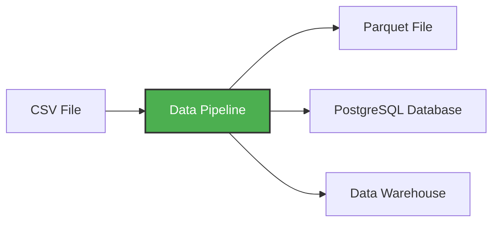

# Module 1: Containerization and Infrastructure as Code

## Instroduction to Docker

- Docker allows to run software in isolated containers where all relevant dependencies are installed
- Why should we care about Docker?
    - Reproducibility of environments
    - Allows local experiments in isolation
    - Integrations Tests (CI/CD)
    - Running Pipelines on the cloud (AWS Batch, Kubernetes jobs, ... )
    - Spark (for Datapipelines)
    - Serversless (AWS Lambda, Google functions, ...)

Installation instructions for Docker can be found here: https://docs.docker.com/get-docker/ 

After installation you can test if docker is correctly installed with some test-commands:

```bash
# Basic example script for verification of installation
docker run hello-world
```

Run a Python container:
```bash
docker run -it --rm --entrypoint bash python:3.13.11-slim
```
- `run`: creates docker container and starts it
- `-it`: interactive (`-i`) + tty-mode (`-t`)
- `--rm`: Removes created container after closing
  - Without this there will be new container created every time the `docker run` command is called
  - Creates and deletes new docker container every time the command is called
- `--entrypoint`: Program that is executed when entering the container (here: opens  `bash`)
- `python:3.13.11-slim`:
  - `python`: Docker image name
  - `3.13.11-slim`: Tag for specific version of docker image


So, we know that with docker we can restore any container to it's initial state in a reproducible manner. But what about data? A common way to do so is with volumes.

Let's create some data in test:

```bash
mkdir test
cd test
touch file1.txt file2.txt file3.txt
echo "Hello from host" > file1.txt
cd ..
```

Now let's create a simple script [`test/list_files.py`](test/list_files.pyV) that shows the files in the folder:

```bash
from pathlib import Path

current_dir = Path.cwd()
current_file = Path(__file__).name

print(f"Files in {current_dir}:")

for filepath in current_dir.iterdir():
    if filepath.name == current_file:
        continue

    print(f"  - {filepath.name}")

    if filepath.is_file():
        content = filepath.read_text(encoding='utf-8')
        print(f"    Content: {content}")
```

To make content of a specific directory available to the container you can mount the folder like this:
```bash
# Important: Must be in the folder where "test/" is located at
docker run -it \
    --rm \
    -v $(pwd)/test:/app/test \
    --entrypoint=bash \
    python:3.13.11-slim
```

Inside the container, run:
```bash
cd /app/test
ls -la
cat file1.txt
python list_files.py
```


## Data Pipelines

A data pipeline is a service that receives data as input and outputs more data. For example, reading a file with data, transforming the data somehow and storing it as a table in a PostgreSQL database or some other data storage offline or online in the cloud.



In this workshop, we'll build pipelines that:

- Download CSV data from the web
- Transform and clean the data with pandas
- Load it into PostgreSQL for querying
- Process data in chunks to handle large files

Create the directory [`pipeline/`](./pipeline) and create a script with the same name [`pipeline.py`](pipeline/pipeline.py)

```bash
mkdir -p pipeline
touch pipeline/pipeline.py
```

```python
# pipeline.py

import sys
import pandas as pd

print('arguments', sys.argv)

month = int(sys.argv[1])

# Pandas Dataframe with columns "day" and "num_passengers"
df = pd.DataFrame({"day": [1, 2], "num_passengers": [3, 4]})
df['month'] = month
print(df.head())

# Saves to parquet file
df.to_parquet(f"output_{month}.parquet")

print(f'hello pipeline, month={month}')
```

To use this script, the package `pandas` has to be installed. For this a virtual environment tool called `uv` is used:

```bash
pip install uv
```

Call the following command:
```bash
uv init --python 3.13
```
This command created a bunch of files that can be used to configure the python project.


This should reult in 
```
Initialized project `pipeline`
```

Check python version in the uv-environment:
```bash
uv run python -V 
# Using CPython 3.13.5
# Creating virtual environment at: .venv
# Python 3.13.5
```

Install additional package with uv (inside the directory where `uv init` was called):
```bash
uv add pandas pyarrow
```

uv automatically adds all dependencies to the [`pyproject.toml`](pipeline/pyproject.toml)
```toml
[project]
name = "pipeline"
version = "0.1.0"
description = "Add your description here"
readme = "README.md"
requires-python = ">=3.13"
dependencies = [
    "pandas>=2.3.3",
    "pyarrow>=22.0.0",
]
```

Calling the script.
```bash
uv run python3 pipeline.py 12
# arguments ['pipeline.py', '12']
#    day  num_passengers  month
# 0    1               3     12
# 1    2               4     12
# hello pipeline, month=12
```

### Dockerfile for creating your own custom image

- **Source**: [`Dockerfile`](pipeline/Dockerfile)

<details>

<summary><b>Dockerfile</b></summary>

```Dockerfile
FROM python:3.13.11-slim

# Copy from existing Docker image the folder /uv to /bin
COPY --from=ghcr.io/astral-sh/uv:latest /uv /bin

# Setting workdirectory 
WORKDIR /code

# Puts uv's python binary in path (no `uv run` needed in entrypoint)
ENV PATH="/code/.venv/bin:$PATH"

COPY pyproject.toml .python-version uv.lock ./

# Install dependencies specified in uv.lock files
RUN uv sync --locked


# Copy file into container
COPY pipeline.py .

# Executes this command upon entering container
ENTRYPOINT [ "python3", "pipeline.py" ]
```

</details>


To create the image use:
```bash
docker build -t test:pandas .
```
- `-t` for setting image identifier / tag
- `test:pandas`: name and tag of new docker image
- `.`: context is current folder `.` (where to look for Docker Image definititon / Dockerfile)

