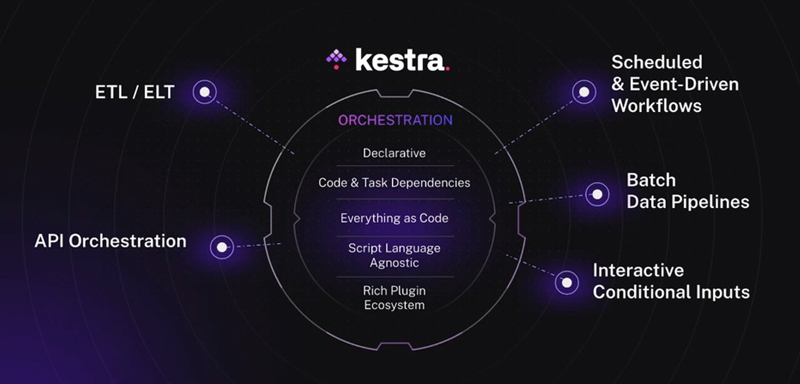

# Module 2: Workflow Orchestration

## Workflow Orchestration Introduction

### What is Workflow Orchestration?
- Is a process where multiple components are arranged (like in an orchestra) to work in the correct way / order
- Workflow orchestration tools are for example: Ariflow, Mage, Prefect, Kestra, ...

### What is Kestra?

- An All-In One Automation and Orchestration Platform



- Has options of...
  - No-Code: 
  - Low-Code
  - Full-Code
- Supports any language
  - Examples: Python, Julia, Ruby, R, JavaScript, C, ...
- Allows monitoring of Workflows and Executions
- Has Plugins for many tools and basically all cloud platforms

### Overview of Content
- Introduction to Kestra
- ETL: Extract data and load it to postgres
- ETL: Extract data and load it to Google Cloud
- Parameterizing Execution
- Scheduling and Backfills
- Install Kestra on the Cloud and sync your Flows with Git


## Getting to know Kestra

To learn what Kestra is and how to use it, you should read the Kestra Blog and the accompanying videos on youtube.

### Getting Started with Kestra
- [Website](https://kestra.io/blogs/2024-04-05-getting-started-with-kestra)
- [Video](https://youtu.be/a2BZ7vOihjg)

#### Properties
- Workflows are declared in yaml
- Each flow requires 3 properties
  - `id`: Name of the flow
  - `namespace`: Environment for your flow
  - `tasks`: List of tasks to execute in your flow

Example flow:
```yaml
id: getting_started
namespace: example
tasks:
  - id: hello_world
    type: io.kestra.core.tasks.log.Log
    message: Hello World!
```

#### 


## ETL Pipelines with Postgres in Kestra

On this section the used data (NYC Taxi data) will be obtained from here: https://github.com/DataTalksClub/nyc-tlc-data/releases.

The goal is to load all the data and put it in one table.

