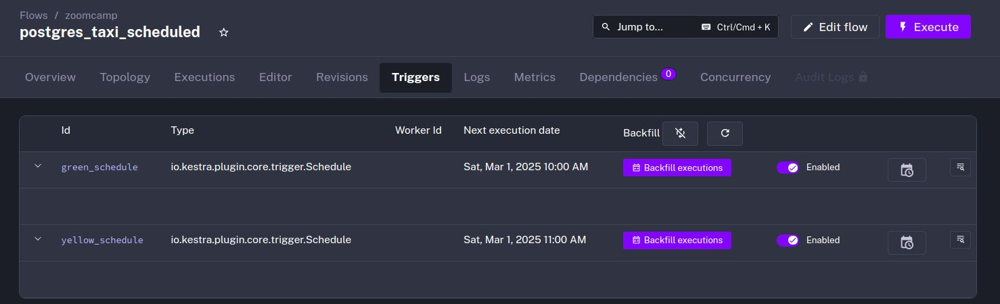
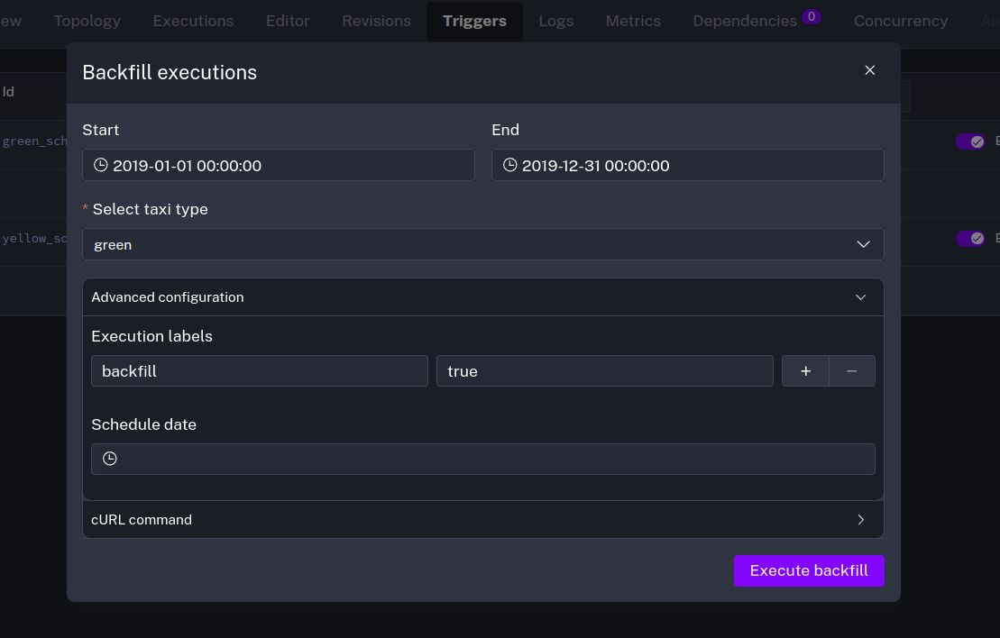

# Module 2: Workflow Orchestration

## 2.2.1 Workflow Orchestration Introduction

### What is Workflow Orchestration?
- Is a process where multiple components are arranged (like in an orchestra) to work in the correct way / order
- Workflow orchestration tools are for example: Ariflow, Mage, Prefect, Kestra, ...

### What is Kestra?

- An All-In One Automation and Orchestration Platform


- Has options of...
  - No-Code: 
  - Low-Code
  - Full-Code
- Supports any language
  - Examples: Python, Julia, Ruby, R, JavaScript, C, ...
- Allows monitoring of Workflows and Executions
- Has Plugins for many tools and basically all cloud platforms

### Overview of Content
- Introduction to Kestra
- ETL: Extract data and load it to postgres
- ETL: Extract data and load it to Google Cloud
- Parameterizing Execution
- Scheduling and Backfills
- Install Kestra on the Cloud and sync your Flows with Git


## 2.2.2 Learn Kestra

To learn what Kestra is and how to use it, you should read the Kestra Blog and the accompanying videos on youtube.

### Getting Started with Kestra 
- [Website](https://kestra.io/blogs/2024-04-05-getting-started-with-kestra)
- [Video](https://youtu.be/a2BZ7vOihjg)

#### Properties
- Workflows are declared in yaml
- Each flow requires 3 properties
  - `id`: Name of the flow
  - `namespace`: Environment for your flow
  - `tasks`: List of tasks to execute in your flow

Example flow:
```yaml
id: getting_started
namespace: example
tasks:
  - id: hello_world
    type: io.kestra.core.tasks.log.Log
    message: Hello World!
```

#### Example Application
- Applications sends API request to github to ask number of stars that the Kestra Repo has
- Sends the results from github every hour to discord

The resulting flow and code look as follows:

<details>
<summary><b>flow</b></summary>

```yaml
id: hello-world
namespace: company.team

inputs:
  - id: kestra_logo
    type: STRING
    defaults: https://avatars.githubusercontent.com/u/59033362?s=48&v=4
  
  - id: discord_webhook
    type: STRING
    defaults: https://discord.com/api/webhooks/...  # replace with your own wbhook

tasks:
  - id: python_script
    type: io.kestra.plugin.scripts.python.Commands
    namespaceFiles:
      enabled: true
    beforeCommands:
      - python -m venv .venv
      - . .venv/bin/activate
      - pip install -r scripts/requirements.txt
    commands:
      - python scripts/api_example.py

  - id: output_gh_stars
    type: io.kestra.plugin.core.log.Log
    message: "Number of stars: {{ outputs.python_script.vars.gh_stars }}"
  
  - id: send_notification
    type: io.kestra.plugin.notifications.discord.DiscordExecution
    content: "Total of Github Stars: {{ outputs.python_script.vars.gh_stars }}"
    username: Kestra
    avatarUrl: "{{ inputs.kestra_logo }}"
    url: "{{ inputs.discord_webhook }}"


triggers:
  - id: hour_trigger
    type: io.kestra.plugin.core.trigger.Schedule
    cron: 0 * * * *
    disabled: false
```

</details>

<details>
<summary><b>scripts/api_example.py</b></summary>

```python
import requests
from kestra import Kestra

r = requests.get("https://api.github.com/repos/kestra-io/kestra")
gh_stars = r.json()["stargazers_count"]
Kestra.outputs({"gh_stars": gh_stars})
```
</details>

<details>
<summary><b>scripts/requirements.txt</b></summary>

```txt
requests
kestra
```
</details>


### Kestra Beginner Tutorial
- [Website](https://kestra.io/docs/tutorial)
- [Playlist](https://www.youtube.com/playlist?list=PLEK3H8YwZn1oaSNybGnIfO03KC_jQVChL)


The very short videos in the playlist give a foundational knowledge of how kestra works. The notation in the videos is in some parts deprecated, so looking into the accompanying documentation is required to get an up-to-date understanding of kestra.

### Use Kestra with Docker Compose

- [Documentation](https://kestra.io/docs/installation/docker-compose)

A list of available Kestra Docker containers can be found in the documentation [here](https://kestra.io/docs/installation/docker#docker-image-tags). There is a major distinction between all the different Docker containers:
- **All Plugins**: 
  - `kestra/kestra:*`
- **No Plugins**: 
  - `kestra/kestra:*-no-plugins`


The [docker-compose.yaml](./docker-compose.yml) launches 4 docker container:
- `kestra`: a Kestra-Server
- `postgres`: a Postgres-Database to have persistent Kestra data
- `postgres_zoomcamp`: a Postgres-Database to store processed data in
- `pgadmin`: a pgAdmin instance to look into the data


## 2.2.3 ETL Pipelines with Postgres in Kestra

On this section the used data (NYC Taxi data) will be obtained from here: https://github.com/DataTalksClub/nyc-tlc-data/releases.

The overall goal is to: 
- **`Extract`**: Load the data from the git repository
- **`Transform`**: Process it with Kestra by merging the data
- **`Load`**: Save it to a database

Here the data has to be added for each month and combined into a table.

Start Kestra with this [docker-compose](docker-compose.yml):
```bash
docker-compose up
```

The Kastra-Flow that is used for the ETL Pipeline is [`postgres_taxi.yaml`](flows/postgres_taxi.yaml). The components are commented and are pretty self-expalnatory.

Accessing the ingested data with pgAdmin:
- Open pgAdmin at http://localhost:8085
- Log in with the credentials [here](docker-compose.yml#L86)
- Register a Server with the following connection configuration:
  - **Host name**:  postgres_zoomcamp
  - **Port**: 5432
  - **Maintenance database**: postgres-zoomcamp
  - **Username**: kestra


## 2.2.4 - Manage Scheduling and Backfills with Postgres in Kestra

In this section we learn how the application of the flow can be automated using scheduling and how backfills can be used for missed schedules in the past.

The flow used in this section is [`postgres_taxi_scheduled`](flows/postgres_taxi_scheduled.yaml)

### Scheduling example
The following example shows how cron-jobs are used to schedule Kestra runs

```yaml
...
triggers:
  # Run at first day of month at 9am
  - id: green_schedule
    type: io.kestra.plugin.core.trigger.Schedule
    cron: "0 9 1 * *"
    inputs:
      taxi: green

  # Run at first day of month at 10am
  - id: yellow_schedule
    type: io.kestra.plugin.core.trigger.Schedule
    cron: "0 10 1 * *"
    inputs:
      taxi: yellow
```

### Backfills
To fill missed data from previous schedules you can activate backfills in the previously defined triggers



Here you can see how the start and end of the backfill is specified. It is also advisable to add a label to the backfill execution to see which executions were backfilled:



## 2.2.5 - Orchestrate dbt Models with Postgres in Kestra

This section is to show the capabilities of Kestra with DBT (Data Build Tool), which will be covered in depth in a later part of the class. Up until now there was no "real" transformation of the data as it was just read in and then put in postgres tables.

### Create DBT Workflow

The Kastra-Flow that is used with DBT is [`postgres_taxi.yaml`](flows/postgres_dbt.yaml).

Executing the Kestra-Flow will result in a bunch of new views and tables when looking at pgAdmin:


## 2.2.6 - ETL Pipelines in Kestra: Google Cloud Platform

For this part of the workflow-orchestration section you need to ...

1. Create a project and name it like "kestra-workspace" or "kestra-project" or something different.
2. Go to `IAM & admin` -> `[Service accounts]` and then click on `[+ Create Service Account]`
3. Name the service account `zoomcamp`
4. Grant the followin roles
   - `Storage Admin`
   - `BigQuery Admin`
5. After creation, click on the new service account and go to the `KEYS` section
6. Create a new private key in json format by clicking `ADD KEY`
7. Dowload and save the key to a secure location on your computer
8. Go to Kestra and create the a Kestra-Flow [`gcp_taxi`](flows/gcp_taxi.yaml) with this yaml-file.
9. Create [`gcp_kv`](flows/gcp_kv.yaml)-workflow in Kestra and cusrtomize the key-value pairs except the `GCP_CREDS`-value part to your needs
    - Running the flow will populate most of the key-value pairs that can then be used in the [`gcp_taxi`](flows/gcp_taxi.yaml)-flow
10. Go to `[Namespaces]` on the left sidebar and choose `zoomcamp`-namespace. Then select `KV Store` on the top-bar
    - You can now set the obtained credentials as key-value pair with `GCP_CREDS` as key and the obtained json-credentials as value.
    
With everything set up you now can execute the following flows in this order:
1. [**`gcp_setup`**](flows/gcp_setup.yaml): To create GCP resources based on [**`gcp_kv`**](flows/gcp_kv.yaml)
   - The Bucket and the BigQuery dataset should now be created on GCP
2. [**`gcp_taxi`**](flows/gcp_taxi.yaml): Run ETL pipelines that uses GCS and BigQuery
   - Here you have to set the taxi type, year and month and the rest will be done just as before

## 2.2.7 - Manage Schedules and Backfills with BigQuery in Kestra

- Adding schedules to BigQuery workflow
- How to perform backfills

The flow of this section is [`gcp_taxi_scheduled`](flows/gcp_taxi_scheduled.yaml).

### Add Schedules

The scheduling for GCP is pretty much the same as the offline version

```yaml
triggers:
  # Runs at first day of month at 9am
  - id: green_schedule
    type: io.kestra.plugin.core.trigger.Schedule
    cron: "0 9 1 * *"
    inputs:
      taxi: green
  
  # Runs at first day of month at 10am
  - id: yellow_schedule
    type: io.kestra.plugin.core.trigger.Schedule
    cron: "0 10 1 * *"
    inputs:
      taxi: yellow
```

The variable `file` now uses `trigger.date` instead of month and year and you only have to select the taxi type when executing the flow:
```yaml
variables:
  file: "{{inputs.taxi}}_tripdata_{{trigger.date | date('yyyy-MM')}}.csv"
  ...
```

### Run Backfills

Same as with the offline variant


## 2.2.8 - Orchestrate dbt Models with BigQuery in Kestra

- The Kestra-Flow used here is [`gcp_dbt`](flows/gcp_dbt.yaml). 
- There is not much to do in terms of configuration due to the setup done by the flow [`gcp_setup`](flows/gcp_setup.yaml).
- Just clicking `Execute` is enough to run the dbt models and everything will be done in BigQuery.


## Homework