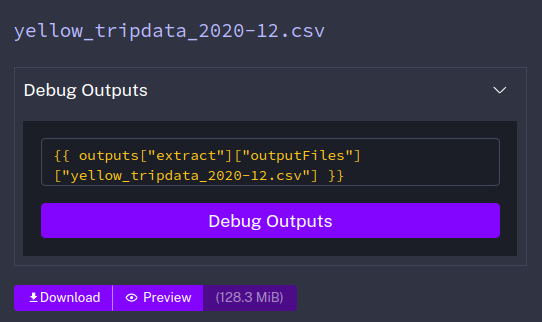

## Module 2 Homework Solution

So far in the course, data from the year 2019 and 2020 was used. The task now is to extend the existing flows to include data for the year 2021.


As a hint, Kestra makes that process really easy:
1. You can leverage the backfill functionality in the [scheduled flow](../flows/gcp_taxi_scheduled.yaml) to backfill the data for the year 2021. Just make sure to select the time period for which data exists i.e. from `2021-01-01` to `2021-07-31`. Also, make sure to do the same for both `yellow` and `green` taxi data (select the right service in the `taxi` input).
2. Alternatively, run the flow manually for each of the seven months of 2021 for both `yellow` and `green` taxi data. Challenge for you: find out how to loop over the combination of Year-Month and `taxi`-type using `ForEach` task which triggers the flow for each combination using a `Subflow` task.


The execution of both triggers of the [gcp_taxi_scheduled](../flows/gcp_taxi_scheduled.yaml)-flow are done with the following parameters:
- **Start**: 2021-01-01 00:00:00
- **End**: 2021-07-31 00:00:00
- **Taxi type**: green / yellow
- **Execution labels**:
  - backfill: true


## Questions


### Question 1 
Within the execution for `Yellow` Taxi data for the year `2020` and month `12`: what is the uncompressed file size (i.e. the output file `yellow_tripdata_2020-12.csv` of the `extract` task)?
- 128.3 MB
- 134.5 MB
- 364.7 MB
- 692.6 MB

#### Answer 1


- **Answer**: `128.3 MB`


### Question 2
What is the rendered value of the variable `file` when the inputs `taxi` is set to `green`, `year` is set to `2020`, and `month` is set to `04` during execution?
- `{{inputs.taxi}}_tripdata_{{inputs.year}}-{{inputs.month}}.csv` 
- `green_tripdata_2020-04.csv`
- `green_tripdata_04_2020.csv`
- `green_tripdata_2020.csv`

#### Answer 2
The file-variable is from the flow [gcp_taxi](../flows/gcp_taxi.yaml#L28)
```yaml
#    green                     2020            04
{{inputs.taxi}}_tripdata_{{inputs.year}}-{{inputs.month}}.csv
```

- **Answer**: `green_tripdata_2020-04.csv`


### Question 3

How many rows are there for the `Yellow` Taxi data for all CSV files in the year 2020?
- 13,537.299
- 24,648,499
- 18,324,219
- 29,430,127

#### Answer 3
For this question, the data of the year 2020 of yellow taxis has to put into BigQuery. Go to the trigger section and select yellow as taxi type and usethe following parameters to backfill 2020:
- **Start**: 2020-01-01 00:00:00
- **End**: 2020-12-31 00:00:00
- **Taxi type**: yellow
- **Execution labels**:
  - backfill: true

Query:
```sql
SELECT 
  COUNT(*) 
FROM 
  `kestra-workspace.de_zoomcamp.yellow_tripdata` 
WHERE 
  EXTRACT(YEAR FROM tpep_pickup_datetime) = 2020;
```
- **Answer**: 24,648,499


### Question 4
How many rows are there for the `Green` Taxi data for all CSV files in the year 2020?
- 5,327,301
- 936,199
- 1,734,051
- 1,342,034

#### Answer 4
For this question, the data of the year 2020 of green taxis has to put into BigQuery. Go to the trigger section and select green as taxi type and usethe following parameters to backfill 2020:
- **Start**: 2020-01-01 00:00:00
- **End**: 2020-12-31 00:00:00
- **Taxi type**: green
- **Execution labels**:
  - backfill: true

Query:
```sql
SELECT 
  COUNT(*) 
FROM 
  `kestra-workspace.de_zoomcamp.green_tripdata` 
WHERE 
  EXTRACT(YEAR FROM lpep_pickup_datetime) = 2020;
```
- **Answer**: 1,734,051


### Question 5
How many rows are there for the `Yellow` Taxi data for the March 2021 CSV file?
- 1,428,092
- 706,911
- 1,925,152
- 2,561,031

#### Answer 5

Query:
```sql
SELECT 
  COUNT(*) 
FROM 
  `kestra-workspace.de_zoomcamp.yellow_tripdata` 
WHERE 
  EXTRACT(YEAR FROM tpep_pickup_datetime) = 2021 AND
  EXTRACT(MONTH FROM tpep_pickup_datetime) = 3;
```
- **Answer**: 1,925,152


### Question 6

How would you configure the timezone to New York in a Schedule trigger?
- Add a `timezone` property set to `EST` in the `Schedule` trigger configuration  
- Add a `timezone` property set to `America/New_York` in the `Schedule` trigger configuration
- Add a `timezone` property set to `UTC-5` in the `Schedule` trigger configuration
- Add a `location` property set to `New_York` in the `Schedule` trigger configuration

#### Answer 6

- Add a `timezone` property set to `America/New_York` in the `Schedule` trigger configuration
