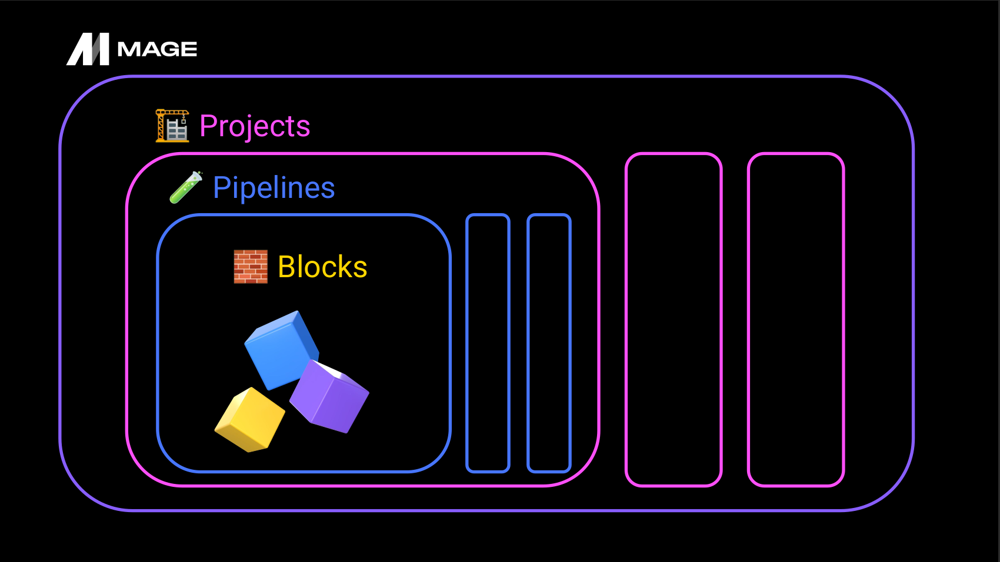

# Week 2: Workflow Orchestration

- **`This week`**: Workflow orchestration with [`Mage`](https://mage.ai/).

* [2.2.1 - 📯 Intro to Orchestration](#221----intro-to-orchestration)
* [2.2.2 - 🧙‍♂️ Intro to Mage](#222---%EF%B8%8F-intro-to-mage)
* [2.2.3 - 🐘 ETL: API to Postgres](#223----etl-api-to-postgres)
* [2.2.4 - 🤓 ETL: API to GCS](#224----etl-api-to-gcs)
* [2.2.5 - 🔍 ETL: GCS to BigQuery](#225----etl-gcs-to-bigquery)
* [2.2.6 - 👨‍💻 Parameterized Execution](#226----parameterized-execution)
* [2.2.7 - 🤖 Deployment (Optional)](#227----deployment-optional)
* [2.2.8 - 🧱 Advanced Blocks (Optional)](#228----advanced-blocks-optional)
* [2.2.9 - 🗒️ Homework](#229---%EF%B8%8F-homework)
* [2.2.10 - 👣 Next Steps](#2210----next-steps)

## Importante Code that is required in this Section
- `mage-ai-terraform-templates`: https://github.com/mage-ai/mage-ai-terraform-templates.git
- `Data Engineering Zoomcamp - Week 2 (mage-zoomcamp)`: https://github.com/mage-ai/mage-zoomcamp.git

## 2.2.1 What is Orchestration?
- Orchestration of what? The data workflow!
- Tool used: Mage

### What will be built?

- Running Mage and Postgres-Database inside a docker environment
- Taxi-Data is ingested and saved to Postgres and Google Cloud
- Taxi-Data, that is saved in the Google Cloud will be further transformed with tools like Pandas, Apache Arrow etc.
- The processed data can then be loaded to BigQuery 

### What is Orchestration? (Now really!)
- A process of dependency management, facilitated through automation
- The oragnized tools, on which the automated process relies on consists to a large part of extracting, transforming and loading data between sources.
- The data orchestrator manages scheduling, triggering, monitoring and ressource allocation between data sources

### What is Orchestration made of?
- Sequential steps / tasks
- Workflow / Pipeline (DAG := directed acyclic graphs)


- **Upper part**: Extract-Transform-Load (ETL)
- **Lower part**: What has to be considered in the entire lifecycle of Data engineering

### What does a *good* solution look like?
A good orchestrator handles:
- `Workflow management`: defining & scheduling of workflows efficiently, dependency management
- `Automation`: automates the orchestrated solution
- `Error handling`: not everything works 100% correctly from the beginning. Orchestrators have error-handling techniques for such cases.
- `Recovery`: Backfilling missing data, recover lost data etc.
- `Monitoring & Alerting`: If something happens, the orchestrator will send an alert
- `Resource optimization`: Manages where a job is executed. Optimizes best route for the execution.
- `Observability`: Every part of the data pipeline should able to be looked into to understand what is done.
- `Debugging`: Orchestrators should make this able in an easy way.
- `Compliance / Auditing`: Is made easy by having good observability

### A good orchestrator prioritizes ...
... Developer Experience:

- `Flow State`: Should make the flow between components / tools effortless and easy
- `Feedback Loop`: A developer shoud get a tangible feedback immediately
- `Cognitive Load`: The task at hand should be easy to understand and apply

## 2.2.2. What is Mage?

- Open-Source pipeline tool for orchestrating, transforming and integrating data

### Main concepts of Mage


**Core parts**

- `Projects`: contain Pipelines
- `Pipelines`: consists of Blocks
- `Blocks`: can be of type Export, Transform or Load

**Additional Block-Types**

- `Sensors`: Observe something and trigger on a specified envent
- `Conditionals`: Branching logic
- `Dynamics`: can create dynamic child-blocks
- `Webhooks`: For additional functionality

**Other relevant concepts**

- `Data Integration`
- `Unified Pipelines`
- `Multi-user envs`
- `Templating`

All those concepts make Mage easy to use

### Mage accelerates Pipeline developement

- **Hybrid Environment**
    - Use `Mage GUI` for interactive developement (or don't, use VS Code)
    - Use `Blocks` as testable, reusable pieces of code.

- **Improved DevEx**
    - Code and test in parallel
    - Reduce your dependencies, switch tools less abd be more efficient

### Engineering best-practices <u>built-in</u>
- **In-line testing and debugging**:
    - A familiar, notebook-style format
- **Fully-featured observability**
    - Transformation in one place: dbt models, streaming & more
- **DRY principles (Don't repeat yourself)**
    - No more DAGs with duplicate functions and weird imports DEaaS (Data Engineering as a Service)

### Overview of Mage-Structure


- **`Projects`**
    - A project forms the basis for all the work you can do in Mage you can think of it like a GitHub repo.
    - It contains the code for all of your pipelines, blocks, and other assets.
    - A Mage instance has one or more projects
- **`Pipelines`**
    - A pipeline is a workflow that executes some data operation maybe extracting, transforming, and loading data from an API. They're also called DAGs on other platforms.
    - In Mage, pipelines can contain Blocks (written in SQL, Python, or R) and charts.
    - Each pipeline is represented by a YAML file in the "pipelines" folder of your project. Similar to Terraform.

- **`Blocks`**
    - A block is a file that can be executed independently or within a pipeline.
    - Together, blocks form Directed Acyclic Graphs (DAGs), which we call pipelines.
    - A block won't start running in a pipeline until all its upstream dependencies are met.
    - Blocks are reusable, atomic pieces of code that perform certain actions.
    - Changing one block will change it everywhere it's used, but don't worry, it's easy to detach blocks to separate instances if necessary.
    - Blocks can be used to perform a variety of actions, from simple data transformations to complex machine learning models.

- **Anatomy of a Block**


## 2.2.2 Configure Mage (Very important)
In this section a special git-repo is provided. In there a Mage-Instance can be found that is started with docker-compose:
```bash
git clone https://github.com/mage-ai/mage-zoomcamp.git mage-zoomcamp
cd mage-zoomcamp
ls -la # will show dev.env
cp dev.env .env # to put secrets into & is in .gitignore

# Only running without building
docker-compose up

# Or just pulling the container from the registry
docker pull mageai/mageai:latest
```

- When a bunch of logs are showing, this indicates that the docker containers are running. 
- You can now access the Mage-GUI with http://localhost:6789/. 
- Similar to docker-compose, Mage is also configured with yaml-files ([io_config.yaml](mage-zoomcamp/magic-zoomcamp/io_config.yaml), [metadata.yaml](mage-zoomcamp/magic-zoomcamp/metadata.yaml)). 


## 2.2.3 - Configuring Postgres

- Defining parameters to use inside the `.env`-file (not pused to git)
- Postgres will be configured inside a docker-compose file.
- docker-compose passes variables to the Mage-Instance via [io_config.yaml](mage-zoomcamp/magic-zoomcamp/io_config.yaml)

The following part in [io_config.yaml](mage-zoomcamp/magic-zoomcamp/io_config.yaml) is parameterized by docker-compose:
```yaml
dev: # Dev profile added to the yaml-file
  # PostgresSQL
  POSTGRES_CONNECT_TIMEOUT: 10
  POSTGRES_DBNAME: "{{ env_var('POSTGRES_DBNAME') }}"
  POSTGRES_SCHEMA: "{{ env_var('POSTGRES_SCHEMA') }}"
  POSTGRES_USER: "{{ env_var('POSTGRES_USER') }}"
  POSTGRES_PASSWORD: "{{ env_var('POSTGRES_PASSWORD') }}"
  POSTGRES_HOST: "{{ env_var('POSTGRES_HOST') }}"
  POSTGRES_PORT: "{{ env_var('POSTGRES_PORT') }}"
```

To test the connection to Postgres a new pipeline will be created:
1. Create a Batch-pipeline with the name `test_pipeline`
2. Add a SQL-Transform block (using dev profile) with the content of
    ```sql
    SELECT 1;
    ```

If the SQL query goes through, it means that the connection to the Postrges database was successfull.

## 2.2.3 - ETL: API to Postgres

Goal of this section:
- Loading data from an API to the Postgres database
    - In this section it has the form of a compressed csv-file

For the new purposes a new pipeline has to be created:
1. <u>**Create new batch-pipeline**</u> with the name of `api_to_postgres`
2. <u>**Add a dataloader of type `Python` and `API`**</u>, name it `load_api_data` and adapt it for the taxi-dataset ([load_nyc_taxi_data.py](load_nyc_taxi_data.py))
    ```python
    import io
    import pandas as pd
    import requests
    if 'data_loader' not in globals():
        from mage_ai.data_preparation.decorators import data_loader
    if 'test' not in globals():
        from mage_ai.data_preparation.decorators import test

    @data_loader
    def load_data_from_api(*args, **kwargs):
        url = 'https://github.com/DataTalksClub/nyc-tlc-data/releases/download/yellow/yellow_tripdata_2021-01.csv.gz'

        taxi_dtypes = {
                        'VendorID': pd.Int64Dtype(),
                        'passenger_count': pd.Int64Dtype(),
                        'trip_distance': float,
                        'RatecodeID':pd.Int64Dtype(),
                        'store_and_fwd_flag':str,
                        'PULocationID':pd.Int64Dtype(),
                        'DOLocationID':pd.Int64Dtype(),
                        'payment_type': pd.Int64Dtype(),
                        'fare_amount': float,
                        'extra':float,
                        'mta_tax':float,
                        'tip_amount':float,
                        'tolls_amount':float,
                        'improvement_surcharge':float,
                        'total_amount':float,
                        'congestion_surcharge':float
                    }

        # native date parsing 
        parse_dates = ['tpep_pickup_datetime', 'tpep_dropoff_datetime']

        return pd.read_csv(
            url, sep=',', 
            compression='gzip', 
            dtype=taxi_dtypes, 
            parse_dates=parse_dates
        )


    @test
    def test_output(output, *args) -> None:
        """
        Template code for testing the output of the block.
        """
        assert output is not None, 'The output is undefined'

    ```
    - Providing the data-types of the data-columns is a best practice
        - Pipeline knows what to expect therefore fails if something wrong is provided (as intended)
        - By letting pandas know what to expect, the memory usage can be greatly reduced (can be significant for dataframes with millions of rows)
    - After applying the data loading step, the data will be able to be processed further (Load-part done!)

3. <u>**Add a Transform-block**</u> and name it `transform_taxi_data`
    - In this part, invalid data is removed (e.g. taxi rides with 0 passengers)
    - Functions that are decorated with `@test` are applied to the output of the `@transformer` decorated function
    ```python
    if 'transformer' not in globals():
        from mage_ai.data_preparation.decorators import transformer
    if 'test' not in globals():
        from mage_ai.data_preparation.decorators import test

    @transformer
    def transform(data, *args, **kwargs):
        # Removes rides with 0 passengers.
        print(f"Preprocessing: rows with 0 passengers: {data['passenger_count'].isin([0]).sum()}")
        return data[data["passenger_count"] > 0]

    @test
    def test_output(output, *args) -> None:
        assert output["passenger_count"].isin([0]).sum() == 0, "There are rides with 0 passengers"
    ```

4. <u>**Add a Data Exporter**</u> and name it `taxi_data_to_postgres`
    - *Type*: Python & PostgresSQL
    - This will save the processed taxi data to the postgres database specified in the dev-config from [io_config.yaml](mage-zoomcamp/magic-zoomcamp/io_config.yaml)
    ```python
    from mage_ai.settings.repo import get_repo_path
    from mage_ai.io.config import ConfigFileLoader
    from mage_ai.io.postgres import Postgres
    from pandas import DataFrame
    from os import path

    if 'data_exporter' not in globals():
        from mage_ai.data_preparation.decorators import data_exporter


    @data_exporter
    def export_data_to_postgres(df: DataFrame, **kwargs) -> None:
        schema_name = 'ny_taxi' 
        table_name = 'yellow_cab_data'
        config_path = path.join(get_repo_path(), 'io_config.yaml')
        config_profile = 'dev'

        with Postgres.with_config(ConfigFileLoader(config_path, config_profile)) as loader:
            loader.export(
                df,
                schema_name,
                table_name,
                index=False,
                if_exists='replace', # Avoiding appending data when running multiple times
            )
    ```

5. <u>**Create a Dataloader**</u> with the name `load_taxi_data`, to see if everything was saved to the database
    - Use `PostgresSQL`-connection and `dev`-profile
    ```sql
    SELECT
        *
    FROM 
        ny_taxi.yellow_cab_data
    LIMIT
        10;
    ```

## 2.2.4 - Configuring GCP

### TODO's in this section:
1. Create a GCP bucket in you project
    - Choose with unique name
    - Choose `Multi-region` with a region location of choice
    - `Storage class` can be set to `Standard`
    - `Access control` can stay uniform & public access prvention must be set
2. Create a new `Service Account` for Mage to connect to GCP
    - Name the service account `mage-zoomcamp`
    - Add as role `Owner` (ok for now)
    - Skip step 3
    - Open the create service account and create a `json` key
    - Copy the downloaded key to the `mage-zoomcamp` folder
    - `docker-compose.yaml` mounts the `mage-zoomcamp` folder to the docker container and makes the key available to Mage with `.:/home/src/`
3. Configuring Mage with the google service account key.
    - You can either replace the default values in `io_config.yaml` under `GOOGLE_SERVICE_ACC_KEY`
    or just give the path to the json-file with `GOOGLE_SERVICE_ACC_KEY_FILEPATH: "/home/src/your-key.json"`
    - Mage can now use Google-related tasks
4. Change the `PostgresSQL` block from the `test_config` pipeline to `BigQuery`
    - `Profile`: default
    - `Connection`: BigQuery
    - Check the checkbox `Use raw SQL`
    - Run the block!

    The result should look like this
    |   | **`f0_`** |
    | - | --------- |
    | 0 |     1     | 

The data-loader can now be deleted, since it was only used to test the connection to GCP and BigQuery!

### Getting the cleaned titanic dataset to GCP
- Execute the whole `example_pipeline` in the Mage-GUI to obtain the output csv-file `titanic_clean.csv`
- Uploadt the file into the previously created bucket
- Creating a new python-dataloder of `Google Cloud Storage`-type with name of `test_gcs` to load the uploaded titanic dataset from
- Set `bucket_name` to the name of your bucket + `object_key` name of file
- It should work now!

## 2.2.4 - ETL: API to GCS
- **`Previously`**: Writing taxi data to `Postgres`
- **`Now`**: Writing taxi data to `Google Cloud Storage`

### Steps of this Section
1. Create new batch pipeline
2. Drag and drop multiple blocks from other pipelines to the new pipeline
    - **Data Loader** `load_api_data.py`: Loads taxi data from local csv
    - **Transformer** `transform_taxi_data.py`
    - Connect loader-output to transformer-input
3. Create Python Data exporter to Google Cloud Storage (GCS) with name `taxi_to_gcs_parquet` (as one big file)
    - Provide bucket name (`bucket_name`) and output file name (`object_key`)
4. Ceate Python Data exporter to GCS, with generic template that splits large file in smaller ones
    - Connected in parralel to `taxi_to_gcs_parquet` with the output ot the data-transformer
    - `Pyarrow` used to partition dataset
    - Setting parameters for `pyarrow`:
    ```python
    # Tells pyarrow where the credentials are located
    os.environ["GOOGLE_APPLICATION_CREDENTIALS"] = "/home/src/gcp-key.json"

    bucket_name = 'mage-zoomcamp-dtc-de'
    project_id = 'dtc-de-project'

    table_name = "nyc_taxi_data"

    root_path = f"{bucket_name}/{table_name}"
    ```
    - Splitting strategy: by date
    - The custom data exporter function
    ```python
    @data_exporter
    def export_data(data, *args, **kwargs):
        # pyarrow can use the date to split the data
        data["tpep_pickup_date"] = data["tpep_pickup_datetime"].dt.date 

        table = pa.Table.from_pandas(data)
        gcs = pa.fs.GcsFileSystem()

        pq.write_to_dataset(
            table,
            root_path=root_path,
            partition_cols=["tpep_pickup_date"],
            filesystem=gcs
        )
    ```
    - Splitting of large datasets can help with the access speed of data, when data is processed

## 2.2.5 - ETL: GCS to BigQuery

**`Task`**: Take the data in GCS, process it and writint it to BigQuery

### Steps of this Section
1. Create a new batch pipeline in Mage
2. Create python (GCS) dataloader `load_taxi_gcs`
    - Use the big parquet file (set `bucket_name` & `object_id`)
    - Use pyarrow to load the partitioned parquet file
3. Transformation of the loaded data (standardization of columns) with generic python Transformer
    ```python
    ...
    @transformer
    def transform(data, *args, **kwargs):
        # remove spaces + everything lowercase
        data.columns = (
            data.columns
            .str.replace(" ", "_")
            .str.lower()
        )
        return data
    ...
    ```
4. Create SQL exporter with name of `write_taxi_to_bigquery`
    - Configuration of the block:
        - *Connection*: `BigQuery`
        - *Profile*: `default`
        - *Schema*: `ny_taxi`
        - *Table*: `yellow_cab_data`
    - Uploading to BigQuery with 
      ```sql
      SELECT * FROM {{ df_1 }};
      ```
    - The schema with the table will now be available in BigQuery inside the specified project

### Triggers in Mage
- Schedule workflows in Mage when `triggered`
- Has 3 types:
    - `Schedule`: pipeline runs continuously on an interval or once
    - `Event`: pipeline runs when specific event occurs
    - `API`: pipeline runs when API is called

- **Example**:
    - **Trigger Type**: Schedule
    - **Settings**:
        - `trigger_name`: gcs_to_bigquery_schedule
        - `Frequency`: daily
    - Save changes!
    - Enable trigger!

## 2.2.6 - Parameterized Execution

Is used when some part of the pipeline depends on some parameter (parameterized execution). 

**`Example use`**: Create a different file for each day when the job is been run. This should load only the relevant datasets for a specific date from the taxi dataset.
- Clone the `load_to_gcp` pipeline
- Rename pipeline to `load_to_gcp_parameterized`
- Remove the complex data exporter with `pyarrow` and retain the basic one
- Create a new block of tpye Python (Generic) and copy the code from the basic data exporter
```python
# Providing parameters is done over the kwargs-object
# Example: partition by day (save parquet files in folder that is named after the current day)

from mage_ai.settings.repo import get_repo_path
from mage_ai.io.config import ConfigFileLoader
from mage_ai.io.google_cloud_storage import GoogleCloudStorage
from pandas import DataFrame
from os import path

if 'data_exporter' not in globals():
    from mage_ai.data_preparation.decorators import data_exporter


@data_exporter
def export_data_to_google_cloud_storage(df: DataFrame, **kwargs) -> None:
    """
    Template for exporting data to a Google Cloud Storage bucket.
    Specify your configuration settings in 'io_config.yaml'.

    Docs: https://docs.mage.ai/design/data-loading#googlecloudstorage
    """

    now = kwargs.get("execution_date")
    now_fpath = now.strftime("%Y/%m/%d")


    config_path = path.join(get_repo_path(), 'io_config.yaml')
    config_profile = 'default'

    bucket_name = "mage-zoomcamp-dtc-de"
    object_key = f"{now_fpath}/daily-trips.parquet"

    GoogleCloudStorage.with_config(ConfigFileLoader(config_path, config_profile)).export(
        df,
        bucket_name,
        object_key,
    )
```
- Remove the old data exported and connect the new one
- Variables for the pipeline can be set in the variables section on the right side of the UI (`x=`)
- (Runtime) Variables can also be defined while defining a trigger

## 2.2.6 - Backfills
- Simulates executing the original DAG


**Example: Run a pipeline every day in an interval + give the date per `**kwargs`**
- Open arbitrary pipeline (e.g. `gcp_to_bigquery`)
- Got to Backfills and create a backfill over `Date and time window`
- Set a start- and end-date and set Interval Unit to 1

## 2.2.7 - Deployment Prerequisites
- Deploying Mage to GCP using Terraform

The AWS version can be found [here](AWS/AWS-Deployment.md). 

### Deployment (setting everything up)
- Install `terraform`
- Install `gcloud cli`
- Configuring `Google Cloud Permissions`
- Mage Terraform templates
    - Instead of writing the terraform script yourself

## 2.2.7 - Google Cloud Permissions
- The following roles have to be added to the Mage Service Account on GCP:
    - `Artifact Registry Reader`
    - `Artifact Registry Writer`
    - `Cloud Run Developer`
    - `Cloud SQL Admin`
    - `Service Account Token Creator`
- The roles are required for performing tasks in terraform later

## 2.2.7 - Deploying to Google Cloud Part 1
Confirm that google cloud is working and terraform is working as expected
- `Google cloud`:
```bash
# Add service acctount for authentification
gcloud auth activate-service-account --key-file=path/to/key.json --project=<project-name>
gcloud auth list
# List all available storages
gcloud storage ls
```

## 2.2.7 - Deploying to Google Cloud Part 2 
Spin up Mage Server on GCP with Mage Terraform-template
```bash
git clone https://github.com/mage-ai/mage-ai-terraform-templates.git
cd mage-ai-terraform-templates/gcp

# The usual terraform commands
terraform init
terraform fmt

# Adapting of `variables.tf` for your project
# Important: the region/zone, project_id

terraform plan
terraform apply
```

The created ressources should be accessible over cloud run.

## 2.2.8 - Homework

The homework can be found [here](homework/).

## 2.2.9 - Next Steps

### Recap
- How to use Mage
- Learned what Orchestration is
- Implement ETL-pipelines with Mage
- Schdeuling of pipelines

### Additional Ressources
- [Documentation](https://docs.mage.ai/introduction/overview)
- [Slack](https://www.mage.ai/chat)

### Next Steps
1. Deployment
2. Pipelines (other than `batch`)
    - Streaming
    - Data Integration
3. Alerting
4. Triggering & Scheduling

### Data Engineering Advice
1. Looking into the DataTalcs.Club resources
2. Personal Projects
3. Online resources / texts
4. Engaging with the Data Engineering community
    - Meetups
    - Conferences
    - LinkedIn
    - Blogs