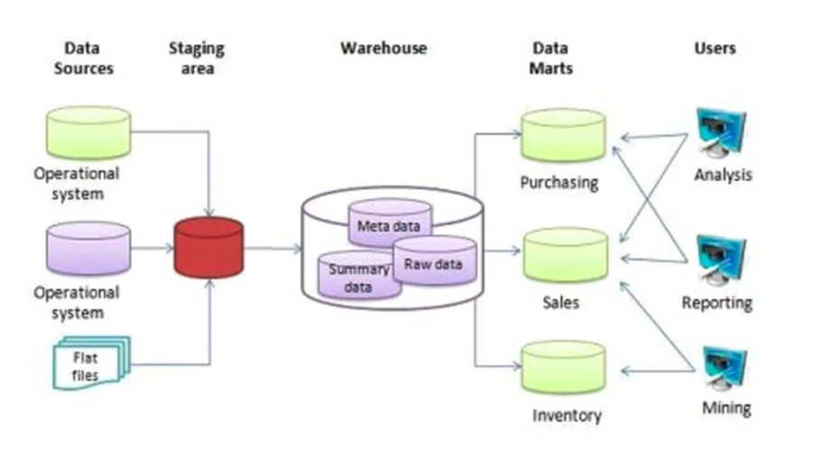

# Week 3: Data Warehouse and BigQuery

**Sections:**
- `3.1` [Data Warehouse & BigQuery](#data-warehouse)
- `3.2` [Partitioning and clustering](#partitioning-and-clustering)
- `3.3` [BigQuery best practices](#bigquery-best-practices)
- `3.4` [Internals of BigQuery](#internals-of-bigquery)
- `3.5` [BigQuery Machine Learning](#bigquery-machine-learning)
- `3.6` [Homework](#homework)

<a id="data-warehouse"></a>
## 3.1 Data Warehouse & BigQuery

## OLAP vs. OLTP


## What is a data warehouse?
- `OLAP` solution
- Used for reporting and data analysis



- Warehouse consists of 
    - Raw data
    - Meta data
    - Summary data

- Warehouses often have many data sources 

- Transforming Warehouse data makes them available in data marts, which user can access

### BigQuery

- **Serverless Data Warehouse**
     - No servers to manage or DB Software to install
- **Software as well as infrastructure including**
    - scalability (even to Petabyte) and high-availablity
- **Built-in features like**
    - Machine Learning
    - Geospatial Analysis
    - Business Intelligence
- BigQuery maximizes flexibility by sparating the compute engine that analyzes your data from the storage

Code of this sub-section:
- [big_query.sql](code/big_query.sql)

### Exploring BigQuery by querying public datasets

```sql
-- Query public available table
SELECT station_id, name FROM
    bigquery-public-data.new_york_citibike.citibike_stations
LIMIT 100;


-- Creating external table referring to gcs path
CREATE OR REPLACE EXTERNAL TABLE `taxi-rides-ny.nytaxi.external_yellow_tripdata`
OPTIONS (
  format = 'CSV',
  uris = ['gs://nyc-tl-data/trip data/yellow_tripdata_2019-*.csv', 'gs://nyc-tl-data/trip data/yellow_tripdata_2020-*.csv']
);

-- Check yello trip data
SELECT * FROM taxi-rides-ny.nytaxi.external_yellow_tripdata limit 10;

-- Create a non partitioned table from external table
CREATE OR REPLACE TABLE taxi-rides-ny.nytaxi.yellow_tripdata_non_partitoned AS
SELECT * FROM taxi-rides-ny.nytaxi.external_yellow_tripdata;
```

### BigQuery costs
- On demand pricing
    - 1 TB of data processing is $5
- Flat rate pricing
    - Based on number of pre-requested slots
    - 100 slots $\rightarrow$ $2,000/month = 400 TB data processed on demand pricing

### Create an external table
- Data already in the cloud. Imported from external source (new york taxi data)

### Partitioning in BigQuery
- Dividing a table by a certain key (e.g. the date)
- Can imporove BigQuery performance by only loading data that is required for a specified key (like the date)


```sql
-- Create a partitioned table from external table
CREATE OR REPLACE TABLE taxi-rides-ny.nytaxi.yellow_tripdata_partitoned
PARTITION BY
  DATE(tpep_pickup_datetime) AS
SELECT * FROM taxi-rides-ny.nytaxi.external_yellow_tripdata;

-- Impact of partition
-- Scanning 1.6GB of data
SELECT DISTINCT(VendorID)
FROM taxi-rides-ny.nytaxi.yellow_tripdata_non_partitoned
WHERE DATE(tpep_pickup_datetime) BETWEEN '2019-06-01' AND '2019-06-30';

-- Scanning ~106 MB of DATA
SELECT DISTINCT(VendorID)
FROM taxi-rides-ny.nytaxi.yellow_tripdata_partitoned
WHERE DATE(tpep_pickup_datetime) BETWEEN '2019-06-01' AND '2019-06-30';

-- Let's look into the partitons
SELECT table_name, partition_id, total_rows
FROM `nytaxi.INFORMATION_SCHEMA.PARTITIONS`
WHERE table_name = 'yellow_tripdata_partitoned'
ORDER BY total_rows DESC;
```


### Clustering in BigQuery
- Like regular partitioning but with more criteria to partition (e.g. date & tag)


```sql
-- Creating a partition and cluster table
CREATE OR REPLACE TABLE taxi-rides-ny.nytaxi.yellow_tripdata_partitoned_clustered
PARTITION BY DATE(tpep_pickup_datetime)
CLUSTER BY VendorID AS
SELECT * FROM taxi-rides-ny.nytaxi.external_yellow_tripdata;

-- Query scans 1.1 GB
SELECT count(*) as trips
FROM taxi-rides-ny.nytaxi.yellow_tripdata_partitoned
WHERE DATE(tpep_pickup_datetime) BETWEEN '2019-06-01' AND '2020-12-31'
  AND VendorID=1;

-- Query scans 864.5 MB
SELECT count(*) as trips
FROM taxi-rides-ny.nytaxi.yellow_tripdata_partitoned_clustered
WHERE DATE(tpep_pickup_datetime) BETWEEN '2019-06-01' AND '2020-12-31'
  AND VendorID=1;
```

<a id="partitioning-and-clustering"></a>
## 3.2 Partitioning and clustering

### BigQuery partition

Partitions can be created by choosing on of the following types
- Time-unit column
- Ingestion time (_PARTITIONTIME)
- Integer range partitioning
- When using Time unit or ingestion time, you can choose between
  - Daily (Default)
  - Hourly
  - Monthly
  - Yearly
- Number of partition limit is 4000
  - Partitions can expire to free some partition-resources

### BigQuery Clustering (1)
- Columns you specify are used to colocate related data
- Order of the column is important
- The order of the specified columns determines the sort order of the data
- Clustering improves
  - Filter queries
  - Aggregate queries
- Table with size < 1GB dont show significant improvement with partitioning and clustering
  - Due to the requirement of additional meta-data reads and maintenance this could be a costly operation to do (for "Small"-data)
- You can specify up to 4 clustering columns

### BigQuery Clustering (2)

Clusterign columns must be top-level, non-repeated columns
- `DATE`
- `BOOL`
- `GEOGRAPHY`
- `INT64`
- `NUMERIC`
- `BIGNUMERIC`
- `STRING`
- `TIMESTAMP`
- `DATETIME`

### Partitioning vs. Clustering


| **`Clustering`** | **`Partitioning`** |
| ---------------- | ------------------ |
| Cost benefit unknown | Cost known upfornt | 
| You need more granularity than partitioning alone allows| You need partition-level management |
| Your quereies commonly use filters or aggragation against *multiple particular columns* | Filter or agragate on *single column* | 
| The cardinality of the number of values in a column or group of columns is large | | 

### When to choose Clustering over Partitioning
- Partitioning results in a small amount of data per partition (approx. < 1 GB)
- Partitioning results in a large number of partitions beyond the limits on partitioned tables
- Partitioning results in your mutation operations modifying the majority of partitions in the table frequently (for example, every few minutes)

### Automatic reclustering

As data is added to a clustered table
- Newly inserted data can be written to blocks that contain key ranges that overlap with the key ranges in previously written blocks
- These overlapping keys weaken the sort property of the table

To maintain the performance characteristics of a clustered table
- BigQuery  performs automatic re-clustering in the background to restore the sort property of the table
- For partitioned tables, clustering is maintained for data within the scope of each partition

<a id="bigquery-best-practices"></a>
## 3.3 BigQuery best practices for ...

### ... Cost Reduction
- Avoid `SELECT *`
- Price your queries before running them
- Using clustered or partitioned tables
- Using streaming inerts with caution
- Materializes query results in stages

### ... Query Performance
- Filter on partitioned columns
- Denormalizing data
- Use nested or repeated columns
- Use external data sources appropriatley
  - Don't use it, in case you want a high query performance
- Reduce data before using a `JOIN`
- Do not treat `WITH` clauses as prepared statements
- Avoid oversharding tables
- Avoid JavaScript user-defined functions
- Use approximate aggregation functions (HyperLogLog++)
- Order-statements should be the Last part of the query operation to maximize performance
- Optimize your `JOIN` patterns
  - `First table`: Largest table in terms of rows
  - `Second table`: talbe with the fewest rows
  - Then all other tables ordered by decreasing size

<a id="internals-of-bigquery"></a>
## 3.4 Internals of BigQuery

- Is not necessary for using BigQuery, but benefitial if you want to build a data-product in the future
- Internals of a Data Warehouse solution

### Internals


- `Colossus`
  - Cheap storage that stores data in columnar format (is separated from "Compute")
- `Jupiter network`
  - connects Collossus storage with Compute that are, which are on separate hardware
  - Connection is very fast and incures basically no delays
- `Dremel`
  - The query execution-engine
  - Divides query into a tree structure and seperates it so that each node of the tree can be executed seperately 

### Column-oriented Storage


- `Record-Oriented Storage`: Is efficient for small relations and large retrievals, making it good for Online Transactional Processing (OLTP) applications. However, it’s not efficient for selective retrieval and sorting, and it’s not suitable for volatile tables.

- `Column-Oriented Storage`: Offers high data compression rates and quick data lookup, making it optimized for read operations. However, its performance for update and insert operations is not as good as row tables.


In this tree the root server is the root-element. 
- The root-server recieves the original query, understands it and divides it into smaller sub-modules (modified queries). 
- The `Mixer`-nodes further sub-divide the queries into subsets of queries. 
- The Leaf-Nodes are the queries that are used to "talk" to the Colossus data-storage
- Query results are propagated from the leafs to the root and aggregated the final result `R`
- The intielligent subdivision of the original Query by BigQuery makes the usage fast
 
<a id="bigquery-machine-learning"></a>
## 3.5 BigQuery Machine Learning

- **Required**: ML & SQL
- **Not Required**: Python, Java, ...

**In this section**:
- Building a model 
  - Done in the Data Warehouse itself
  - No exporting of data, training and deploying required
- Exporting it and running it with docker


### Pricing for ML in BigQuery
- `Free`
  - 10GB per Month of data storage
  - 1TB per Month of queries processed
  - ML Create model step: First 10 GB per Month are free
- `Non Free` pricing
  - $250.00 per TB
    - Logistic regression model creation
    - Linear regression model creation
    - K-means model creation
  - $5.00 per TB + Vertex AI training cost
    - AutoML Tables model creation
    - DNN model creation
    - Boosted tree model creation

### Steps of Machine Learning Developement


BigQuery can help in all steps of the Machine Learning process. It can help in:
- Feature engineering + has automatic feature engineering
- Splitting the data in Training-, Validation- and Test-Data
- Choosing differnt ML aclorithms
- (Hyper-)Parameter tuning
- Evaluating the model with different metrics
- Deploying the ML-model with docker

### Choosing what to use


### Linear Regression model in BigQuery

Code of this subsection: [big_query_ml.sql](code/big_query_ml.sql)

Task for the ML model: Predicting tip of a trip

**Feature-preprocessing**
- [Manual feature-preprocessing](https://cloud.google.com/bigquery/docs/manual-preprocessing)
- [Automatic feature-preprocessing](https://cloud.google.com/bigquery/docs/auto-preprocessing)


Obtaining the table that is used for further computations:
```sql
-- SELECT THE COLUMNS INTERESTED FOR YOU
SELECT 
  passenger_count, trip_distance, PULocationID, DOLocationID, 
  payment_type, fare_amount, tolls_amount, tip_amount
FROM 
  `taxi-rides-ny.nytaxi.yellow_tripdata_partitoned` 
WHERE 
  fare_amount != 0; 
```

Casting columns of the table to appropriate types s.t. BigQuery can apply the correct transformation in automated feature-preprocessing
  - `PULocationID` and `DOLocationID` were previously represented as `INTEGER` but are really categorical features. To achieve this, the features are cast to `STRING`.
  - One-Hot Encoding will be applied to the 2 features 
```sql
-- CREATE A ML TABLE WITH APPROPRIATE TYPE
CREATE OR REPLACE TABLE `taxi-rides-ny.nytaxi.yellow_tripdata_ml` (
    `passenger_count` INTEGER,
    `trip_distance` FLOAT64,
    `PULocationID` STRING,
    `DOLocationID` STRING,
    `payment_type` STRING,
    `fare_amount` FLOAT64,
    `tolls_amount` FLOAT64,
    `tip_amount` FLOAT64
) AS (
    SELECT 
      passenger_count, 
      trip_distance, 
      CAST(PULocationID AS STRING), 
      CAST(DOLocationID AS STRING),
      CAST(payment_type AS STRING), 
      fare_amount, 
      tolls_amount, 
      tip_amount
    FROM `taxi-rides-ny.nytaxi.yellow_tripdata_partitoned` WHERE fare_amount != 0
);
```


Creating a model with:
- `Type`: Linear Regression
- `Target-Variable`: tip_amount
- Splitting the data automatically
- `Input-data`: taxi-rides-ny.nytaxi.yellow_tripdata_ml
```sql
-- CREATE MODEL WITH DEFAULT SETTING
CREATE OR REPLACE MODEL `taxi-rides-ny.nytaxi.tip_model`
OPTIONS
    (model_type='linear_reg',
    input_label_cols=['tip_amount'],
    DATA_SPLIT_METHOD='AUTO_SPLIT') AS
SELECT
    *
FROM
    `taxi-rides-ny.nytaxi.yellow_tripdata_ml`
WHERE
    tip_amount IS NOT NULL;
```

Getting feature-informations from the model:
- Statistical information about each feature (categorical or continuous)

```sql
-- CHECK FEATURES
SELECT * FROM ML.FEATURE_INFO(MODEL `taxi-rides-ny.nytaxi.tip_model`);
```

Evaluation of the trained model returns a list of evaluation metrics:
- `mean_absolute_error`
- `mean_squared_error`
- `mean_squared_log_error`
- `median_absolute_error`
- `r2_score`
- `exlained_variance`

The metrics can be used for optimiyzation of a model.

```sql
-- EVALUATE THE MODEL
SELECT
    *
FROM
    ML.EVALUATE(MODEL `taxi-rides-ny.nytaxi.tip_model`,
        (
        SELECT
            *
        FROM
            `taxi-rides-ny.nytaxi.yellow_tripdata_ml`
        WHERE
            tip_amount IS NOT NULL
));
```

Using the model for predicting the tip-amount of input-features:

```sql
-- PREDICT THE MODEL
SELECT
    *
FROM
    ML.PREDICT(MODEL `taxi-rides-ny.nytaxi.tip_model`,
        (
        SELECT
            *
        FROM
            `taxi-rides-ny.nytaxi.yellow_tripdata_ml`
        WHERE
            tip_amount IS NOT NULL
));
```

Returns the predictions + tells you what the top features are in the dataset:
```sql
-- PREDICT AND EXPLAIN
SELECT
    *
FROM
    ML.EXPLAIN_PREDICT(MODEL `taxi-rides-ny.nytaxi.tip_model`,
        (
        SELECT
            *
        FROM
            `taxi-rides-ny.nytaxi.yellow_tripdata_ml`
        WHERE
            tip_amount IS NOT NULL
), STRUCT(3 as top_k_features));
```

Optimizes linear regression:
- Paramers for Hyperparameter search have to be given
- Documentation-Reference with other options: [Link](https://cloud.google.com/bigquery/docs/reference/standard-sql/bigqueryml-syntax-create-glm)
```sql
-- HYPER PARAM TUNNING
CREATE OR REPLACE MODEL `taxi-rides-ny.nytaxi.tip_hyperparam_model`
OPTIONS
    (model_type='linear_reg',
    input_label_cols=['tip_amount'],
    DATA_SPLIT_METHOD='AUTO_SPLIT',
    num_trials=5,
    max_parallel_trials=2,
    l1_reg=hparam_range(0, 20),
    l2_reg=hparam_candidates([0, 0.1, 1, 10])) AS
SELECT
    *
FROM
    `taxi-rides-ny.nytaxi.yellow_tripdata_ml`
WHERE
    tip_amount IS NOT NULL;
```

### BigQuery Machine Learning Deployment

Deploying a trained Machine Learning model with docker

#### Model Deployment
[Tutorial](https://cloud.google.com/bigquery/docs/exporting-models)

#### Steps to deploy the model

```bash
# Authenticate to Google cloud
gcloud auth login
# Export the project to google cloud storage (`taxi_ml_model` should be in GCS)
bq --project_id taxi-rides-ny extract -m nytaxi.tip_model gs://taxi_ml_model/tip_model
# Create folder to save the model to
mkdir /tmp/model
# Copying the model to the temp-model folder
gsutil cp -r gs://taxi_ml_model/tip_model /tmp/model
# Creae a serving directory (model-version: 1)
mkdir -p serving_dir/tip_model/1
# Copy tip-model data to the serving directory
cp -r /tmp/model/tip_model/* serving_dir/tip_model/1
# Get the tf-serving docker-image
docker pull tensorflow/serving
# Deploy the model with docker
docker run \
  -p 8501:8501 \
  --mount type=bind,source=`pwd`/serving_dir/tip_model,target=/models/tip_model \
  -e MODEL_NAME=tip_model \
  -t tensorflow/serving &

# Send a sample with a POST request to the deployed model
curl -d '{"instances": [{"passenger_count":1, "trip_distance":12.2, "PULocationID":"193", "DOLocationID":"264", "payment_type":"2","fare_amount":20.4,"tolls_amount":0.0}]}' -X POST http://localhost:8501/v1/models/tip_model:predict

# Address of the deployed model
http://localhost:8501/v1/models/tip_model
```

<a id="homework"></a>
## 3.6 Homework
The homework questions and solutions can be found [here](homework/). 