# Week 4: Analytics Engineering

## 4.1.1 - Analytics Engineering Basics

### 1 - What ist `Analytics Engineering`

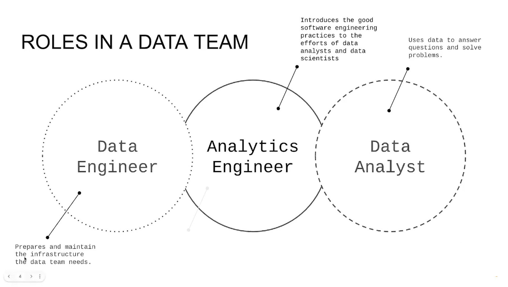

### Tooling

- Relevant sections of the tooling are here:
    - Data Modleing
    - Data Presentation

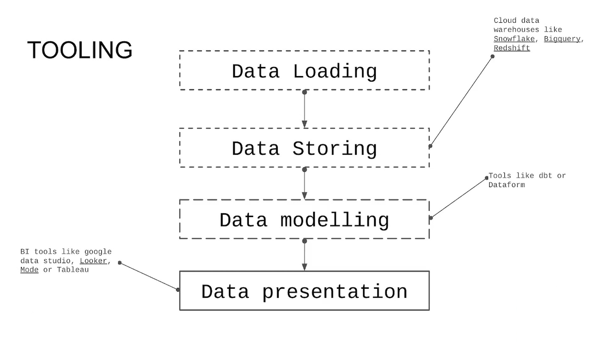


### 2 - Data Modeling Concepts

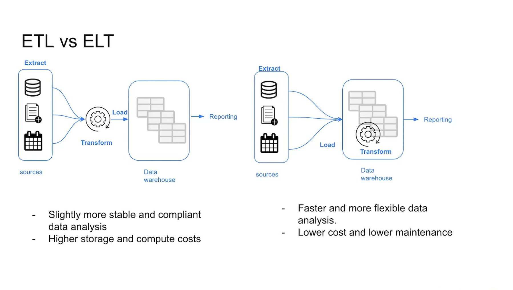

**ETL (Extract, Transform, Load)**
1. `Extract` data from source
2. `Transform` the data
3. `Load` data to data warehouse

Properties of ETL:
- Longer to implement, due to the requirement to transform the data
- More stable and compliant data, because the data is "clean"


**ELT (Extract, Load, Transform)**
1. `Extract` data from source 
2. `Load` data to data warehouse
3. `Transform` the data in the data warehouse

Properties of ETL:
- Faster and more flexible, since data is already loaded in the data warehouse after extraction
- Data warehouse usually cheaper than storing the data locally


### Kimball's Dimensional Modeling

**Objective**
- Deliver data understandable to a business user
- Deliver fast query performance

**Approach**: Prioritize user understandability and query performance over non-redundant data (3NF)

**Other approaches**
- Bill Inmon
- Data Vault

### Elements of dimensional modeling

**Facts tables**
- Measurements, metrics or facts about a business
- Correspond to a *business process*
- Like "Verbs"
- *Dimensions* provide context to the fact table

**Dimensions tables**
- Corresponds to a business *entity*
- Provides context to a business process
- Like "Nouns" (*customer*, *product*, ...)


### Architecture of Dimensional Modeling

**Analogy**: From buying ingredients to serving food at a resturant

- **`Stage Area`** (Buying ingredients)
    - Contains new raw data
    - Not meant to be exposed to everyone

- **`Processing Area`** (Cooking ingredients)
    - From raw data to data models
    - Focusses on efficiency
    - Ensuring standards

- **`Presentation Area`** (Serving food)
    - Final presentation of the data
    - Exposure to business stakeholder

## 4.1.2 - What is `dbt`?

`dbt` is a transformation workflow, that allows anyone that knows SQL or Python to deploy analytics code, following software engineering best practices like modularity, portability, CI/CD and documentation.

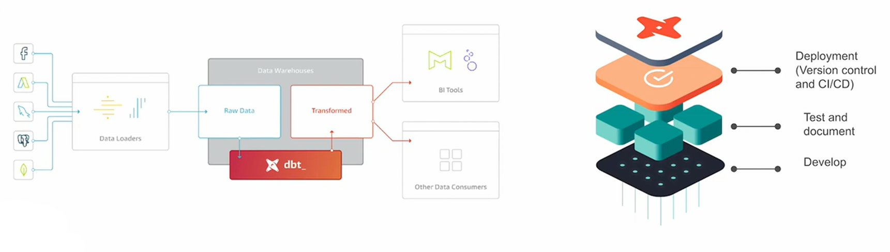

- Sits on top of Data Warehouse
- Helps to transform the data to something presentablev e.g. with BI Tools or data comsumers (other applications)

### How does `dbt` work?

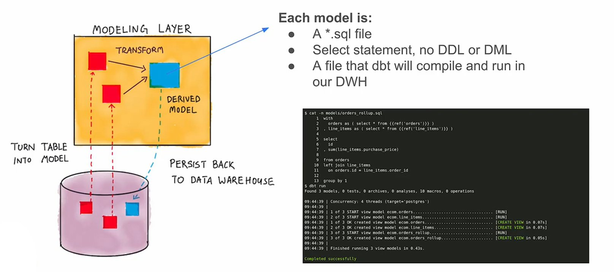

### How to use `dbt`?

**`dbt Core`**
-  Open-source project that allows the data transformation
- Builds and runs a dbt project (`.sql` and `.yml` files)
- Introduces SQL compilation logic, macros and database adapters
- Includes a CLI interface to run dbt commands locally
- FOSS

**`dbt Cloud`**: SaaS application to develop and manage dbt projects
- Web-based IDE and cloud CLI to develop, run and test dbt project
- Managed environment
- Jobs orchestration
- Logging and Alerting
- Integrated documentation
- Admin and metadata API
- Semtantic Layer

### How are we going to use `dbt`?

**BigQuery**
- Development using Cloud IDE
- No local installation of `dbt core`

**Postgres**
- Development using local IDE of your choice
- Local installation of `dbt core` connecting to the Postgres database
- Running `dbt models` throught the CLI

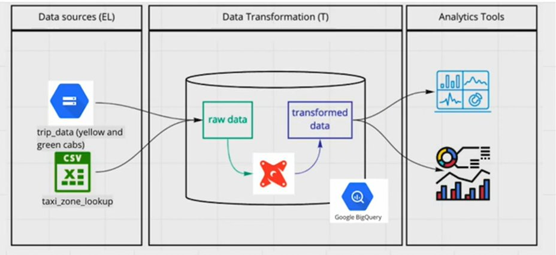

## 4.2.1 - Start Your dbt Project: BigQuery and dbt Cloud (Alternative A)

### Create a new `dbt` project

`dbt` provides a starte project with a basic structure to ubild upon. 
- Repo: https://github.com/dbt-labs/dbt-starter-project
- Local adapted version: [dbt_project.yml](code/dbt_project.yml)

There are 2 ways to use the starte project:
- **With the `CLI`**
    - After havin installed `dbt` locally and setup the `profiles.yml`, run `dbt init` in the path we want to start the project to clone the starter project
- **With `dbt cloud`**
    - After having set up the dbt cloud credentials (repo and data warehouse) we can start a project from the web-based IDE

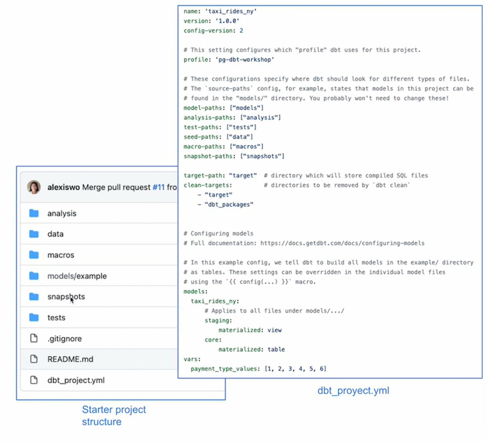

###  Project Setup

- Create a free `dbt`-account on https://www.getdbt.com/
- **Create a new project**:
    - Name the project
    - Choose connection (here: BigQuery)
    - Establish the connection between dbt and BigQuery by importing the json-key from an adequate service account


## 4.2.2 - Start Your dbt Project: Postgres and dbt Core Locally (Alternative B)

`Prerequisite`: Installing dbt locally 
```bash
pip install dbt-core dbt-postgres dbt-bigquery
```
This will install the postgres and BigQuery adapter for dbt. For more adapter for other services please refer to the documentation [here](https://docs.getdbt.com/docs/core/pip-install).

### Creating a dbt-project locally:

- Create a `profiles.yml`
    - Stores informations about different dbt projects in one single file
```bash
mkdir ~/.dbt
touch ~/.dbt/profiles.yml
```

Example:
```yml
pg-dbt-workshop: # Postgres
  target: dev
  outputs:
    dev:
      type: postgres
      host: localhost
      user: my_user 
      password: my_password
      port: 5432
      dbname: production
      schema: dbt_schema
      threads: 4
      keepalives_idle: 0 # default 0, indicating the system default
bg-de-zoomcamp: # BigQuery
  target: dev
  outputs:
    dev:
      type: bigquery
      method: service-account
      project: taxi-rides-ny
      dataset: dbt_ds
      threads: 4
      keyfile: my_key_file.json
```

Run `dbt init` in the folder you want to want the dbt project.


## 4.3.1 - Build the First dbt Models

### `dbt` Overview

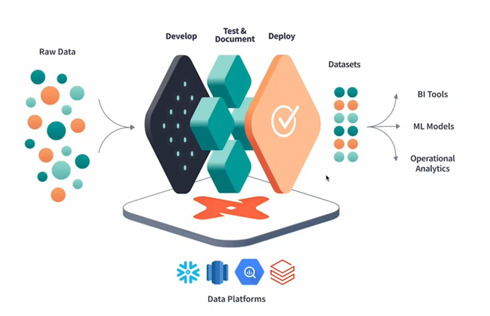

- `dbt` sits on top of a given platform like BigQuery, Postgres, Snowflake, Redshift, Databricks etc.

### Modular Data Modeling

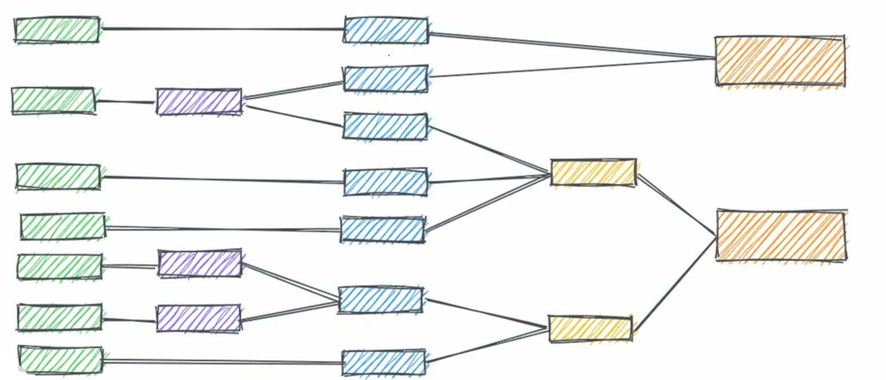

- `Green`: loaded tables (e.g. the trips data) from our sources
- `Purple`, `Blue`, `Yellow`: Transformations (SQL scripts) can be ...
    - Data Cleaning
    - Recasting / Renaming
    - Creating tables relevant for business logic
    - ...

### Anatomy of a `dbt` model

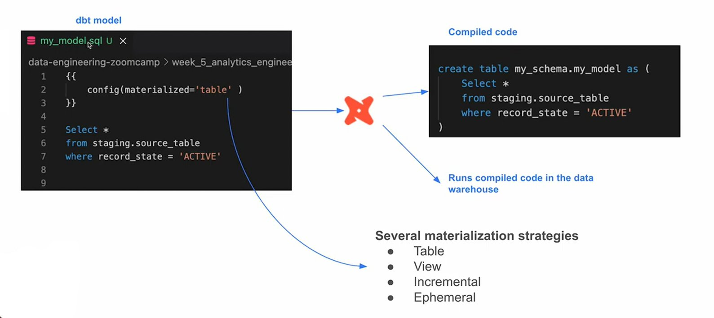

- dbt models are SQL scripts that have the name of the model (e.g. `my_model.sql`)

### Materializations in dbt Cloud


### Modular Data Modeling (2)

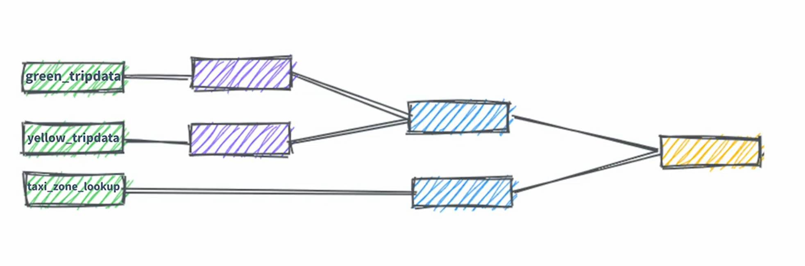

Input tables with data

### The `FROM` clause of a dbt model

**Sources**:

- The data loaded to our data warehouse that we use as sources for our models
- Configuration defined in the `yml` files in the models folder
- Used with the source macro that will resolve the name to the right schema, plus build the dependencies automatically
- Source freshness can be defined and tested

**Seeds**:

- `CSV` files stored in our repository under the seed folder
- Benefits of version controlling
- Equivalent to a copy command
- Recommended for data that does not change frequently
- Runs with `dbt seed -s file_name`

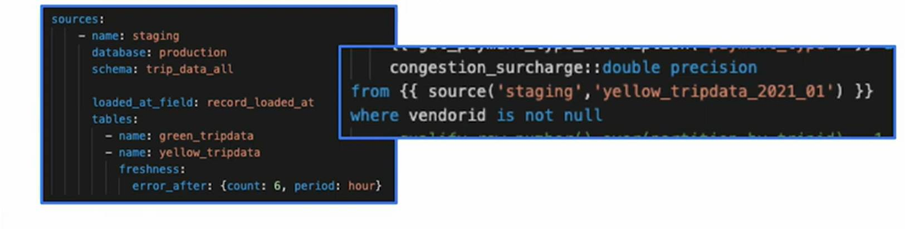


### Modular Data Modeling (3)

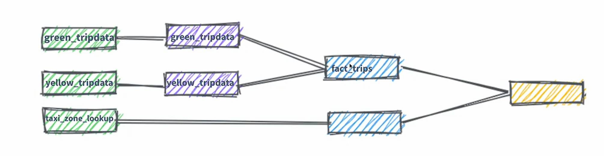

After transforming (e.g. data cleaning) the data with the `purple` the data will be coposed to the `fact_trips` table 

### The `FROM` clause of a dbt model (2)

**Ref**:

- Macro to reference the underlying tables and views that were building the data warehouse
- You can run the same code in any environment. It will resolve the correct schema for you
- Dependencies are built automatically

**`dbt model`**
```sql
WITH green_data AS (
    SELECT 
        *,
        'Green' AS service_type
    FROM 
        {{ ref('stg_green_tripdata') }}
),
...
```

**`compiled code`**
```sql
WITH green_data AS (
    SELECT
        *,
        'Green' AS service_type
    FROM
        "production"."dbt_data"."stg_green_tripdata"
),
...
```

### Creating a new project with taxi data
Watch this [video](https://youtu.be/ueVy2N54lyc?si=Jcnu3Msx4zlJmu0v&t=600) for instructions how to build the project,

**`Pre-Requisites`**:
- Having a GCP account with BigQuery dwh that contains the following:
    - **dataset**: `taxi-rides-ny-<ID>`
        - **schema**: `trips_data_all`
            - **table**: `green_tripdata`
            - **table**: `yellow_tripdata`

**`Steps`**:
1. Create `staging`-directory in the `models`-dir.
2. Create `staging/schema.yml`
    ```yml
    version: 2

    sources:
      - name: staging
        database: taxi-rides-ny-<ID>
        schema: trips_data_all

        tables:
            # Generate Model (Clickable)
          - name: green_tripdata
            # Generate Model (Clickable)
          - name: yellow_tripdata
    ```
    - `Generate Model` creates a SQL script for each table in the specified sources
    - Changes only have to be made in the `schema.yml`, since generated files are parameterized by this configuration
3. Move the generated sql-files to the `staging` folder one level up (before: `staging/staging/*.sql`) & rename them to `stg_green_tripdata.sql` / `stg_yellow_tripdata.sql`
4. Build the whole project, with the command line at the bottom of the IDE with `dbt build`
5. Delete the `models/example`-folder (build errors are casued by it in step 4)

### Macros (will be used in the next steps)
- Use control structures (e.g. if statements and for loops) in SQL
- Use environment variables in your dbt project for production deployments
- Operate on the results of one query to generate another query
- Abstract snippets of SQL into reusable macros - These are analogous to functions in most programming languages

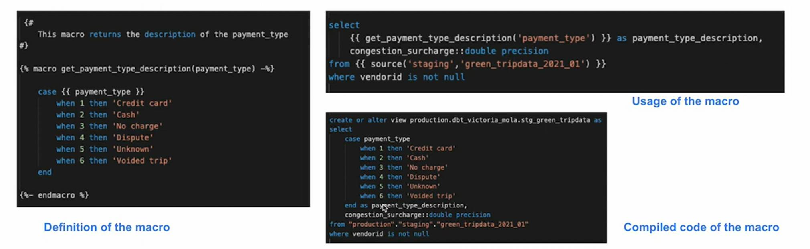

6. **Macros**: Create new file in the `macros`-folder with the name `get_payment_type_description.sql` and use the following code:
    ```sql
    {#
    This macro returns the description of the payment_type 
    #}

    

        case {{ dbt.safe_cast("payment_type", api.Column.translate_type("integer")) }}  
            when 1 then 'Credit card'
            when 2 then 'Cash'
            when 3 then 'No charge'
            when 4 then 'Dispute'
            when 5 then 'Unknown'
            when 6 then 'Voided trip'
            else 'EMPTY'
        end

    
    ```
    - Trying out the macro in `stg_green_tripdata.sql` by adding the following to the `SELECT` statement
    ```sql
    {{ get_payment_type_description(payment_type) }} as get_payment_type_descripted,
    ```
    - By clicking on compile for the current file you can see, what the file looks like when the macro is inserted and resolved

### Packages

- Like libraries in other programming languages
- Standalone dbt projects, with models and macros that tackle a specific problem area
- By adding a package to your project, the package's models and macros will become part of your own project.
- Imported in the **`packages.yml`** file and imported by running `dbt deps`
- A list of useful packages can be found in [dlt package hub](https://hub.getdbt.com/)

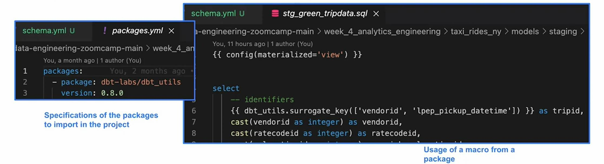

7. **Packages**: Create `packages.yml` file in the root of the project and insert the following package
   ```yml
    packages:
      - package: dbt-labs/dbt_utils
        version: 1.1.1
   ```
   - Link: https://github.com/dbt-labs/dbt-utils
8. Run `dbt deps` to import the packages specified in the file
9. Create a hashed surrogate key for each entry an add the call into the staged sql-scripts as the first "column"
   ```sql
   select
   -- Green taxis (stg_green_tripdata.sql)
   {{ dbt_utils.generate_surrogate_key(['vendorid', 'lpep_pickup_datetime']) }} as tripid, 
   ...

   select
   -- Yellow taxis (stg_yellow_tripdata.sql)
   {{ dbt_utils.generate_surrogate_key(['vendorid', 'tpep_pickup_datetime']) }} as tripid,
   ...
   ```
   - Compile and build `stg_green_tripdata.sql` / `stg_yellow_tripdata.sql` to see the resulting code and create views for both tables

10. Replace the code of `stg_green_tripdata.sql` / `stg_yellow_tripdata.sql` with the "final" code from the repository of the course
    - [stg_green_tripdata.sql](https://github.com/DataTalksClub/data-engineering-zoomcamp/blob/main/04-analytics-engineering/taxi_rides_ny/models/staging/stg_green_tripdata.sql)
    - [stg_yellow_tripdata.sql](https://github.com/DataTalksClub/data-engineering-zoomcamp/blob/main/04-analytics-engineering/taxi_rides_ny/models/staging/stg_yellow_tripdata.sql)

### Variables

- Variables are useful for defining values that should be used across the project
- With a macro, dbt allows us to provide data to models for compilation
- To use a variable we use the `{{ var('...') }}` function
- Variables can be defined in two ways:
    - In the `dbt_project.yml` file
    - On the command line

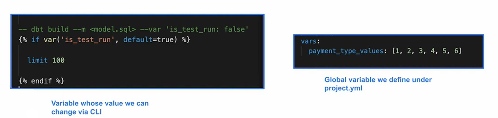

**Example** (from [stg_green_tripdata.sql](https://github.com/DataTalksClub/data-engineering-zoomcamp/blob/main/04-analytics-engineering/taxi_rides_ny/models/staging/stg_green_tripdata.sql)):  
```sql
-- dbt build --select <model_name> --vars '{'is_test_run': 'false'}'


  limit 100


```
Lets see what the code does

11. Compile and build both staged sql scripts, then look at the logs (Detailed)
12. Try out the case where `is_test_run` is false (the code with `LIMIT` is gone in the logs)
```bash
dbt build --select stg_green_tripdata --vars '{'is_test_run': 'false'}'
``` 

13. Create the `fact_trips`-table from the data that is available:


14. Create `core`-directory in the `model`-folder
15. Add `dim_zones.sql` to the folder
    ```sql
    {{ config(materialized='table') }}

    select 
        locationid, 
        borough, 
        zone, 
        replace(service_zone,'Boro','Green') as service_zone 
    from {{ ref('taxi_zone_lookup') }}
    ```
16. Under the `seeds`-directory create or import the [`taxi_zome_lookup.csv`](https://github.com/DataTalksClub/data-engineering-zoomcamp/blob/main/04-analytics-engineering/taxi_rides_ny/seeds/taxi_zone_lookup.csv)

17. Create the `fact_trips.sql` table in `models/core`
    - This should be a table and not a view. This is because the data is near the BI-Tool and should be performant. 
    - The code can be found [here](https://github.com/DataTalksClub/data-engineering-zoomcamp/blob/main/04-analytics-engineering/taxi_rides_ny/models/core/fact_trips.sql)

You now have the following graph for your dbt model:

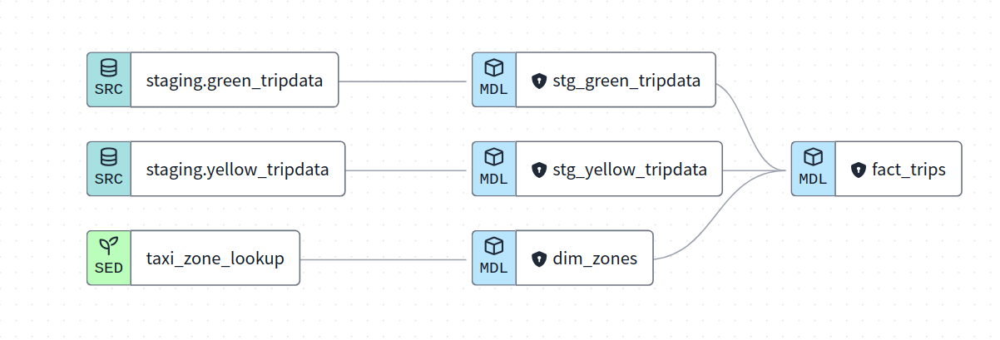
Components of this graph / pipeline can be run independently and later be used in the final results. An example is to build everything with:
- `Build +model+ (Up/Downstream)` which results in `dbt build --select +fact_trips+`


### Final execution of the model
Finally run the following command to fully execute the full dbt model:

```bash
dbt build --select +fact_trips+ --vars '{'is_test_run': 'false'}'
```

## 4.3.2 - Testing and Documenting the Project

To avoid to have a model that was build upon incorrect data `dbt` Tests are used

### Tests

- Assumptions that we make about our data
- Tests in `dbt` are essentially a `SELECT` sql query
- These assumptions get compiled to sql that returns the amount of failing records
- Tests are defined on a column in the `.yml` file
- dbt provides basic tests to check if the column values are:
    - `UNIQUE`
    - `NOT NULL`
    - Accepted values
    - A foreign key to another table
- You can create your custom tests as queries

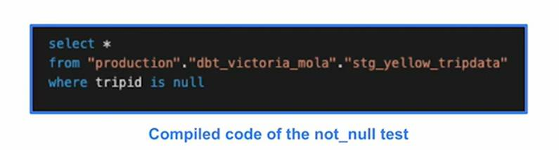
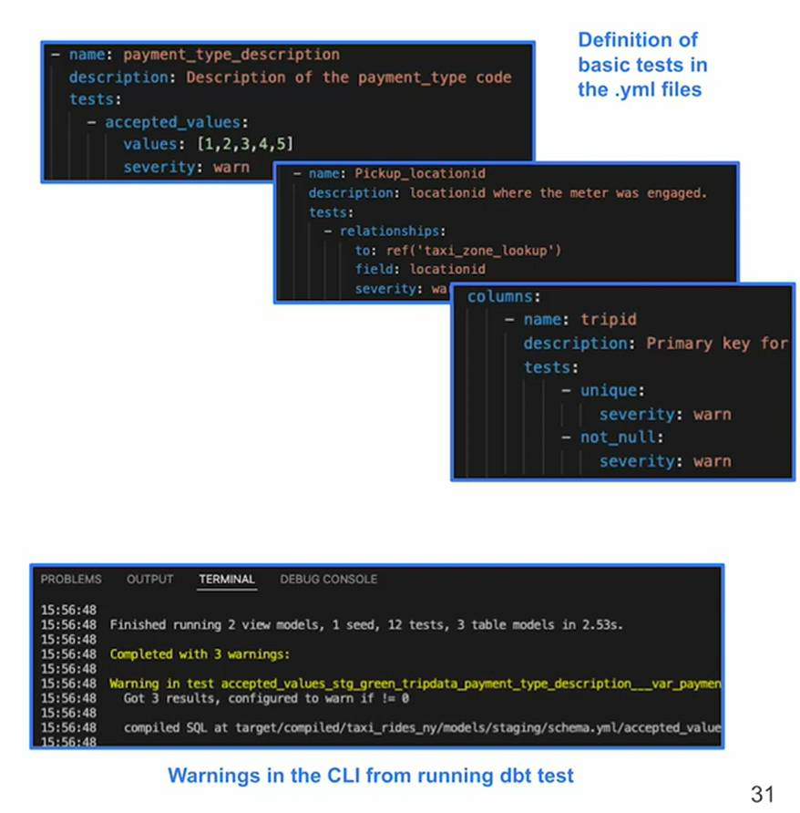


### Generate project documentation as website

The file [`dm_monthly_zone_revenue.sql`](https://github.com/DataTalksClub/data-engineering-zoomcamp/blob/main/04-analytics-engineering/taxi_rides_ny/models/core/dm_monthly_zone_revenue.sql) contains queries that return some values of interest

One interesting part of the code is this:
```sql
{{ dbt.date_trunc("month", "pickup_datetime") }} as revenue_month, 
```
This is a database independent macro and is converted to fit the required dataset type. In the case of BigQuery the code is:
```sql
timestamp_trunc(
    cast(pickup_datetime as timestamp),
    month
) as revenue_month, 
```

**Using Codegen**: [Package](https://hub.getdbt.com/dbt-labs/codegen/latest/) that can help generate code. For a more comprehensive list of capabilities of `codegen` please refer to the [codegen-repo](https://github.com/dbt-labs/dbt-codegen)

In `packages.yml` the following has to be added
```yml
  - package: dbt-labs/codegen
    version: 0.12.1
```
Then `dbt deps` has to be called.

To create a yml-fole for a model from the `staging`-directory, the following can be used:
```sql

{{ codegen.generate_model_yaml(
    model_names = models_to_generate
) }}
```

Build the code to obtain the yml-formatted code. This can now be copy-pasted to the `schema.yml` in the `model`-section.

```yml
version: 2

sources:
  - name: staging
    database: taxi-rides-ny-414141
    schema: trips_data_all

    tables:
      - name: green_tripdata
      - name: yellow_tripdata

# New part from here:
models:
  - name: stg_green_tripdata
    description: ""
    columns:
      - name: tripid
        data_type: string
        description: ""
...
```

Now some tests have to be added to the columns
```yaml
...
models:
  - name: stg_green_tripdata
    description: ""
    columns:
      - name: tripid
        data_type: string
        description: ""
        tests:
          - unique:
              severity: warn
          - not_null:
              severity: warn
     ...
      - name: pickup_locationid
        data_type: int64
        description: ""
        tests:
          - relationships:
              field: locationid
              to: ref('taxi_zone_lookup')
              severity: warn
     ...
      - name: payment_type
        data_type: int64
        description: ""
        tests:
          - accepted_values:
              values: "{{ var('payment_type_values') }}"
              severity: warn
              quote: false
     ...
...
```

It's time to "test" the tests! For this purpose the whole project will be build with `dbt build`. There will be a test that failed and throws a warning. This can be seen here:
```log
22:01:30 4 of 10 START test accepted_values_stg_green_tripdata_payment_type__False___var_payment_type_values_  [RUN]
22:01:32 4 of 10 WARN 1 accepted_values_stg_green_tripdata_payment_type__False___var_payment_type_values_  [WARN 1 in 2.00s]
```

### Documentation

- dbt provides a way to generate documentation for your dbt project and render it as a website
- The documentation for your project includes:
  - **Information anout your project**:
    - Model code (both from the `.sql` file and compiled)
    - Model dependencies
    - Sources
    - Auto generated DAG from the `ref` and `source` macros
    - Descriptions (from `.yml` file) and tests
  - **Information about your data warehouse (information_schema)**:
    - Column names and data types
    - Table stats like size and rows
- dbt docs can also be hosted in dbt cloud

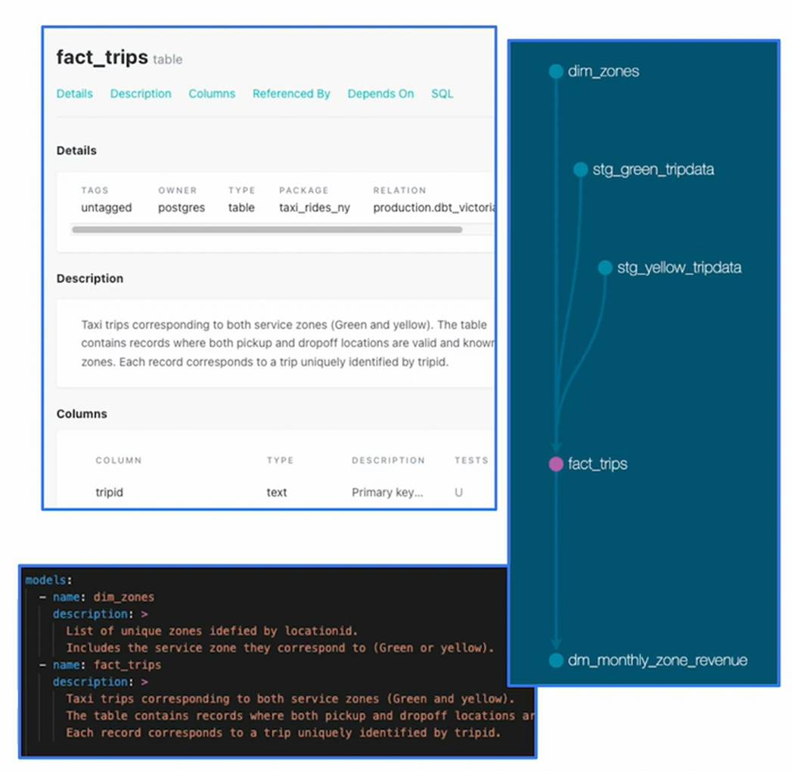

To create an exemplary documentation a [schema.yml](https://github.com/DataTalksClub/data-engineering-zoomcamp/blob/main/04-analytics-engineering/taxi_rides_ny/models/core/schema.yml) has to be created in the `core`-directory. The content of the file has documentation for `dim_zones`, `fact_trips` and `dm_monthly_zones_revenue`.

To create the documentation, the following command has to be called:
```bash
dbt docs generate
```
To open the generated docs, you have to clikc on the `View Docs` button on the top left of the dbt window. 

## 4.4.1 - Deployment Using dbt Cloud (Alternative A)

How to deploy the project to provide the data to the stakeholders.

### What is deployment?
- Process of running the models we create in our development environment in a production environment
- Development and later deployment allows us continue building models and testing them without affecting our production environment
- A deployment environment will normally have a different schema in out data warehouse and ideally a different user
- A development - deployment workflow will be something like:
  - Deploy in a user branch
  - Open a Pull Request into the main branch
  - Merge the branch to the main branch
  - Run the new models in the production environment using the main branch
  - Schedule the models

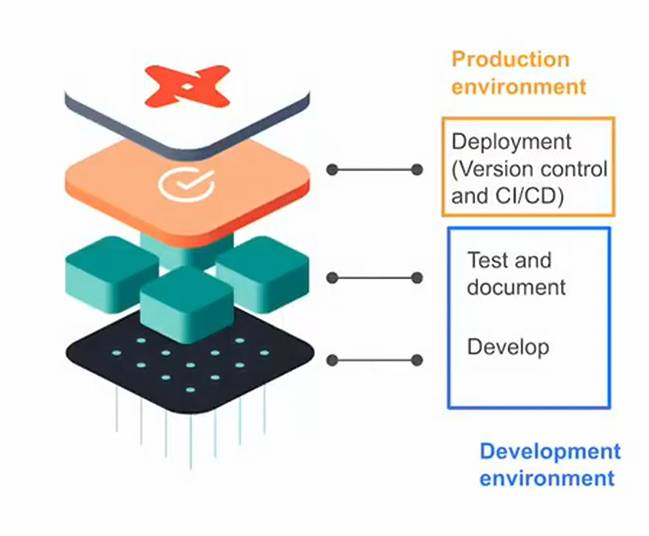

**`Before`**: Developement environment  
**`Now`**: Production Environment - The orange layer of the visualizations

#### Creating Production environment in dbt cloud

**Creaing Deploy Environment**

- Open the `Deploy` dropdown-menu and click on `Environments`
- Create a new one with the name `Production` 
- Name the dataset `prod`

**Create Deploy job** (using the followin parameters):
- `Job settings`
  - Job name: Nightly
  - Description: (fitting description)
  - Environment: Production

- `Execution settings`
  - Commands: dbt build
  - Generate docs on run: [x]
  - Run source freshness: [x]

- `Schedule`
  - Turn on run on schedule
  - Timing: Hours of the day
  - Run at (UTC): 12
  - Days of the week: Mo-Fr


### Running a dbt project in production
- dbt cloud includes a scheduler where to create jobs to run in production
- A single job can run multiple commands
- Jobs can be triggered manually or on schedule
- Each job will keep a log of the runs over time
- Each run will have the logs for each command
- A job could also generate documentation, that could be viewed under the run information
- If dbt source freshness was run, the results can also be viewed at the end of a job


After running the dbt project at least one time there are several logged artifacts and documentation. The documentation of each run can be accessed by setting `Explore > Settings > Artifacts > Documentation`. You can choose the recently ran job `Nightly`. After this, clicking on the documentation will return the documentation of the chosen run.

### Continuous Integration (CI) Job & what is CI?

- CI is the practice of regularly merge developement branches into a central repository, after which automated builds and tests are run
- The goal is to reduce adding bugs to the production code and maintain a more stable project
- dbt allows us to create CI on pull requests
- Enabled via webhooks from GitHab or GitLab
- When a Pull Request is ready to be merged, a webhook is received in dbt cloud that will enqueue a new run of the specified job
- The run of the CI job will be against a temporary schema
- No Pull Request will be able to be merged unless the run has been completed successfully

### Create a CI job
`Deploy > Environment > CI job`

**Create CI job** (using the followin parameters):

- `Job settings`: 
  - Job name: CI checks
  - Description: ...
  - Environment: Production
  - Trigger by pull request: [x]

- `Execution settings`:
  - `dbt build --select state:modified+`

Save the CI job! This will run every time when something was changed and pushed to the git repo.