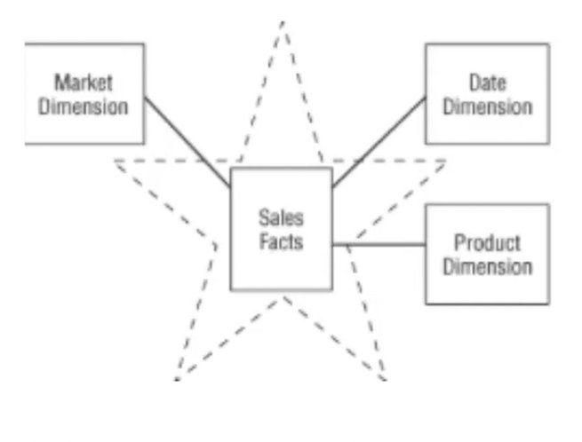
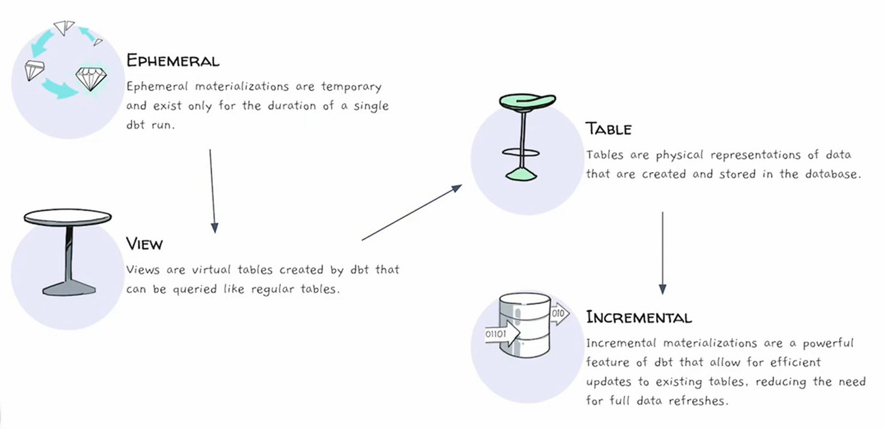

# Week 4: Analytics Engineering

## 4.1.1 - Analytics Engineering Basics

### 1 - What ist `Analytics Engineering`


### Tooling

- Relevant sections of the tooling are here:
    - Data Modleing
    - Data Presentation


### 2 - Data Modeling Concepts


**ETL (Extract, Transform, Load)**
1. `Extract` data from source
2. `Transform` the data
3. `Load` data to data warehouse

Properties of ETL:
- Longer to implement, due to the requirement to transform the data
- More stable and compliant data, because the data is "clean"


**ELT (Extract, Load, Transform)**
1. `Extract` data from source 
2. `Load` data to data warehouse
3. `Transform` the data in the data warehouse

Properties of ETL:
- Faster and more flexible, since data is already loaded in the data warehouse after extraction
- Data warehouse usually cheaper than storing the data locally


### Kimball's Dimensional Modeling

**Objective**
- Deliver data understandable to a business user
- Deliver fast query performance

**Approach**: Prioritize user understandability and query performance over non-redundant data (3NF)

**Other approaches**
- Bill Inmon
- Data Vault

### Elements of dimensional modeling

**Facts tables**
- Measurements, metrics or facts about a business
- Correspond to a *business process*
- Like "Verbs"
- *Dimensions* provide context to the fact table

**Dimensions tables**
- Corresponds to a business *entity*
- Provides context to a business process
- Like "Nouns" (*customer*, *product*, ...)



### Architecture of Dimensional Modeling

**Analogy**: From buying ingredients to serving food at a resturant

- **`Stage Area`** (Buying ingredients)
    - Contains new raw data
    - Not meant to be exposed to everyone

- **`Processing Area`** (Cooking ingredients)
    - From raw data to data models
    - Focusses on efficiency
    - Ensuring standards

- **`Presentation Area`** (Serving food)
    - Final presentation of the data
    - Exposure to business stakeholder

## 4.1.2 - What is `dbt`?

`dbt` is a transformation workflow, that allows anyone that knows SQL or Python to deploy analytics code, following software engineering best practices like modularity, portability, CI/CD and documentation.


- Sits on top of Data Warehouse
- Helps to transform the data to something presentablev e.g. with BI Tools or data comsumers (other applications)

### How does `dbt` work?


### How to use `dbt`?

**`dbt Core`**
-  Open-source project that allows the data transformation
- Builds and runs a dbt project (`.sql` and `.yml` files)
- Introduces SQL compilation logic, macros and database adapters
- Includes a CLI interface to run dbt commands locally
- FOSS

**`dbt Cloud`**: SaaS application to develop and manage dbt projects
- Web-based IDE and cloud CLI to develop, run and test dbt project
- Managed environment
- Jobs orchestration
- Logging and Alerting
- Integrated documentation
- Admin and metadata API
- Semtantic Layer

### How are we going to use `dbt`?

**BigQuery**
- Development using Cloud IDE
- No local installation of `dbt core`

**Postgres**
- Development using local IDE of your choice
- Local installation of `dbt core` connecting to the Postgres database
- Running `dbt models` throught the CLI


## 4.2.1 - Start Your dbt Project: BigQuery and dbt Cloud (Alternative A)

### Create a new `dbt` project

`dbt` provides a starte project with a basic structure to ubild upon. 
- Repo: https://github.com/dbt-labs/dbt-starter-project
- Local adapted version: [dbt_project.yml](code/dbt_project.yml)

There are 2 ways to use the starte project:
- **With the `CLI`**
    - After havin installed `dbt` locally and setup the `profiles.yml`, run `dbt init` in the path we want to start the project to clone the starter project
- **With `dbt cloud`**
    - After having set up the dbt cloud credentials (repo and data warehouse) we can start a project from the web-based IDE


###  Project Setup

- Create a free `dbt`-account on https://www.getdbt.com/
- **Create a new project**:
    - Name the project
    - Choose connection (here: BigQuery)
    - Establish the connection between dbt and BigQuery by importing the json-key from an adequate service account


## 4.2.2 - Start Your dbt Project: Postgres and dbt Core Locally (Alternative B)

`Prerequisite`: Installing dbt locally 
```bash
pip install dbt-core dbt-postgres dbt-bigquery
```
This will install the postgres and BigQuery adapter for dbt. For more adapter for other services please refer to the documentation [here](https://docs.getdbt.com/docs/core/pip-install).

### Creating a dbt-project locally:

- Create a `profiles.yml`
    - Stores informations about different dbt projects in one single file
```bash
mkdir ~/.dbt
touch ~/.dbt/profiles.yml
```

Example:
```yml
pg-dbt-workshop: # Postgres
  target: dev
  outputs:
    dev:
      type: postgres
      host: localhost
      user: my_user 
      password: my_password
      port: 5432
      dbname: production
      schema: dbt_schema
      threads: 4
      keepalives_idle: 0 # default 0, indicating the system default
bg-de-zoomcamp: # BigQuery
  target: dev
  outputs:
    dev:
      type: bigquery
      method: service-account
      project: taxi-rides-ny
      dataset: dbt_ds
      threads: 4
      keyfile: my_key_file.json
```

Run `dbt init` in the folder you want to want the dbt project.


## 4.3.1 -  Build the First dbt Models

### `dbt` Overview


- `dbt` sits on top of a given platform like BigQuery, Postgres, Snowflake, Redshift, Databricks etc.

### Modular Data Modeling


- `Green`: loaded tables (e.g. the trips data) from our sources
- `Purple`, `Blue`, `Yellow`: Transformations (SQL scripts) can be ...
    - Data Cleaning
    - Recasting / Renaming
    - Creating tables relevant for business logic
    - ...

### Anatomy of a `dbt` model


- dbt models are SQL scripts that have the name of the model (e.g. `my_model.sql`)

### Materializations in dbt Cloud




### Modular Data Modeling (2)


Input tables with data

### The `FROM` clause of a dbt model

**Sources**:

- The data loaded to our data warehouse that we use as sources for our models
- Configuration defined in the `yml` files in the models folder
- Used with the source macro that will resolve the name to the right schema, plus build the dependencies automatically
- Source freshness can be defined and tested

**Seeds**:

- `CSV` files stored in our repository under the seed folder
- Benefits of version controlling
- Equivalent to a copy command
- Recommended for data that does not change frequently
- Runs with `dbt seed -s file_name`


### Modular Data Modeling (3)


After transforming (e.g. data cleaning) the data with the `purple` the data will be coposed to the `fact_trips` table 

### The `FROM` clause of a dbt model (2)

**Ref**:

- Macro to reference the underlying tables and views that were building the data warehouse
- You can run the same code in any environment. It will resolve the correct schema for you
- Dependencies are built automatically

**`dbt model`**
```sql
WITH green_data AS (
    SELECT 
        *,
        'Green' AS service_type
    FROM 
        {{ ref('stg_green_tripdata') }}
),
...
```

**`compiled code`**
```sql
WITH green_data AS (
    SELECT
        *,
        'Green' AS service_type
    FROM
        "production"."dbt_data"."stg_green_tripdata"
),
...
```

### Creating a new project with taxi data