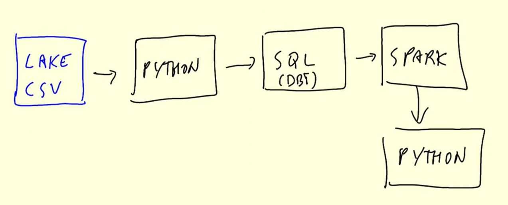
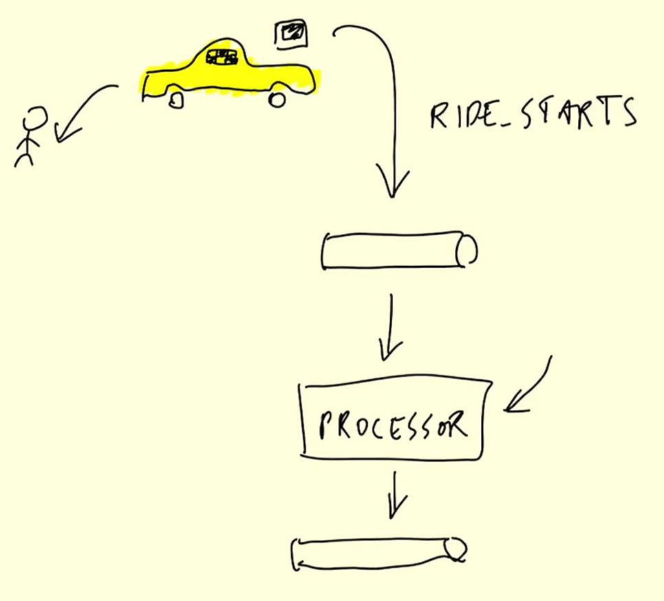
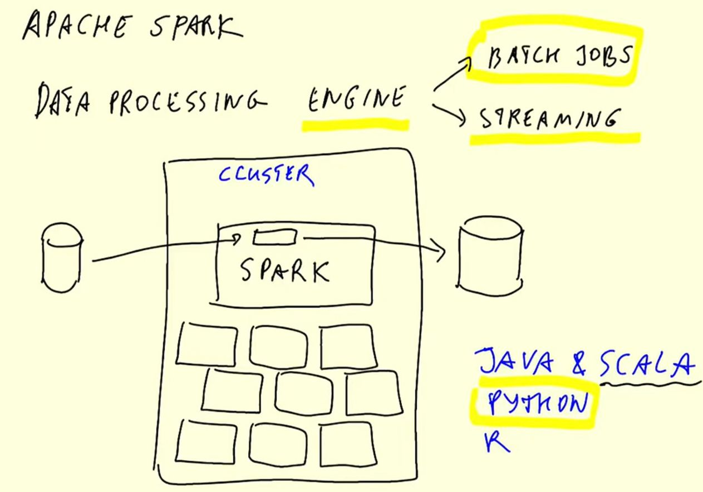
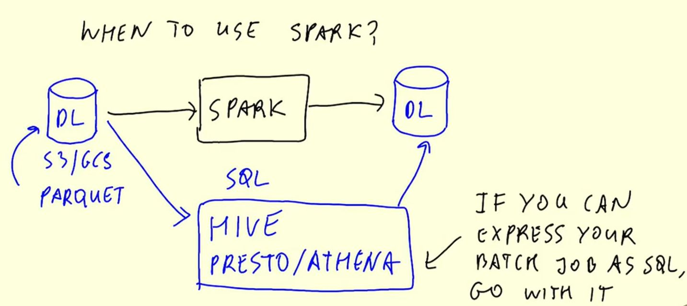
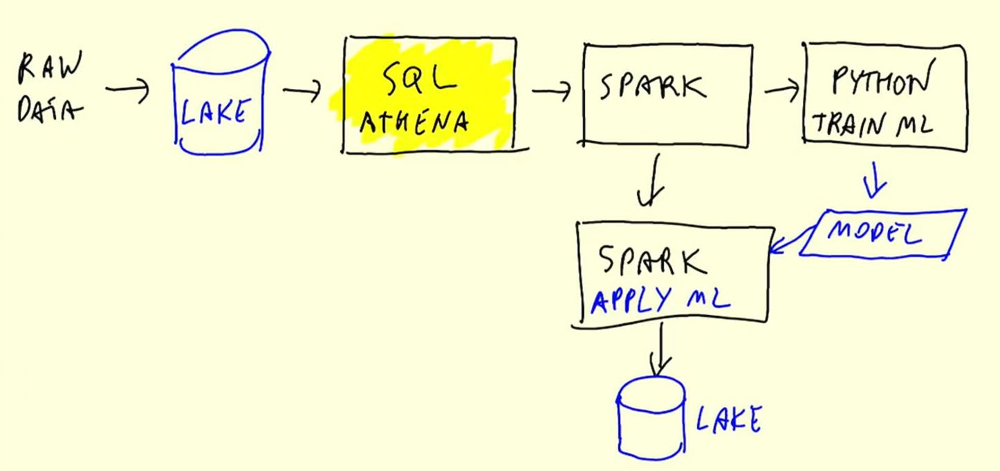
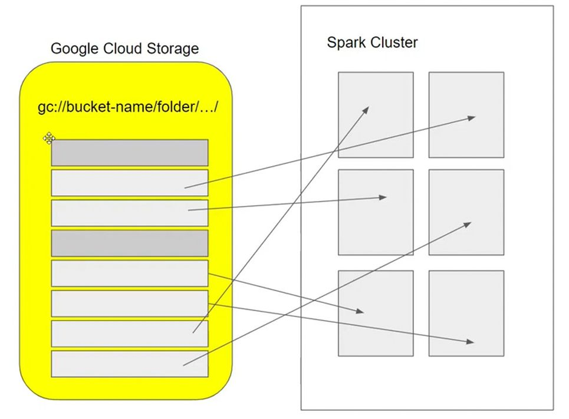

# Week 5: Batch Processing

## 5.1 Introduction

### 5.1.1 - Introduction to Batch processing

- Batch vs. Streaming
- Types of batch jobs
    - SQL, Pything scripts, Spark, Flink
- Orchestrating batch jobs
- Advantages and disadvantages of batch jobs
    - `Advantages`: easy to manage, retry, scale, easier to orchestrate
    - `Disadvantages`: delay

#### Batch vs. Streaming

**`Batch`**: processing of a chunk of data at regular intervals


**Batch jobs**

Batch jobs often run with the data used from a specified time interval, e.g.:
- Weekly
- `Daily` (most common)
- `Hourly` (most common)
- 3x per hour
- Every 5 minutes

**Technologies**

What can be used to run batch jobs:
- Python scripts (most flexible; Can run on:, Kubernetes, AWS Batch, ...)
- SQL
- Spark
- Flink

**Workflow**

Every part of this workflow works in batches. Workflows can be run with tools like Airflow or Mage



1. Data Lake with CSV files
2. Python script
    - Put data in data warehouse
    - Transforming data
3. SQL for data preparation
    - DBT
    - ...
4. Spark
5. Python

**Advantages of batch processing**
- Easy to:
    - `manage` (workflow tools used in every step)
    - `retry` (running workflow with other configuration by changing parameter)
    - `scale` (provisioning more resources easily done)

Due to these advantages, batch processing is used in 80% of the data engineering use-cases, the remaining 20% is stream-processing

**Disadvantage of batch processing**
- `delay` (results are available at a later point in time) 


**`Stream`** processing data on the fly



### 5.1.2 - Introduction to Spark

Spark is an open-source multi-language (Java, Scala, Python, ...) unified analytics `engine` for large-scale data processing. PySpark is the method of choice when the rest of the environment is also in python (e.g. in data science).



#### When is Spark used?



If data is located in a data lake and can be processed by SQL alone, then tools like `Hive`, `Presto`, `Athena`, etc. are used. If the data requires more granular processing and is used for a more complex use-case (like Machine Learning), Spark is the better choice, because it provides more flexibility in the process. However there is also the possibility to use both SQL processing and Spark. An example can be seen here:


**Steps**:

1. Raw data is saved to data lake
2. SQL tool on the cloud service processes the data (most of pre-processing done here)
3. Spark finalizes the processing
4. Using data for training ML model (returns `model`)
5. Using Spark to apply the `model` on the processed data
6. Saving the results to the data lake
 

## 5.2 Installation

- `Spark on Windows`: [Link](https://github.com/DataTalksClub/data-engineering-zoomcamp/blob/main/05-batch/setup/windows.md)
- `Spark on MacOS`: [Link](https://github.com/DataTalksClub/data-engineering-zoomcamp/blob/main/05-batch/setup/macos.md)
- `Spark on Linux`: [Link](https://github.com/DataTalksClub/data-engineering-zoomcamp/blob/main/05-batch/setup/linux.md)

- `PySpark`: [Link](https://github.com/DataTalksClub/data-engineering-zoomcamp/blob/main/05-batch/setup/pyspark.md)

**Installing Spark and PySpark on Linux (short version)**

```bash
# The installation folder
mkdir -p ~/spark
cd ~/spark

# Java JDK 11.0.2
wget -c https://download.java.net/java/GA/jdk11/9/GPL/openjdk-11.0.2_linux-x64_bin.tar.gz
tar xzfv openjdk-11.0.2_linux-x64_bin.tar.gz
echo 'export JAVA_HOME="${HOME}/spark/jdk-11.0.2"' >> ~/.bashrc
echo 'export PATH="${JAVA_HOME}/bin:${PATH}"' >> ~/.bashrc
rm openjdk-11.0.2_linux-x64_bin.tar.gz
source ~/.bashrc # update

# Spark (3.3.2)
wget -c https://archive.apache.org/dist/spark/spark-3.3.2/spark-3.3.2-bin-hadoop3.tgz
tar xzfv spark-3.3.2-bin-hadoop3.tgz
rm spark-3.3.2-bin-hadoop3.tgz
echo 'export SPARK_HOME="${HOME}/spark/spark-3.3.2-bin-hadoop3"' >> ~/.bashrc
echo 'export PATH="${SPARK_HOME}/bin:${PATH}"' >> ~/.bashrc
source ~/.bashrc # update

# PySpark
echo 'export PYTHONPATH="${SPARK_HOME}/python/:$PYTHONPATH"' >> ~/.bashrc
echo 'export PYTHONPATH="${SPARK_HOME}/python/lib/py4j-0.10.9-src.zip:$PYTHONPATH"' >> ~/.bashrc

# If you get the errror: `ModuleNotFoundError: No module named 'py4j'` use this
export PYTHONPATH="${SPARK_HOME}/python/lib/py4j-0.10.9.5-src.zip:$PYTHONPATH"
```

A very basic test to check if you can import `pyspark` is to open the `IPython`-console and import `pyspark`:

A more elaborate test of functionality of `pyspark` is to create a jupyter [notebook](code/1_pyspark-test-notebook.ipynb) and executing the follosing code:

```python
import pyspark
from pyspark.sql import SparkSession

spark = SparkSession.builder \
    .master("local[*]") \       # connect to "local" master with all available cpus [*]
    .appName('test') \          # application name
    .getOrCreate()              

# Read in taxi zone lookup table to spark dataframe
df = spark.read \
    .option("header", "true") \     # otherwise headers are unknown
    .csv('taxi+_zone_lookup.csv')
df.show()

# Test that writing works as well (writes parquet file to `zones` folder)
df.write.parquet('zones')
```

The code of this section can be found in the notebook [1_pyspark-test-notebook.ipynb](code/1_pyspark-test-notebook.ipynb)

## 5.3 Spark SQL and DataFrames

### 5.3.1 - First Look at Spark / PySpark

The code of this section can be found in the notebook [4_pyspark.ipynb](code/4_pyspark.ipynb)

Until now the data was read in as one big file, however this does not utilize the parrallel processing properties of Spark. To do computations more effectively, the data is split in multiple partitions so that it can be processed by a Spark cluster faster. 



### 5.3.2 - Spark DataFrames

The code of this section can be found in the notebook [4_pyspark.ipynb](code/4_pyspark.ipynb)

#### Actions vs. Transformations
- **Transformations (lazy execution)**:
    - Used for transforming data
    - Not executed right away (require explicit call to `.show()`)
    - *Examples*: Selecting columns, filtering, JOINs, GROUP BY, ... 
- **Actions (eager execution)**:
    - Used for extracting data (data required immediately)
    - Executed immediately
    - show, take, head
    - Write-functions that write files

### 5.3.3 Getting the Yellow and Green Taxi data

The code to download the required data from the NYC taxi data repository can be found in the file [download_data.py](code/download_data.py)

## 5.4 Spark Internals


## 5.5 (Optional) Resilient Distributed Datasets

## 5.6 Running Spark in the Cloud


## Homework
