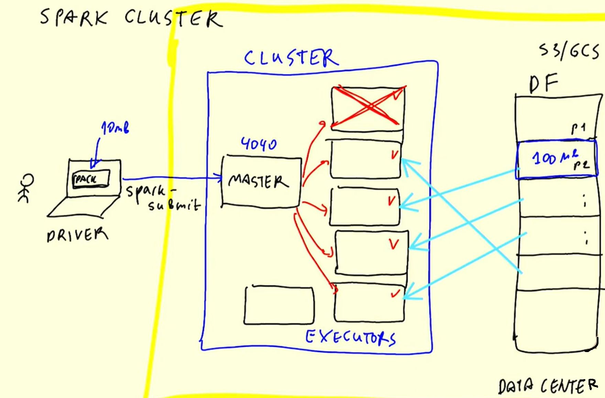
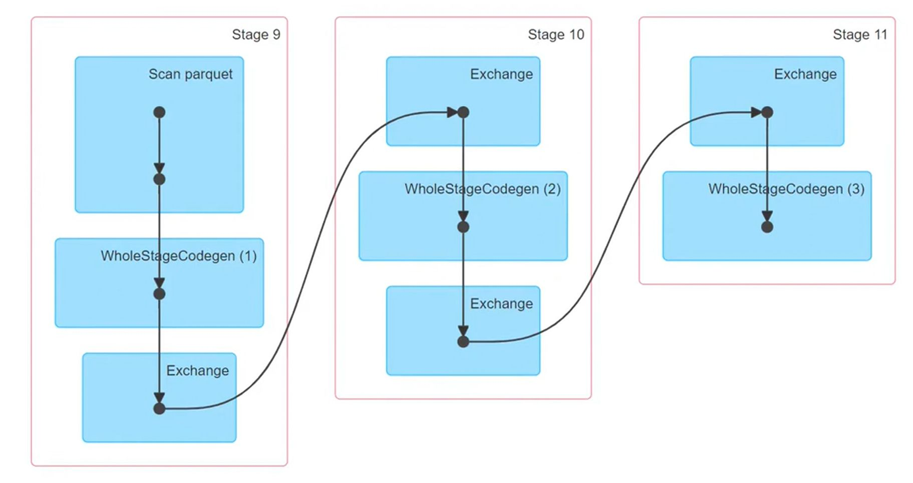
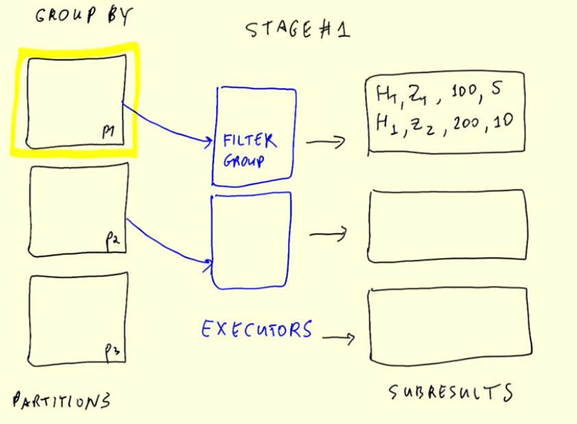
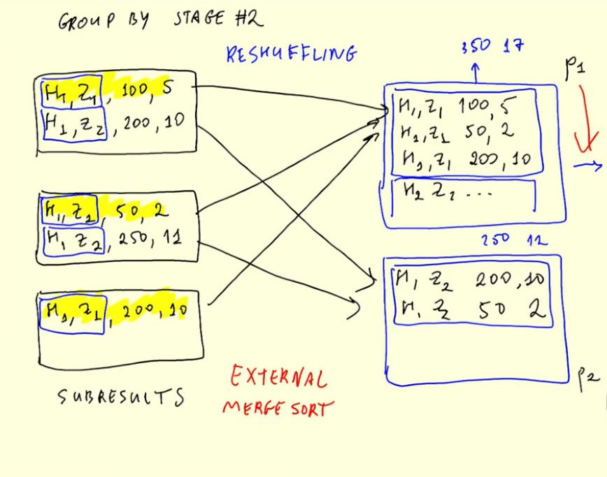
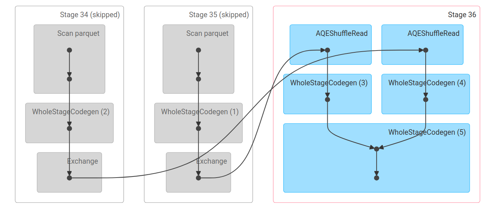
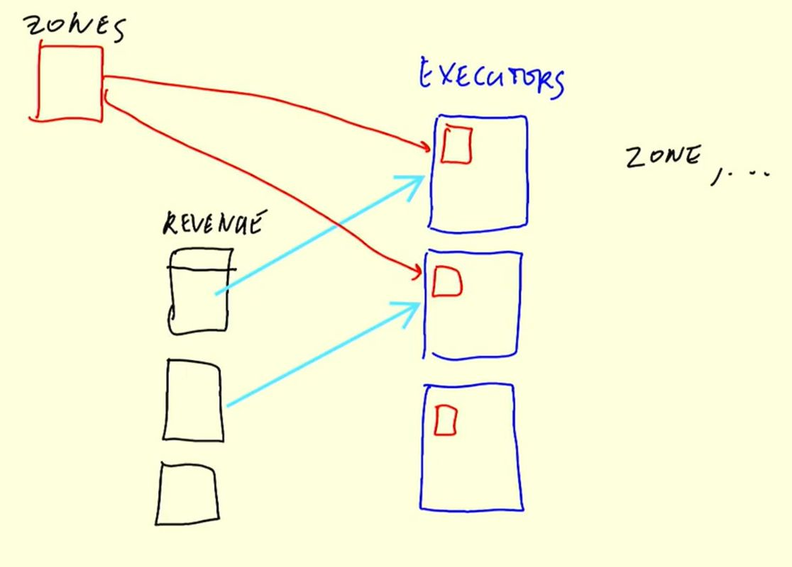

# Week 5: Batch Processing

## 5.1 Introduction

### 5.1.1 - Introduction to Batch processing

- Batch vs. Streaming
- Types of batch jobs
    - SQL, Pything scripts, Spark, Flink
- Orchestrating batch jobs
- Advantages and disadvantages of batch jobs
    - `Advantages`: easy to manage, retry, scale, easier to orchestrate
    - `Disadvantages`: delay

#### Batch vs. Streaming

**`Batch`**: processing of a chunk of data at regular intervals


**Batch jobs**

Batch jobs often run with the data used from a specified time interval, e.g.:
- Weekly
- `Daily` (most common)
- `Hourly` (most common)
- 3x per hour
- Every 5 minutes

**Technologies**

What can be used to run batch jobs:
- Python scripts (most flexible; Can run on:, Kubernetes, AWS Batch, ...)
- SQL
- Spark
- Flink

**Workflow**

Every part of this workflow works in batches. Workflows can be run with tools like Airflow or Mage


1. Data Lake with CSV files
2. Python script
    - Put data in data warehouse
    - Transforming data
3. SQL for data preparation
    - DBT
    - ...
4. Spark
5. Python

**Advantages of batch processing**
- Easy to:
    - `manage` (workflow tools used in every step)
    - `retry` (running workflow with other configuration by changing parameter)
    - `scale` (provisioning more resources easily done)

Due to these advantages, batch processing is used in 80% of the data engineering use-cases, the remaining 20% is stream-processing

**Disadvantage of batch processing**
- `delay` (results are available at a later point in time) 


**`Stream`** processing data on the fly


### 5.1.2 - Introduction to Spark

Spark is an open-source multi-language (Java, Scala, Python, ...) unified analytics `engine` for large-scale data processing. PySpark is the method of choice when the rest of the environment is also in python (e.g. in data science).


#### When is Spark used?


If data is located in a data lake and can be processed by SQL alone, then tools like `Hive`, `Presto`, `Athena`, etc. are used. If the data requires more granular processing and is used for a more complex use-case (like Machine Learning), Spark is the better choice, because it provides more flexibility in the process. However there is also the possibility to use both SQL processing and Spark. An example can be seen here:


**Steps**:

1. Raw data is saved to data lake
2. SQL tool on the cloud service processes the data (most of pre-processing done here)
3. Spark finalizes the processing
4. Using data for training ML model (returns `model`)
5. Using Spark to apply the `model` on the processed data
6. Saving the results to the data lake
 

## 5.2 Installation

- `Spark on Windows`: [Link](https://github.com/DataTalksClub/data-engineering-zoomcamp/blob/main/05-batch/setup/windows.md)
- `Spark on MacOS`: [Link](https://github.com/DataTalksClub/data-engineering-zoomcamp/blob/main/05-batch/setup/macos.md)
- `Spark on Linux`: [Link](https://github.com/DataTalksClub/data-engineering-zoomcamp/blob/main/05-batch/setup/linux.md)

- `PySpark`: [Link](https://github.com/DataTalksClub/data-engineering-zoomcamp/blob/main/05-batch/setup/pyspark.md)

**Installing Spark and PySpark on Linux (short version)**

```bash
# The installation folder
mkdir -p ~/spark
cd ~/spark

# Java JDK 11.0.2
wget -c https://download.java.net/java/GA/jdk11/9/GPL/openjdk-11.0.2_linux-x64_bin.tar.gz
tar xzfv openjdk-11.0.2_linux-x64_bin.tar.gz
echo 'export JAVA_HOME="${HOME}/spark/jdk-11.0.2"' >> ~/.bashrc
echo 'export PATH="${JAVA_HOME}/bin:${PATH}"' >> ~/.bashrc
rm openjdk-11.0.2_linux-x64_bin.tar.gz
source ~/.bashrc # update

# Spark (3.3.2)
wget -c https://archive.apache.org/dist/spark/spark-3.3.2/spark-3.3.2-bin-hadoop3.tgz
tar xzfv spark-3.3.2-bin-hadoop3.tgz
rm spark-3.3.2-bin-hadoop3.tgz
echo 'export SPARK_HOME="${HOME}/spark/spark-3.3.2-bin-hadoop3"' >> ~/.bashrc
echo 'export PATH="${SPARK_HOME}/bin:${PATH}"' >> ~/.bashrc
source ~/.bashrc # update

# PySpark
echo 'export PYTHONPATH="${SPARK_HOME}/python/:$PYTHONPATH"' >> ~/.bashrc
echo 'export PYTHONPATH="${SPARK_HOME}/python/lib/py4j-0.10.9-src.zip:$PYTHONPATH"' >> ~/.bashrc

# If you get the errror: `ModuleNotFoundError: No module named 'py4j'` use this
export PYTHONPATH="${SPARK_HOME}/python/lib/py4j-0.10.9.5-src.zip:$PYTHONPATH"
```

A very basic test to check if you can import `pyspark` is to open the `IPython`-console and import `pyspark`:

A more elaborate test of functionality of `pyspark` is to create a jupyter [notebook](code/1_pyspark-test-notebook.ipynb) and executing the follosing code:

```python
import pyspark
from pyspark.sql import SparkSession

spark = SparkSession.builder \
    .master("local[*]") \       # connect to "local" master with all available cpus [*]
    .appName('test') \          # application name
    .getOrCreate()              

# Read in taxi zone lookup table to spark dataframe
df = spark.read \
    .option("header", "true") \     # otherwise headers are unknown
    .csv('taxi+_zone_lookup.csv')
df.show()

# Test that writing works as well (writes parquet file to `zones` folder)
df.write.parquet('zones')
```

The code of this section can be found in the notebook [1_pyspark-test-notebook.ipynb](code/1_pyspark-test-notebook.ipynb)

## 5.3 Spark SQL and DataFrames

### 5.3.1 - First Look at Spark / PySpark

The code of this section can be found in the notebook [4_pyspark.ipynb](code/4_pyspark.ipynb)

Until now the data was read in as one big file, however this does not utilize the parrallel processing properties of Spark. To do computations more effectively, the data is split in multiple partitions so that it can be processed by a Spark cluster faster. 


### 5.3.2 - Spark DataFrames

The code of this section can be found in the notebook [4_pyspark.ipynb](code/4_pyspark.ipynb)

#### SELECT in PySpark
This is used similar to the keyword in SQL, to select certain data. The functionality is similar to a pandas dataframe that has a list of columns given, to get a subset of the data. The column names can be given as a list or as multiple parameters themself. Here the `filter` method works like  `WHERE` in SQL. To obtain the data, `.show()` has to be used, because `select` and `filter` use lazy execution.

```python
cols = ["pickup_datetime", "dropoff_datetime", "PULocationID", "DOLocationID"]
df.select(cols) \
  .filter(df.hvfhs_license_num == "HV0003") \
  .show()
```

#### Actions vs. Transformations

- **Transformations (lazy execution)**:
    - Used for transforming data
    - Not executed right away (require explicit call)
    - *Examples*: Selecting columns, filtering, JOINs, GROUP BY, ... 

- **Actions (eager execution)**:
    - Used for extracting data (data required immediately)
    - Executed immediately
    - show, take, head
    - Write-functions that write files

#### Functions available in Spark
- *Example*: Using SQL functions on columns with `pyspark.sql.functions`
  ```python
  from pyspark.sql import functions as F
  df.withColumn("pickup_date", F.to_date(df.pickup_date))
  ```
  - Adds a date column that was generated from a datatime column

- Defining your own function
  ```python
  def crazy_stuff(base_num):
    num = int(base_num[1:])
    if num % 7 == 0:
        return f"s/{num:03x}"
    elif num % 3 == 0:
        return f"a/{num:03x}"
    else:
        return f"e/{num:03x}"
    
  # function that works on Spark df's
  crazy_stuff_udf = F.udf(crazy_stuff, returnType=types.StringType())
  # applying the function
  df.withColumn("base_id", crazy_stuff_udf(df.dispatching_base_num))
  ```

### 5.3.3 Getting the Yellow and Green Taxi data

The code to download the required data from the NYC taxi data repository can be found in the file [download_data.py](data/download_data.py)

### 5.3.4 SQL with Spark

The practical application of the concepts of this section can be found in the notebook [4_pyspark.ipynb](code/4_pyspark.ipynb)

**Overview: Contents of this section**

- Loading parquet data
  ```python
  df = spark.read.parquet("data/raw/taxi/*/*/")
  ```
- Renaming columns
  ```python
  df = df.withColumnRenamed("old_name", "new_name")
  ```
- Getting overlapping columns of datasets
  ```python
  cols = set(df1.columns) & set(df1.columns)
  ```
- Adding column to dataframe & filling it with literal-value
  ```python
  from pyspark.sql import functions as F
  df = df.select(cols).withColumn("col", F.lit("value")) 
  ```
- Unifying subsets of dataframes that have same columns
  ```python
  df_union = df1.unionAll(df2)
  ```
- Counting of grouped values of a column
  ```python
  df_union.groupBy("col_name").count().show()
  ```
- Creating a SQL view on which the spark dataframe can be queried
  ```python
  df_union.createOrReplaceTempView("table")
  ```
- Getting data from spark with SQL queries
  ```python
  spark.sql("""
        SELECT col, COUNT(1) as count FROM table
        GROUP BY col;
    """).show()
  ```

## 5.4 Spark Internals

### 5.4.1 Anatomy of a Spark Cluster

**Content of this section**:

- Spark Driver, Master and Executor

In previous sections the used Spark-Cluster was run locally on the computer, however it is also possible to run a cluster in the cloud / on a server.



**Main components of using a spark cluster**:

- **`User / Client`**:
    -  with Driver that submits `spark-submits` to a spark cluster
- **`Cluster`**:
    - Has a `Master`-Service that is accessible over the cluster address on port `4040`.
    - `Executors` are computers in the cluster that are assigned tasks from the `Master`
- **`Data Center`**:
    - Stores, loads and saves the data / dataframe that is used in the computation
    - Data partitions are assigned to executors in the spark cluster
    - S3, GCS, ...

### 5.4.2 GroupBy in Spark

**Content of this section**:

- How `GroupBy` works internally
- Shuffling 

The practical application of the concepts of this section can be found in the notebook [groupby_join.ipynb](code/groupby_join.ipynb)

The `GROUP BY` command from SQL is executed in Spark dataframes in a specific way which will be explored here. As an example the following query is used:

```sql
SELECT
    date_trunc('hour', lpep_pickup_datetime) AS hour,
    PULocationID AS zone,

    ROUND(SUM(total_amount), 2) AS amount,
    COUNT(1) AS number_records
FROM
    green
WHERE 
    lpep_pickup_datetime >= '2020-01-01 00:00:00'
GROUP BY
    1, 2
ORDER BY
    1, 2
```

The process of `GROUP BY` in Spark can in general be divided into 2 steps (the 3rd step in the image below is `ORDER BY`)
1. Preparing for `GROUP BY`
2. The `GROUP BY` operation itself



Lets dive deeper in the respective stages for `GROUP BY` in Spark and look into what is happening:

<div style="display:flex; align-items: center;">
     <div style="flex:1">
          
     </div>
     <div style="flex:1;padding-left:10px;">
          
     </div>
</div>

#### Stage #1
1. Put partitions of the dataframe to an executor which is then filtered for the specified columns
2. Initial `GROUP BY` is applied to filtered data
  - Returns grouped tables
3. When all partitions are processed by the executors, the intermediate results that were returned are used for Stage #2 

#### Stage #2 
1. Given the outputs with grouped tables of partitions, `Reshuffling` will be applied to the data
  - `Reshuffling`: Moving entries from partitions to other partitions
 - Moves results to different partitions based on keys used for `GROUP BY`
2. Applying another group by to each of the partition
3. Returning the reduced records

### 5.4.3 Joins in Spark

- Joining two large tables
- Merge Sort Join
- Joining one large tabele and one small table
- Broadcasting

#### Joining two large tables


In the graphic above 2 tables (green and yello taxi data) will be joined along the `hour` and `zone` columns. The remaining columns are the revenue and the amound of yellow taxis and the green taxis.

Joining spark dataframes can be easily done with one line of code, however in the background there is a specific algorithm at work s.t. big amounts of data can be handled.

```python
join_cols = [...]
df_join = df1.join(df2, on=join_cols, how="outer")
```   

What does spark do internally when joining tables. Lets have look at the internals of the operation.

#### Merge Sort Join



This graph from the Spark Web-UI shows 2 inputs, which are yellow and green taxi, that are then combined in the next step on the right. This overview however is only an high level overview over join process that is much more advanced under the hood. A detailed explanation can be found in this [video](https://youtu.be/lu7TrqAWuH4?si=Bby3wqrv3qP9Ax4u&t=324).

#### Joining one large tabele and one small table



Given are a partitioned big dataframe and a non-partitioned small dataframe, then the following steps can be taken for joining them:

1. `Data Distribution`: The partitions of the large dataframe are distributed across the executors in the Spark cluster.
2. `Broadcasting`: The entire small dataframe is copied (or "broadcast") to each executor. This is known as a "broadcast join". Broadcasting is efficient when one of the dataframes is small enough to fit in the memory of each executor.
3. `Join Operation`: The join operation is performed on each executor separately. This is done in parallel, which is one of the key advantages of Spark's distributed computing model.
4. `Result Aggregation`: Finally, the results from each executor are collected and appended together to form the final result.

This approach allows Spark to perform the join operation in a distributed and parallel manner. However, it is important to note that this method works best when one dataframe is significantly smaller than the other.

## 5.5 Resilient Distributed Datasets

### 5.5.1 Operations on Spark RDDs

**Content of this section**:

- What is RDD and how it is related to dataframes
- From DataFrame to RDD
- Operations on RDD: map, filter, reduceByKey
- From RDD to DataFrame

### 5.5.2 Spark RDD mapPartition

## 5.6 Running Spark in the Cloud

### 5.6.1 Connecting to Google Cloud Storage

### 5.6.2 Creating a Local Spark Cluster

### 5.6.2 Creating a Local Spark Cluster

### 5.6.4 Connecting Spark to Big Query


## Homework
The homework