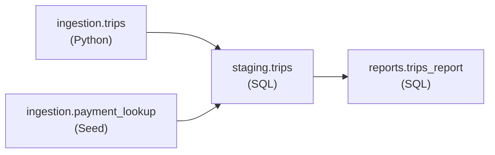

# NYC Taxi Pipeline - Comprehensive Guide

This document explains every component of the `nyc-taxi` Bruin pipeline, how the pieces fit together, and exactly how to run it.

## Table of Contents

- [NYC Taxi Pipeline - Comprehensive Guide](#nyc-taxi-pipeline---comprehensive-guide)
  - [Table of Contents](#table-of-contents)
  - [Architecture Overview](#architecture-overview)
  - [Project Structure](#project-structure)
  - [Configuration Files](#configuration-files)
    - [`.bruin.yml` - Connections \& Environments](#bruinyml---connections--environments)
    - [`pipeline.yml` - Pipeline Definition](#pipelineyml---pipeline-definition)
  - [Assets](#assets)
    - [1. `ingestion.trips`](#1-ingestiontrips)
    - [2. `ingestion.payment_lookup`](#2-ingestionpayment_lookup)
    - [3. `staging.trips`](#3-stagingtrips)
    - [4. `reports.trips_report`](#4-reportstrips_report)
  - [Running the Pipeline](#running-the-pipeline)
    - [Validate (no execution)](#validate-no-execution)
    - [Run the entire pipeline](#run-the-entire-pipeline)
    - [Run individual assets](#run-individual-assets)
    - [Run an asset and all downstream assets](#run-an-asset-and-all-downstream-assets)
    - [Query results](#query-results)
    - [Check lineage](#check-lineage)
  - [Bruin VS Code Sidebar](#bruin-vs-code-sidebar)
  - [Common Errors](#common-errors)

## Architecture Overview

The pipeline follows a classic ELT layered architecture: raw data is ingested first, then cleaned in staging, then aggregated in reports. Bruin determines execution order automatically by reading the `depends` field in each asset.



| Layer     | Asset                      | Purpose                                               |
| --------- | -------------------------- | ----------------------------------------------------- |
| Ingestion | `ingestion.trips`          | Fetch raw NYC taxi parquet files from TLC endpoint    |
| Ingestion | `ingestion.payment_lookup` | Load static payment type CSV into DuckDB              |
| Staging   | `staging.trips`            | Deduplicate, normalize, and enrich raw trips          |
| Reports   | `reports.trips_report`     | Aggregate into daily metrics by taxi type and payment |

**Data availability**: TLC trip data only exists up to **November 2025**. Always use dates before `2025-12-01`.

## Project Structure

```
/home/user/GITs/Zoomcamps/DE/2026/bruin/
│
├── .bruin.yml                          ← Connections & environments (gitignored)
│
└── zoomcamp/
    ├── pipeline/
    │   ├── pipeline.yml                ← Pipeline name, schedule, variables, default connections
    │   └── assets/
    │       └── ingestion/
    │           ├── trips.py            ← Python ingestion asset
    │           ├── requirements.txt    ← Python dependencies
    │           ├── payment_lookup.asset.yml  ← Seed asset definition
    │           ├── payment_lookup.csv        ← Static lookup data
    │           ├── staging/
    │           │   └── trips.sql       ← Staging transformation asset
    │           └── reports/
    │               └── trips_report.sql  ← Reporting aggregation asset
    └── PIPELINE.md                     ← This file
```

> **Note on `.bruin.yml` location**: The file lives one level above `zoomcamp/` at `/home/user/GITs/Zoomcamps/DE/2026/bruin/.bruin.yml`. Bruin automatically searches parent directories for it, so you never need to specify its path explicitly.

## Configuration Files

### `.bruin.yml` - Connections & Environments

This file defines named connections for each environment. It **must be gitignored** because it contains credentials.

<details>
<summary>View .bruin.yml</summary>

```yaml
default_environment: default

environments:
    default:
        connections:
            duckdb:
                - name: duckdb-default
                  path: duckdb.db
            chess:
                - name: chess-default
                  players:
                    - MagnusCarlsen
                    - Hikaru
```

</details>

**Key fields:**

| Field                        | Value            | Meaning                                                                   |
| ---------------------------- | ---------------- | ------------------------------------------------------------------------- |
| `default_environment`        | `default`        | Used when `--environment` flag is omitted                                 |
| `connections.duckdb[0].name` | `duckdb-default` | The connection name referenced by assets and `pipeline.yml`               |
| `connections.duckdb[0].path` | `duckdb.db`      | Path to the DuckDB database file, relative to where `bruin run` is called |

> **`duckdb.db` path resolution**: The path `duckdb.db` is relative to the working directory when you invoke `bruin run`. If you call it from `zoomcamp/`, the database will be at `zoomcamp/duckdb.db`.

### `pipeline.yml` - Pipeline Definition

Defines the pipeline-level configuration. Bruin reads this file to discover the pipeline name, schedule, default connections, and variables shared across all assets.

<details>
<summary>View pipeline.yml</summary>

```yaml
name: nyc-taxi

schedule: "daily"

start_date: "2022-01-01"

default_connections:
  duckdb: duckdb-default

variables:
  taxi_types:
    type: array
    items:
      type: string
    default: ["yellow"]  # e.g. ["yellow", "green"]
```

</details>

**Key fields:**

| Field                        | Value                | Meaning                                                                                            |
| ---------------------------- | -------------------- | -------------------------------------------------------------------------------------------------- |
| `name`                       | `nyc-taxi`           | Pipeline identifier shown in logs and Bruin Cloud                                                  |
| `schedule`                   | `daily`              | Bruin Cloud runs this pipeline once per day                                                        |
| `start_date`                 | `2022-01-01`         | Earliest date used when running a full backfill                                                    |
| `default_connections.duckdb` | `duckdb-default`     | All `duckdb.sql` and `duckdb.seed` assets use this connection unless overridden at the asset level |
| `variables.taxi_types`       | default `["yellow"]` | Pipeline variable passed to assets via `BRUIN_VARS` env var                                        |

**How `taxi_types` is resolved (priority order):**
1. `--var 'taxi_types=["yellow","green"]'` flag at runtime - highest priority
2. `default: ["yellow"]` in `pipeline.yml` - used when no `--var` is passed
3. Fallback in `trips.py`: `bruin_vars.get("taxi_types", ["yellow"])` - safety net

## Assets

Bruin scans all files under `pipeline/assets/` and builds a DAG from their `depends` declarations. The pipeline runs all 4 assets in dependency order whenever you pass `pipeline.yml` to `bruin run`.

### 1. `ingestion.trips`

- **File**: `pipeline/assets/ingestion/trips.py`
- **Type**: Python asset
- **Materialization**: `append` - new rows are always inserted; duplicates are handled downstream in staging
- **Depends on**: nothing (root node)

This asset fetches one `.parquet` file per taxi type per month from the TLC public endpoint and appends the raw data to `ingestion.trips` in DuckDB.

**How Bruin runs a Python asset:**
Bruin injects the run window into the environment before executing the script:
- `BRUIN_START_DATE` - start of the window (`YYYY-MM-DD`)
- `BRUIN_END_DATE` - end of the window (`YYYY-MM-DD`)
- `BRUIN_VARS` - JSON string of all pipeline variables (e.g. `{"taxi_types": ["yellow"]}`)

The asset's `materialize()` function must return a `pd.DataFrame`. Bruin takes that DataFrame and appends it to the destination table using the configured strategy.

**Source URL pattern:**
```
https://d37ci6vzurychx.cloudfront.net/trip-data/{taxi_type}_tripdata_{YYYY}-{MM}.parquet
```

Example: `yellow_tripdata_2022-01.parquet`

<details>
<summary>View trips.py</summary>

```python
"""@bruin
name: ingestion.trips
type: python
image: python:3.11
connection: duckdb-default

materialization:
  type: table
  strategy: append
@bruin"""

import io
import json
import os
from datetime import datetime, timezone
from typing import List, Tuple

import pandas as pd
import requests
from dateutil.relativedelta import relativedelta

BASE_URL = "https://d37ci6vzurychx.cloudfront.net/trip-data"


def generate_months_to_ingest(start_date: str, end_date: str) -> List[Tuple[int, int]]:
    start = datetime.strptime(start_date, "%Y-%m-%d").replace(day=1)
    end = datetime.strptime(end_date, "%Y-%m-%d")
    months = []
    current = start
    while (current.year, current.month) <= (end.year, end.month):
        months.append((current.year, current.month))
        current += relativedelta(months=1)
    return months


def build_parquet_url(taxi_type: str, year: int, month: int) -> str:
    filename = f"{taxi_type}_tripdata_{year}-{month:02d}.parquet"
    return f"{BASE_URL}/{filename}"


def fetch_trip_data(taxi_type: str, year: int, month: int) -> pd.DataFrame:
    url = build_parquet_url(taxi_type, year, month)
    print(f"Fetching {url}")
    response = requests.get(url)
    response.raise_for_status()
    df = pd.read_parquet(io.BytesIO(response.content))
    df["taxi_type"] = taxi_type
    return df


def materialize() -> pd.DataFrame:
    start_date = os.environ["BRUIN_START_DATE"]
    end_date = os.environ["BRUIN_END_DATE"]
    bruin_vars = json.loads(os.environ.get("BRUIN_VARS", "{}"))
    taxi_types = bruin_vars.get("taxi_types", ["yellow"])

    months = generate_months_to_ingest(start_date, end_date)
    frames = []
    for year, month in months:
        for taxi_type in taxi_types:
            df = fetch_trip_data(taxi_type, year, month)
            frames.append(df)

    result = pd.concat(frames, ignore_index=True)
    result["extracted_at"] = datetime.now(timezone.utc)
    return result
```

</details>

<details>
<summary>View requirements.txt</summary>

```
pandas==2.2.3
requests==2.32.3
pyarrow==18.1.0
python-dateutil==2.9.0
```

</details>

**Added columns** (not in the original parquet):

| Column         | Value                    | Purpose                                                      |
| -------------- | ------------------------ | ------------------------------------------------------------ |
| `taxi_type`    | `"yellow"` or `"green"`  | Identifies the source taxi type after merging months         |
| `extracted_at` | UTC timestamp of the run | Lineage tracking; used for deduplication ordering in staging |

### 2. `ingestion.payment_lookup`

- **File**: `pipeline/assets/ingestion/payment_lookup.asset.yml`
- **Type**: Seed asset (`duckdb.seed`)
- **Materialization**: `replace` - table is fully replaced on every run
- **Depends on**: nothing (root node)

A seed asset loads a local CSV file directly into DuckDB. There is no Python or SQL to write - Bruin handles the loading automatically.

<details>
<summary>View payment_lookup.asset.yml</summary>

```yaml
name: ingestion.payment_lookup
type: duckdb.seed

parameters:
  path: payment_lookup.csv

columns:
  - name: payment_type_id
    type: integer
    primary_key: true
    checks:
      - name: not_null
      - name: unique
  - name: payment_type_name
    type: string
    checks:
      - name: not_null
```

</details>

<details>
<summary>View payment_lookup.csv</summary>

```csv
payment_type_id,payment_type_name
0,flex_fare
1,credit_card
2,cash
3,no_charge
4,dispute
5,unknown
6,voided_trip
```

</details>

This table is joined in `staging.trips` to enrich `payment_type` (integer) with a human-readable `payment_type_name`.

### 3. `staging.trips`

- **File**: `pipeline/assets/ingestion/staging/trips.sql`
- **Type**: `duckdb.sql`
- **Materialization**: `table` (full replace each run)
- **Depends on**: `ingestion.trips`, `ingestion.payment_lookup`

This asset cleans, deduplicates, and enriches the raw ingestion data. Because `ingestion.trips` uses `append` strategy, the same rows can be inserted multiple times across runs. Staging is the layer that resolves this.

**What it does, step by step:**

1. **Filters invalid records** - drops rows where `tpep_pickup_datetime IS NULL`, `fare_amount < 0`, or `total_amount < 0`
2. **Normalizes column names** - renames `tpep_pickup_datetime` → `pickup_datetime` and `pu_location_id` → `pickup_location_id` (DuckDB lowercases parquet column names)
3. **Deduplicates** - uses `ROW_NUMBER()` partitioned by `(pickup_datetime, dropoff_datetime, pickup_location_id, dropoff_location_id, fare_amount)`, ordered by `extracted_at DESC` to keep the most recently extracted copy
4. **Enriches** - LEFT JOINs with `ingestion.payment_lookup` on `payment_type` to add `payment_type_name`; falls back to `'unknown'` via `COALESCE`

**Quality checks defined in the asset header:**

| Column                | Check                                                   |
| --------------------- | ------------------------------------------------------- |
| `pickup_datetime`     | `not_null`                                              |
| `dropoff_datetime`    | `not_null`                                              |
| `pickup_location_id`  | `not_null`                                              |
| `dropoff_location_id` | `not_null`                                              |
| `fare_amount`         | `not_null`                                              |
| `payment_type_name`   | `not_null`                                              |
| `taxi_type`           | `not_null`, `accepted_values: ["yellow", "green"]`      |
| *(custom)*            | `SELECT COUNT(*) > 0 FROM staging.trips` must equal `1` |

<details>
<summary>View staging/trips.sql</summary>

```sql
/* @bruin
name: staging.trips
type: duckdb.sql

depends:
  - ingestion.trips
  - ingestion.payment_lookup

materialization:
  type: table

columns:
  - name: pickup_datetime
    type: timestamp
    primary_key: true
    checks:
      - name: not_null
  - name: dropoff_datetime
    type: timestamp
    primary_key: true
    checks:
      - name: not_null
  - name: pickup_location_id
    type: integer
    primary_key: true
    checks:
      - name: not_null
  - name: dropoff_location_id
    type: integer
    primary_key: true
    checks:
      - name: not_null
  - name: fare_amount
    type: float
    primary_key: true
    checks:
      - name: not_null
  - name: payment_type_name
    type: string
    checks:
      - name: not_null
  - name: taxi_type
    type: string
    checks:
      - name: not_null
      - name: accepted_values
        value: ["yellow", "green"]

custom_checks:
  - name: row_count_positive
    description: Ensures table is not empty (returns 1 if true)
    query: SELECT COUNT(*) > 0 FROM staging.trips
    value: 1

@bruin */

WITH normalized AS (
    SELECT
        tpep_pickup_datetime  AS pickup_datetime,
        tpep_dropoff_datetime AS dropoff_datetime,
        pu_location_id        AS pickup_location_id,
        do_location_id        AS dropoff_location_id,
        passenger_count,
        trip_distance,
        payment_type,
        fare_amount,
        extra,
        mta_tax,
        tip_amount,
        tolls_amount,
        improvement_surcharge,
        total_amount,
        congestion_surcharge,
        taxi_type,
        extracted_at
    FROM ingestion.trips
    WHERE
        tpep_pickup_datetime IS NOT NULL
        AND fare_amount  >= 0
        AND total_amount >= 0
),

deduplicated AS (
    SELECT
        *,
        ROW_NUMBER() OVER (
            PARTITION BY
                pickup_datetime,
                dropoff_datetime,
                pickup_location_id,
                dropoff_location_id,
                fare_amount
            ORDER BY extracted_at DESC
        ) AS row_num
    FROM normalized
)

SELECT
    d.pickup_datetime,
    d.dropoff_datetime,
    d.pickup_location_id,
    d.dropoff_location_id,
    d.passenger_count,
    d.trip_distance,
    d.payment_type,
    COALESCE(p.payment_type_name, 'unknown') AS payment_type_name,
    d.fare_amount,
    d.extra,
    d.mta_tax,
    d.tip_amount,
    d.tolls_amount,
    d.improvement_surcharge,
    d.total_amount,
    d.congestion_surcharge,
    d.taxi_type,
    d.extracted_at
FROM deduplicated AS d
LEFT JOIN ingestion.payment_lookup AS p
    ON d.payment_type = p.payment_type_id
WHERE d.row_num = 1
```

</details>

### 4. `reports.trips_report`

- **File**: `pipeline/assets/ingestion/reports/trips_report.sql`
- **Type**: `duckdb.sql`
- **Materialization**: `table` (full replace each run)
- **Depends on**: `staging.trips`

Aggregates staging data into daily metrics grouped by `trip_date`, `taxi_type`, and `payment_type_name`. This is the analytics-ready output layer.

**Output schema:**

| Column                | Type    | Category  |
| --------------------- | ------- | --------- |
| `trip_date`           | date    | Dimension |
| `taxi_type`           | string  | Dimension |
| `payment_type_name`   | string  | Dimension |
| `trip_count`          | integer | Count     |
| `total_passengers`    | integer | Count     |
| `total_trip_distance` | float   | Distance  |
| `avg_trip_distance`   | float   | Distance  |
| `total_fare_amount`   | float   | Revenue   |
| `total_tip_amount`    | float   | Revenue   |
| `total_amount_sum`    | float   | Revenue   |
| `avg_passenger_count` | float   | Average   |
| `avg_trip_distance`   | float   | Average   |
| `avg_fare_amount`     | float   | Average   |

<details>
<summary>View reports/trips_report.sql</summary>

```sql
/* @bruin
name: reports.trips_report
type: duckdb.sql

depends:
  - staging.trips

materialization:
  type: table

columns:
  - name: trip_date
    type: date
    primary_key: true
    checks:
      - name: not_null
  - name: taxi_type
    type: string
    primary_key: true
    checks:
      - name: not_null
  - name: payment_type_name
    type: string
    primary_key: true
    checks:
      - name: not_null
  - name: trip_count
    type: integer
    checks:
      - name: non_negative
  - name: total_passengers
    type: integer
    checks:
      - name: non_negative
  - name: total_trip_distance
    type: float
    checks:
      - name: non_negative
  - name: total_fare_amount
    type: float
    checks:
      - name: non_negative
  - name: total_tip_amount
    type: float
    checks:
      - name: non_negative
  - name: total_amount_sum
    type: float
    checks:
      - name: non_negative
  - name: avg_passenger_count
    type: float
    checks:
      - name: non_negative
  - name: avg_trip_distance
    type: float
    checks:
      - name: non_negative
  - name: avg_fare_amount
    type: float
    checks:
      - name: non_negative

@bruin */

SELECT
    pickup_datetime::DATE                 AS trip_date,
    taxi_type,
    payment_type_name,

    -- Count metrics
    COUNT(*)                              AS trip_count,
    COALESCE(SUM(passenger_count),  0)    AS total_passengers,

    -- Distance metrics
    COALESCE(SUM(trip_distance),    0)    AS total_trip_distance,
    COALESCE(AVG(trip_distance),    0)    AS avg_trip_distance,

    -- Revenue metrics
    COALESCE(SUM(fare_amount),      0)    AS total_fare_amount,
    COALESCE(SUM(tip_amount),       0)    AS total_tip_amount,
    COALESCE(SUM(total_amount),     0)    AS total_amount_sum,

    -- Average metrics
    COALESCE(AVG(passenger_count),  0)    AS avg_passenger_count,
    COALESCE(AVG(trip_distance),    0)    AS avg_trip_distance,
    COALESCE(AVG(fare_amount),      0)    AS avg_fare_amount

FROM staging.trips
WHERE pickup_datetime >= '{{ start_datetime }}'
  AND pickup_datetime <  '{{ end_datetime }}'
GROUP BY
    CAST(pickup_datetime AS DATE),
    taxi_type,
    payment_type_name
```

</details>

## Running the Pipeline

> All CLI commands below assume the working directory is:
> ```
> /home/user/GITs/Zoomcamps/DE/2026/bruin/zoomcamp/
> ```
> Absolute paths work from any directory.

### Validate (no execution)

Always validate before running. It checks syntax, dependency resolution, and connection references without touching any data.

```bash
bruin validate ./pipeline/pipeline.yml --environment default
```

### Run the entire pipeline

Bruin reads `pipeline.yml`, discovers all 4 assets, resolves the DAG, and runs them in order.

```bash
bruin run ./pipeline/pipeline.yml \
  --environment default \
  --start-date 2022-01-01 \
  --end-date 2022-01-31
```

**First time only** - add `--full-refresh` to create tables from scratch:

```bash
bruin run ./pipeline/pipeline.yml \
  --environment default \
  --full-refresh \
  --start-date 2022-01-01 \
  --end-date 2022-01-31
```

### Run individual assets

<details>
<summary>ingestion.trips - fetch TLC parquet files</summary>

```bash
bruin run ./pipeline/assets/ingestion/trips.py \
  --environment default \
  --start-date 2022-01-01 \
  --end-date 2022-01-31

# Override taxi types:
bruin run ./pipeline/assets/ingestion/trips.py \
  --environment default \
  --start-date 2022-01-01 \
  --end-date 2022-01-31 \
  --var 'taxi_types=["yellow","green"]'
```

</details>

<details>
<summary>ingestion.payment_lookup - reload the CSV seed</summary>

```bash
bruin run ./pipeline/assets/ingestion/payment_lookup.asset.yml \
  --environment default
```

</details>

<details>
<summary>staging.trips - deduplicate and enrich</summary>

First run (table does not exist yet):
```bash
bruin run ./pipeline/assets/ingestion/staging/trips.sql \
  --environment default \
  --full-refresh \
  --start-date 2022-01-01 \
  --end-date 2022-01-31
```

Subsequent runs:
```bash
bruin run ./pipeline/assets/ingestion/staging/trips.sql \
  --environment default \
  --start-date 2022-01-01 \
  --end-date 2022-01-31
```

</details>

<details>
<summary>reports.trips_report - aggregate metrics</summary>

First run (table does not exist yet):
```bash
bruin run ./pipeline/assets/ingestion/reports/trips_report.sql \
  --environment default \
  --full-refresh \
  --start-date 2022-01-01 \
  --end-date 2022-01-31
```

Subsequent runs:
```bash
bruin run ./pipeline/assets/ingestion/reports/trips_report.sql \
  --environment default \
  --start-date 2022-01-01 \
  --end-date 2022-01-31
```

</details>

### Run an asset and all downstream assets

```bash
bruin run ./pipeline/assets/ingestion/trips.py \
  --environment default \
  --downstream \
  --start-date 2022-01-01 \
  --end-date 2022-01-31
```

This runs `ingestion.trips` → `staging.trips` → `reports.trips_report` in order.

### Query results

```bash
bruin query --connection duckdb-default --query "SELECT COUNT(*) FROM ingestion.trips"
bruin query --connection duckdb-default --query "SELECT COUNT(*) FROM staging.trips"
bruin query --connection duckdb-default --query "SELECT * FROM reports.trips_report LIMIT 10"
```

### Check lineage

```bash
bruin lineage ./pipeline/assets/ingestion/staging/trips.sql
```

## Bruin VS Code Sidebar

Open any asset file (`.py`, `.sql`, `.asset.yml`) in VS Code or Cursor. The Bruin panel appears in the sidebar with the following controls:

| Control                 | Purpose                                                                                                                                 |
| ----------------------- | --------------------------------------------------------------------------------------------------------------------------------------- |
| **Start Date**          | Set the beginning of the run window. Must be before `2025-12-01` for TLC data.                                                          |
| **End Date**            | Set the end of the run window.                                                                                                          |
| **Full Refresh** toggle | Enable for the **first run** of `staging.trips` and `reports.trips_report` - these tables must be created before incremental runs work. |
| **Run** button          | Executes the currently open asset with the configured options.                                                                          |
| **Validate** button     | Validates syntax and dependencies without executing.                                                                                    |
| **Variables**           | Set `taxi_types` to override the pipeline default.                                                                                      |

> **Default date range**: The sidebar defaults to **yesterday**. Since TLC data does not exist for 2026, always set a custom date range such as `2022-01-01` → `2022-01-31` before clicking Run.

## Common Errors

| Error                                        | Cause                                                                                                                                   | Fix                                                                            |
| -------------------------------------------- | --------------------------------------------------------------------------------------------------------------------------------------- | ------------------------------------------------------------------------------ |
| `Table with name trips does not exist`       | `staging.trips` or `reports.trips_report` has never been created - the `table` strategy tries to replace a table that doesn't exist yet | Add `--full-refresh` on the first run, or enable Full Refresh in the sidebar   |
| `403 Forbidden` fetching parquet             | The requested date is after November 2025 - TLC data does not exist for that period                                                     | Use dates before `2025-12-01`                                                  |
| `Referenced column "PULocationID" not found` | DuckDB lowercases all column names from parquet files                                                                                   | Use lowercase snake_case: `pu_location_id`, `do_location_id`                   |
| `no pipeline file found in '.'`              | `bruin run` was called without a path argument                                                                                          | Pass the pipeline or asset file as the last argument                           |
| `lpep_pickup_datetime not found`             | `ingestion.trips` was populated with yellow taxi data only - green taxi columns don't exist in the schema                               | Either ingest green data first, or handle normalization in the ingestion layer |