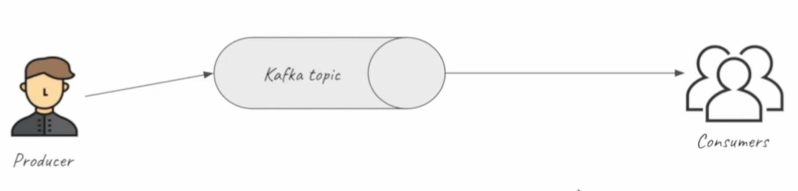
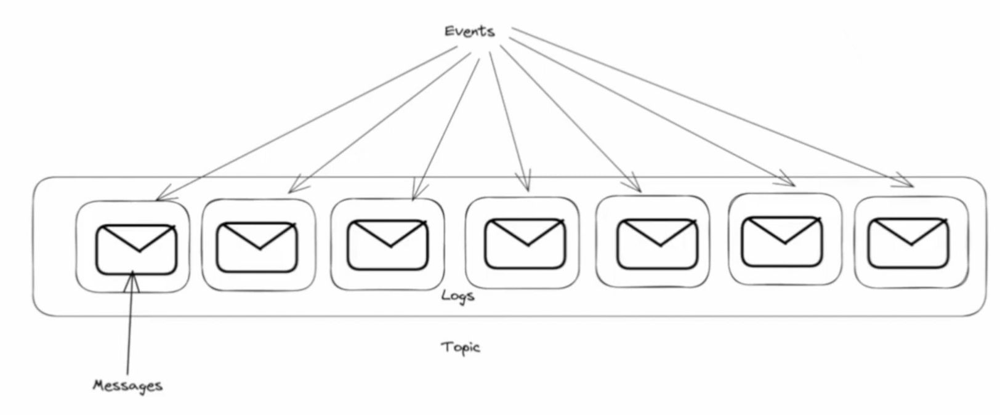
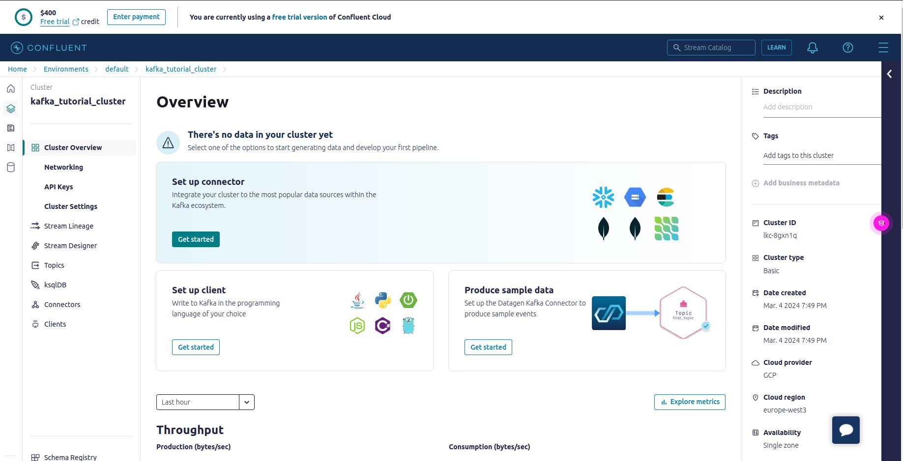
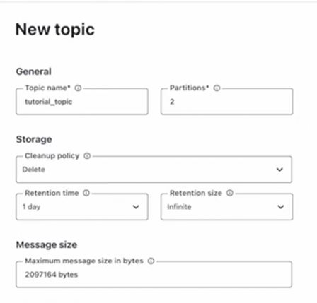
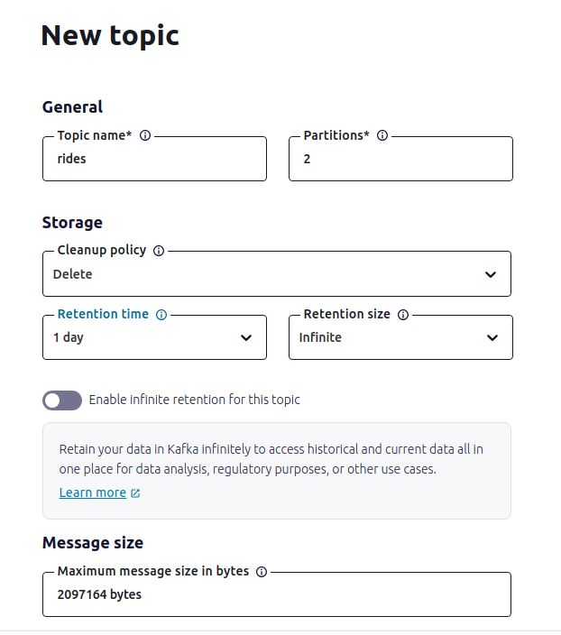

# Week 6: Stream Processing

**Sections:**
- `6.1` [Introduction](#introduction)
- `6.2` [What is stream processing](#stream-processing)
- `6.3` [What is kafka](#kafka)
- `6.4` [Confluent cloud](#confluence)
- `6.5` [Kafka producer consumer](#producer-consumer)
- `6.6` [Kafka configuration](#kafka-configurtation)
- `6.7` [Kafka streams basics](#kafka-streams-basics)
- `6.8` [Kafka stream join](#stream-join)
- `6.9` [Kafka stream testing](#stream-testing)
- `6.10` [Kafka stream windowing](#stream-windowing)
- `6.11` [Kafka ksqldb & Connect](#ksqldb)
- `6.12` [Kafka Schema registry](#schema-registry)
- `6.13` [Kafka Streaming with Python](#kafka-streaming-python)
- `6.14` [Pyspark Structured Streaming](#python-structured-streaming)

<a id="introduction"></a>
## 6.1 Introduction

In this week the following questions will be answered:

- What is Stream Processing?
- What is Kafka?
- What is the role of Kafka in stream processing?
- What are message properties of stream processing?
- What are the configuration parameters for stream processing with Kafka?
- What are Kafka-Producers & Kafka-Consumers?
- How to programmatically consume or produce data?
- How data is partitioned in stream processing?
- How schemas play an important role in stream processing?
- What is `ksqldb`?

This weeks code will be in Java and Python + Spark. 

<a id="stream-processing"></a>
## 6.2 What is stream processing

Stream processing describes a continuous process of obtaining, analyzing and processing data in **a more real-time fashion**. This property of stream processing allows you to get results faster, instead of waiting for a full batch to be processed (as seen in batch processing). A visualization of stream processing could be that a producer is generating data, which is then sent to a topic. The topic is subscribed by consumers and everytime something new is provided, the consumer will obtain and process the data.



<a id="kafka"></a>
## 6.3 What is Kafka

**`To make it short`**: Kafka is a software for stream processing 

### Important concepts
- `Producer`: User that creates and provides data (events) to topics
- `Topic`: Data scructure to which data is send to
- `Consumer`: User that recieves data from topic

### What (exactly) is a topic?
- A topic is a continuous stream of events that subscribers can access
- `Event`: is a datapoint of something that was measured/recorded at a certain timestep (e.g. temperature of a room in °C at a given time)
    - Events are the data that is read by consumers
- `Logs`: Data storage of events
- `Events` contain a `Message` (e.g. timestamp and temperature of a room)
- `Message`: consists of key, value (content) & tiestamp



### But why kafka?

Kafka provides:

- **Robustness**: This means that data is still provided, even when a server goes down. Data is replicated accross different nodes, which enables access, even when one goes down.
- **Flexibility:**: Topics can be very small or big, there could be hundreds of consumers and many more. It is also possible to connect many different components to the topic.
- **Scalability**: Can handle small and big loads of data easily

<a id="confluence"></a>
## 6.4 Confluent cloud

[confluent.cloud](https://confluent.cloud) is a webservice that can be used for hosting kafka clusters. After setting up a free account, you can start and create your first cluster. For this class the free tier is sufficient. For setting up the cluster follow these steps:

1. **`Select cluster type`**: Basic (Free Tier)
2. **`Region/zones`**:
    - `Cloud Provider`: <u>Google Cloud</u> / AWS / Azure
    - `Region`: as you wish
    - `Availability`: as you wish
3. **`Set payment`** Skipped (using free credit)
4. **`Review and launch`**
    - `Cluster name`: kafka_tutorial_cluster

The kafka cluster will now be set up and you will see a dashboard.

<!-- TODO -->



### Creating an API Key for confluent.cloud
To connect to the newly created cluster on confluent.cloud, an API key is required. This can be easily done by clicking on the `API Key` option on the left sidebar. When on the API-Key page, click `Create key` with `Global scope` for the API key. This should have generated the key. Don't forget to give the key a fitting description like `kafka_cluster_tutorial_key`. Now the key can be downloaded and used.s

### Creating a Topic

Steps to create a topic:

1. Click on the topic-option on the left sidebar, then `Create topic`
2. Create new topic with following (examplary) parameters:
    - **`General`**
        - `Topic name`: tutorial_topic
        - `Partitions`: 2
    - **`Storage`**
        - `Cleanup policy`: delete
        - `Retention time`: 1 day
        - `Retention size`: Infinite (default / no changes)
    - **`Message size`**
        - `Maximum message size in bytes`: (default / no changes)
3. Click `Save & create`



Now the topic is created with the specified parameters. It can now send end recieve messages. To test it's functionality, go to the `Message` section of the created topic and click `Produce a new message to this topic` and then `Produce` it by clicking on the `Produce` button. Now you should be able to see `key`, `value` and `header` of a `Message`.

**Value**
```json
{
    "ordertime": 1497014222380,
    "orderid": 18,
    "itemid": "Item_184",
    "address": {
        "city": "Mountain View",
        "state": "CA",
        "zipcode": 94041
    }
}
```
**Key**
```json
18
```
**Header**
```json 
[]
```

### Creating a (dummy) connector

Go to the `Connector` option on the left sidebar and choose `Datagen Source`. Then follow the steps:
1. `Topic Selection`: tutorial_topic
2. `Kafka credentials`: Global access
3. `Configuration`: 
    - Output record value format: json
    - Template: Orders
4. `Sizing`: 
    - Connector sizing: 1
5. `Review and launch`:
    - Connector name: OrdersConnector_tutorial

Now click on **`Continue`** to create the connector! After wating a short period of time, you should be able to see messages in json-format incoming to the topic.

<u>**`Important`**</u>: The connector has to be shut down after the tutorial. Otherwise the granted credit for the free tier of confluence.cloud will be use up very fast.


<a id="producer-consumer"></a>
## 6.5 Kafka producer consumer

In this section data with be produced and consumed programmatically, instead of auto generated sample data. For this section the code will be in Java. Python is also available, but is not that well maintained. There are examples from previous versions of the Data Engineering class, where Python was used with docker.

- For this section, a new `topic` is created



- The next step is to connect the topic to a client. For this purpose a Java client is used. For this purpose, click on the `Clients` section on the left side-bar and then choose `Java`. After choosing `Java`, there will appear a configuration snipped that is required for connecting with kafka. 
The code for this client can be found [here](java/kafka_examples/).

### Java Producer

For sending data to the topic the `Secrets`-class has to be given the api-key as well as the `StreamsConfig.BOOTSTRAP_SERVERS_CONFIG` in the [`JSONProducer`-class](java/kafka_examples/src/main/java/org/example/JsonProducer.java). Other than that, the code can stay the same. The `JSONProducer` can then be build with gradle and executed. The program will start sending messages to the `rides` topic. 

```java
// The pulishing method
public void publishRides(List<Ride> rides) throws ExecutionException, InterruptedException {
    KafkaProducer<String, Ride> kafkaProducer = new KafkaProducer<String, Ride>(props);
    for(Ride ride: rides) {
        ride.tpep_pickup_datetime = LocalDateTime.now().minusMinutes(20);
        ride.tpep_dropoff_datetime = LocalDateTime.now();
        var record = kafkaProducer.send(new ProducerRecord<>("rides", String.valueOf(ride.DOLocationID), ride), (metadata, exception) -> {
            if(exception != null) {
                System.out.println(exception.getMessage());
            }
        });
        System.out.println(record.get().offset());
        System.out.println(ride.DOLocationID);
        Thread.sleep(500);
    }
}
```

### Java Consuer
As the name implies the [`JSONConsumer`-class](java/kafka_examples/src/main/java/org/example/JsonConsumer.java) is used to recieve messages from a topic. After building and running it, the client will obtain data from the topic.

```java
// The consuming method
public void consumeFromKafka() {
    System.out.println("Consuming form kafka started");
    var results = consumer.poll(Duration.of(1, ChronoUnit.SECONDS));
    var i = 0;
    do {
        for(ConsumerRecord<String, Ride> result: results) {
            System.out.println(result.value().DOLocationID);
        }
        results =  consumer.poll(Duration.of(1, ChronoUnit.SECONDS));
        System.out.println("RESULTS:::" + results.count());
        i++;
    }
    while(!results.isEmpty() || i < 10);
}
```

<a id="kafka-configurtation"></a>
## 6.6 Kafka configuration

In this section some important questions will be answered.

### Kafka cluster
- **What is a Kafka cluster?**
    - Machines / Nodes that all run Kafka that communicate with each other
- **How do Kafka-Nodes communicate?**
    - `Previously`: Zookeeper (for keeping track of Kafka-cluster components)
    - `Now`: Kafka-internal functionality used for communication (topics)

### Topic
- **What is a topic?**
    - A sequence of events that are coming in 
    - Example: The previously used `rides`-topic stores events of (taxi-)rides that contains a `message` with the following components:
        - `key` (`vendor_id`, but could be anything)
        - `value` (information about the ride; the datapoint)
        - `timestamp`: time the record was produced

### Replication
- **What is replication and why is it used?**
    - Having copies of the same topic distributed on multiple nodes
    - Mitigates the loss of a topic by having a copy of it and all the messages
    - There is one `Leader` node and one or more `Follower` nodes;
        - `Leader`: the node with the "active" topic that is communicated with (producer, consumer)
        - `Follower`: recieve and save the topics and the messages of the `Leader`
        - A `Follower` can become `Leader` if the `Leader` is unavailable and another node will become follower (depending on number of specified follower)

### Retention
- **What does retention mean in Kafka?**
    - How long data will be retained by kafka i.e. how long are messages stored in a topic on a kafka node
    - Retention is usually limited due to constaints like memory (messages can be deleted after specified time)

### Partitions
- **What are partitions and why are they used?**
    - Partitions are sub-divisions of a topic
    - One topic can be distributed over multiple kafka-nodes and each partition can handle producer and a consumer independent from each other. With this more topics are available to be communicated with.
    - Partitioned topics can still be replicated 


### Offset
- How does a consumer know which particular message to consume and how does Kafka know what messages a consumer has already consumed?
- **Offsets are used!**
    - Offset is added to each message (like a list-index) and can be read by consumer
    - A consumer provides the Kafka-cluster with the offset which is then published in a specific topic `__consumer_offset` (internal Kafka-topic)
    - Kafka knows which consumer group ID consumed (committed) how much messages from which topic


### Auto.Offset.Reset

The decision on whether to consume from the beginning of a topic partition or to only consume new messages when there is no initial offset for the consumer group is controlled by the `auto.offset.reset` configuration parameter on the Kafka Consumer. The following table shows the valid values and their behaviour.

| **`Value`** | **`Usage`** | 
| ----------- | ----------- |
| **earliest**| Reset offset to the earliest offset. Consume from the beginning of the topic partition. |
| **latest**  | Reset offset to the latest offset. Consume from the end of the topic partition (*default*).
| **none**    | Throw an exception if no offset present for the consumer group | 


### Ack.All (Acknowledge All)
When a producer produces a message to a topic, the message has to be recieved in some form. Here acknowledgement (`ack`) comes into play in terms of what successfully recieving a message means. 

The types of `ack`'s:
- `ack:0`: <u>Fire and Forget</u>
    - Producer does not care if the message was recieved (acknowledged) by the Leader or not
    - When fast processing of un-critical data is required
- `ack:1`: <u>Leader successful</u> 
    - Message has to be received (acknowledged) by the Leader (log has to be produced)
    - A good compromise between critical and un-critical
- `ack:all`: <u>Leader + Followers</u>
    - Leader and Follower must have recieved the messages  (logs of it)
    - Used for more critical task where loss of messages is not acceptable


### Recap
- `Kafka-clustr`: Kafka-nodes that talk to each other
- `Topic`: Collection of events (containing messages), that are produced by a producer. 
- `Message`: Content of an event that has the fields *key*, *value*, *timestamp* 
- `Replication`: duplication of topic-messages accross different nodes. To handle the case if nodes are down. Nodes can be Leader or Follower.
- `Retention`: How long a message is saved before it will be deleted. For "housekeeping", to avoid a full memory.
- `Partition`: Makes a topic consumable by more than one consumer (not possible with one partition)
- `Offset`: Saves and stores the current state of what was already read from a topic in a Kafka-internal topic. Helps to find out producer and consumer where to "start".
- `Auto.Offset.Reset`: *Earliest* and *Latest* provide specific offsets for new producer / consumer, s.t. they know where to start.
- `Ack.All`: Acknowledgement types *ack:0*, *ack:1* and *ack:all* for different safety levels of message acknowledgement


<a id="kafka-streams-basics"></a>
## 6.7 Kafka streams basics

In this section a simple Kafka-stream example will be examined. This example will give us the basic building blocks for more complicated cases later on. It will be shown, that keys play a important role when messages are outputed to Kafka. 

The first class that will be created will be [JsonKStream.java](java/kafka_examples/src/main/java/org/example/JsonKStream.java):

Now you can go to confluent.cloud and create the desired topic with the following properties: 
- **Topic name**: `rides-pulocation-count`
- **Partitions**: 2

After running `JsonKStream.java` you can see the results in the topic section of your kafka cluster on confluence cloud.

### TODO - Visualizazions

<a id="stream-join"></a>
## 6.8 Kafka stream join

**Example**: There are 2 topics in which the data will be joined. For this a Kafka stream application is used.

In the previous sections there was the topic `rides` that has messages that have the a value for `Drop-off Location`, which can be used as a key. The topic `pickup-location` has the key `pickup location` inside it's messages. Both topics can be joined on location ids. 


The code can be found in [JsonKStreamJoin.java](java/kafka_examples/src/main/java/org/example/JsonKStreamJoins.java). The relevant code snippets are:

```java
public Topology createTopology() {
    StreamsBuilder streamsBuilder = new StreamsBuilder();
    KStream<String, Ride> rides = streamsBuilder.stream(
        Topics.INPUT_RIDE_TOPIC, 
        Consumed.with(
            Serdes.String(), 
            CustomSerdes.getSerde(Ride.class)
        )
    );
    KStream<String, PickupLocation> pickupLocations = streamsBuilder.stream(
        Topics.INPUT_RIDE_LOCATION_TOPIC, 
        Consumed.with(
            Serdes.String(), 
            CustomSerdes.getSerde(PickupLocation.class)
        )
    );

    var pickupLocationsKeyedOnPUId = pickupLocations.selectKey(
        (key, value) -> String.valueOf(value.PULocationID)
    );

    var joined = rides.join(
        pickupLocationsKeyedOnPUId, (ValueJoiner<Ride, PickupLocation, Optional<VendorInfo>>) (ride, pickupLocation) -> {
            var period = Duration.between(ride.tpep_dropoff_datetime, pickupLocation.tpep_pickup_datetime);
                if (period.abs().toMinutes() > 10) 
                    return Optional.empty();
                else 
                    return Optional.of(
                        new VendorInfo(
                            ride.VendorID, 
                            pickupLocation.PULocationID, 
                            pickupLocation.tpep_pickup_datetime, 
                            ride.tpep_dropoff_datetime
                        ));
            }, 
            JoinWindows.ofTimeDifferenceAndGrace(Duration.ofMinutes(20), Duration.ofMinutes(5)),
            StreamJoined.with(Serdes.String(), CustomSerdes.getSerde(Ride.class), CustomSerdes.getSerde(PickupLocation.class))
    );

    joined.filter(((key, value) -> value.isPresent())).mapValues(Optional::get)
            .to(Topics.OUTPUT_TOPIC, Produced.with(Serdes.String(), CustomSerdes.getSerde(VendorInfo.class)));

    return streamsBuilder.build();
}
```

```java
    public void joinRidesPickupLocation() throws InterruptedException {
        var topology = createTopology();
        var kStreams = new KafkaStreams(topology, props);

        kStreams.setUncaughtExceptionHandler(exception -> {
            System.out.println(exception.getMessage());
            return StreamsUncaughtExceptionHandler.StreamThreadExceptionResponse.SHUTDOWN_APPLICATION;
        });
        kStreams.start();
        while (kStreams.state() != KafkaStreams.State.RUNNING) {
            System.out.println(kStreams.state());
            Thread.sleep(1000);
        }
        System.out.println(kStreams.state());
        Runtime.getRuntime().addShutdownHook(new Thread(kStreams::close));
    }
```

To finally run the stream join, the following programs have to be build and executed:
1. [JsonKStreamJoin.java](java/kafka_examples/src/main/java/org/example/JsonKStreamJoins.java)
    - Will start waiting for messages
2. [JsonProducer.java](java/kafka_examples/src/main/java/org/example/JsonProducer.java)
    - Producer that publishes messages over the `rides`-topic
3. [JsonProducerPickupLocation.java](java/kafka_examples/src/main/java/org/example/JsonProducerPickupLocation.java)
    - Producer that publishes messages over the `rides_location`-topic

If everything worked out, you should be able to see the topics in confluence. 

*Important*: If two topis should be merged, they must have the same number of partitions. 


<a id="stream-testing"></a>
## 6.9 Kafka stream testing

**Content of this section**:
- Unit tests for kafka 


### What was done before (an abstraction of the process)


- `Topology`: Defines what topics to read from, what actions do take place where, where to output results
- `KStreams`: Used with the `StreamsBuilder` to define Kafka topology
- `StreamsBuilder`: Object that contains the Kafka topology

The topology in Kafka is what can be testet. The tests should validate that the topology does what it should. For the purpose of thesting the topology in the class [JsonKStream.java](java/kafka_examples/src/main/java/org/example/JsonKStream.java), the test-class [JsonKStreamTest.java](java/kafka_examples/src/test/java/org/example/JsonKStreamTest.java) is used. There is also a test class for [JsonKStreamJoins.java](java/kafka_examples/src/main/java/org/example/JsonKStreamJoins.java) that has the name [JsonKStreamJoinsTest.java](java/kafka_examples/src/test/java/org/example/JsonKStreamJoinsTest.java) and tests if joining works properly. For the functionalty plese refer to the aforementioned code.


<a id="stream-windowing"></a>
## 6.10 Kafka stream windowing

[Video](https://www.youtube.com/watch?v=r1OuLdwxbRc&list=PL3MmuxUbc_hJed7dXYoJw8DoCuVHhGEQb&index=76&pp=iAQB) to this section.

**Content of this section**:
- Global KTables
- How Kafka allows different joins (and what joins are allowed)
- Left, Right, Inner Joins in Kafka
- How Windowing works (and what Kafka provides)


<a id="ksqldb"></a>
## 6.11 Kafka ksqldb & Connect

[Video](https://www.youtube.com/watch?v=DziQ4a4tn9Y&list=PL3MmuxUbc_hJed7dXYoJw8DoCuVHhGEQb&index=77&pp=iAQB) to this section.


<a id="schema-registry"></a>
## 6.12 Kafka Schema registry

[Video](https://www.youtube.com/watch?v=tBY_hBuyzwI&list=PL3MmuxUbc_hJed7dXYoJw8DoCuVHhGEQb&index=78&pp=iAQB) to this section.

<a id="kafka-streaming-python"></a>
## 6.13 Kafka Streaming with Python


<a id="python-structured-streaming"></a>
## 6.14 Pyspark Structured Streaming

